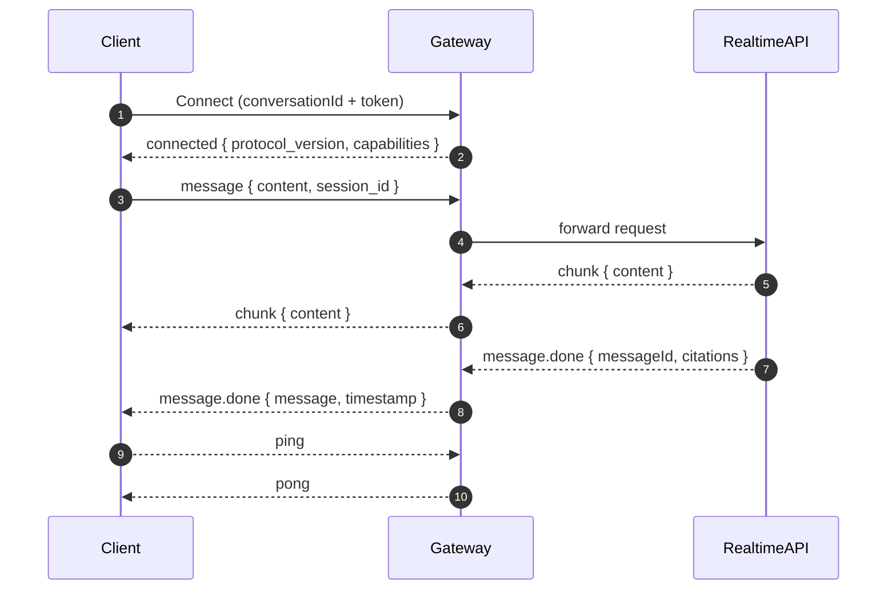

<Badge tone="info">Protocol v1.0</Badge>

<Callout title="Why MDX?" variant="info">
  The protocol relies on multiple moving pieces (auth, audio streams, realtime tokens). MDX lets us mix diagrams and interactive
  tabs so engineers can visualize the sequence without cross-referencing multiple markdown files.
</Callout>

### Connection endpoints

<Tabs>
  <TabList>
    <Tab index={0}>Development</Tab>
    <Tab index={1}>Production</Tab>
  </TabList>
  <TabPanels>
    <TabPanel index={0}>
      ```
      ws://localhost:8000/api/realtime/ws
      ```
      <Callout variant="info">
        Local clients append <code>conversationId</code> and a short-lived JWT to the query string before opening the socket.
      </Callout>
    </TabPanel>
    <TabPanel index={1}>
      ```
      ws://localhost:8000/api/realtime/ws
      ```
      <Callout variant="success">
        Production sessions use the same shape but require an access token minted by the Control Panel.
      </Callout>
    </TabPanel>
  </TabPanels>
</Tabs>

### Handshake and streaming lifecycle



<Callout title="Ordering guarantees" variant="success">
  Chunks arrive in order and do not include an explicit <code>chunkIndex</code>. Clients should append content in the order
  received and display partial output immediately for responsive UX.
</Callout>

### Core messages at a glance

- **connected** — emitted after authentication, includes protocol version and feature flags.
- **chunk** — incremental assistant output; multiple chunks compose a single response.
- **message.done** — finalizes the streamed response and includes citations plus timestamps.
- **ping/pong** — lightweight heartbeat to keep idle sockets alive.

### Recommended client guards

- Debounce reconnect attempts to avoid cascading load when the backend is rolling deployments.
- Use <Badge tone="warning">AbortController</Badge> or equivalent to cancel prior synthesis when the user barge-ins.
- Capture and log <code>client_id</code> from the <code>connected</code> frame to correlate WebSocket traces with backend logs.
