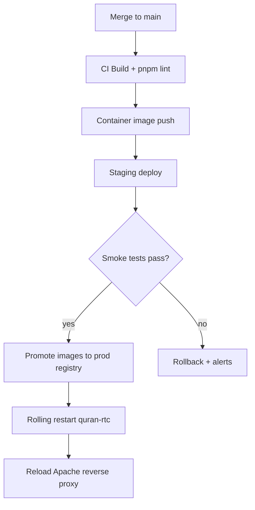

<Badge tone="success">Rolling-safe</Badge>

<Callout title="Release checklist" variant="info">
  - Validate <code>quran-rtc</code> and <code>quran-ingest</code> service health in staging.
  - Confirm Control Panel authentication works after migrations.
  - Flip CDN cache rules only after the WebSocket edge routes are green.
</Callout>

### Deployment pipeline

<Callout title="Zero downtime guardrails" variant="success">
  Deployments keep a warm pool of workers and reload the Apache proxy last, so existing WebSocket sessions finish streaming before
  connections drain.
</Callout>

### Environment-specific commands

<Tabs>
  <TabList>
    <Tab index={0}>Staging</Tab>
    <Tab index={1}>Production</Tab>
  </TabList>
  <TabPanels>
    <TabPanel index={0}>
      <ul>
        <li><code>ssh staging sudo systemctl restart quran-rtc</code></li>
        <li><code>ssh staging sudo journalctl -u quran-rtc -f</code></li>
        <li><code>ssh staging sudo systemctl status quran-ingest</code></li>
      </ul>
    </TabPanel>
    <TabPanel index={1}>
      <ul>
        <li><code>sudo systemctl restart quran-rtc</code> — restart API workers</li>
        <li><code>sudo systemctl restart quran-ingest</code> — refresh KB ingest</li>
        <li><code>sudo systemctl reload apache2</code> — reload reverse proxy once services are healthy</li>
      </ul>
    </TabPanel>
  </TabPanels>
</Tabs>

<Callout title="Troubleshooting shortcuts" variant="warning">
  - Use <code>sudo lsof -i :8000</code> if sockets appear stuck after a deploy.
  - Snapshot <code>/var/log/apache2/error.log</code> before restarting to keep history when reproducing regressions.
</Callout>
