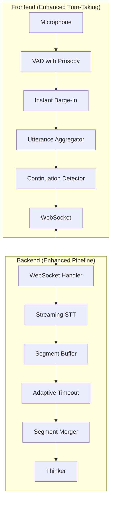

<Badge tone="info">Feature: Natural Conversation Flow v1.0</Badge>

<Callout title="Feature Status" variant="warning">
  This document describes a feature currently in development on branch `feat/natural-conversation-flow`.
</Callout>

## Problem Statement

Current Voice Mode has difficulty handling natural human speech patterns where users:

1. **Pause mid-sentence** while thinking ("So, I'm thinking about... [pause] ...adding a new event")
2. **Get interrupted by AI** during these natural pauses
3. **Attempt to barge-in** but AI takes 1-2 seconds to stop speaking
4. **Lose context** when AI only catches the final fragment of the user's continued speech

This creates an unnatural experience where users feel rushed and misunderstood.

### Observed Failure Modes

| Scenario | Current Behavior | Expected Behavior |
|----------|------------------|-------------------|
| User pauses 1s mid-sentence | AI starts responding | AI waits for continuation signals |
| User resumes speaking | AI continues for 150-500ms | AI stops immediately (<50ms) |
| User speaks in fragments | Only last fragment captured | All fragments aggregated into coherent query |
| User says "um" or "uh" | Treated as end of utterance | Recognized as hesitation marker |

---

## Technical Analysis

### Current Architecture Limitations

#### 1. Fixed Endpointing Threshold
**Location:** `services/api-gateway/app/services/streaming_stt_service.py:77`

```python
# Current: Fixed 800ms silence triggers end-of-utterance
endpointing_ms: int = 800
utterance_end_ms: int = 1500
```

**Problem:** 800ms is a reasonable average but doesn't adapt to:
- Individual speaking patterns (some users pause longer)
- Context (complex thoughts require more pause time)
- Linguistic cues (incomplete sentences, rising intonation)

#### 2. Barge-In Detection Latency
**Location:** `apps/web-app/src/lib/fullDuplex/overlapHandler.ts:344`

```typescript
// Current: Wait 150ms before deciding to interrupt
if (vadConfidence >= this.config.interruptThreshold) {
  if (overlapDuration > 150) {
    return { action: "interrupt_ai", ... };
  }
}
```

**Problem:** 150ms delay + processing time results in 200-500ms before AI stops.

#### 3. No Speech Segment Aggregation
**Location:** Multiple handlers treat each speech segment independently

**Problem:** When user speaks in fragments:
```
Segment 1: "So, I'm thinking about maybe..."
[AI starts responding]
Segment 2: "...adding a new event to my calendar"
```
Only Segment 2 reaches the Thinker, losing essential context.

#### 4. Inadequate Continuation Detection
**Location:** `apps/web-app/src/lib/turnTaking/silencePredictor.ts:200-215`

The silence predictor classifies pauses but doesn't effectively detect:
- Incomplete sentences (trailing conjunctions: "and", "but", "so")
- Filler words ("um", "uh", "like")
- Rising intonation indicating question formation

---

## Proposed Solution Architecture

### Overview



### Component Design

#### 1. Utterance Window Aggregator (Frontend + Backend)

Accumulates speech segments within a configurable time window and merges them before sending to the Thinker.

**Behavior:**
```
T=0s:    User: "So, I'm thinking about maybe..."
T=0.8s:  [Silence detected - start window timer]
T=1.5s:  User: "...adding a new event"
T=2.3s:  [Silence detected - check for continuation]
T=3.3s:  [Window expires - no more speech]
         -> Merged: "So, I'm thinking about maybe adding a new event"
         -> Send to Thinker
```

**Configuration:**
```typescript
interface AggregatorConfig {
  windowDurationMs: number;        // Max time to wait for continuation (default: 3000)
  minSegmentGapMs: number;         // Min gap to consider separate segments (default: 200)
  maxSegmentsPerWindow: number;    // Prevent runaway aggregation (default: 5)
  continuationHints: string[];     // Words that extend the window
}
```

#### 2. Instant Barge-In System

Uses Deepgram's `SpeechStarted` event to immediately stop AI audio, before transcript analysis.

**Current Flow:**
```
User speaks → STT transcript → Barge-in classifier → Stop AI
              (100-150ms)        (50-100ms)           (50ms)
              Total: 200-300ms
```

**Proposed Flow:**
```
User speaks → SpeechStarted event → Immediately stop AI
                    (50ms)              (0ms)
              Total: 50ms
```

**Implementation:**
```typescript
// Frontend: Immediate stop on any speech detection during AI playback
onSpeechStart() {
  if (this.isAISpeaking) {
    // 1. Immediately mute/fade AI audio
    this.audioPlayer.fadeOut(50);  // 50ms fade for smoothness

    // 2. Signal backend to prepare for new input
    this.ws.send({ type: 'barge_in_initiated' });

    // 3. Switch state to listening
    this.setState('user_turn');
  }
}
```

#### 3. Continuation Detection System

Analyzes speech patterns to predict when user intends to continue.

**Detection Signals:**

| Signal | Weight | Example |
|--------|--------|---------|
| Trailing conjunction | High | "I want to... and..." |
| Filler word | High | "um", "uh", "like" |
| Rising intonation | Medium | Question formation |
| Incomplete sentence | Medium | "The appointment is..." |
| Short fragment (<3 words) | Low | "So basically" |

**Backend Implementation:**
```python
class ContinuationDetector:
    CONTINUATION_MARKERS = {
        'en': ['and', 'but', 'so', 'because', 'or', 'then', 'also',
               'um', 'uh', 'like', 'you know', 'I mean'],
        'ar': ['و', 'لكن', 'يعني', 'كمان', 'طيب'],
    }

    def should_wait_for_continuation(self, transcript: str, prosody: dict) -> float:
        """Returns confidence (0-1) that user will continue speaking."""
        score = 0.0

        # Check trailing markers
        words = transcript.strip().split()
        if words and words[-1].lower() in self.CONTINUATION_MARKERS['en']:
            score += 0.4

        # Check prosody (rising intonation)
        if prosody.get('pitch_trend') == 'rising':
            score += 0.3

        # Check for incomplete thought (no sentence-ending punctuation)
        if not transcript.strip().endswith(('.', '?', '!')):
            score += 0.2

        # Short fragment likely incomplete
        if len(words) < 4:
            score += 0.1

        return min(1.0, score)
```

#### 4. Pre-emptive Listening Mode

Keeps STT active during AI speech for faster barge-in detection.

**Current Behavior:**
- Microphone continues capturing during AI speech
- STT receives audio but transcripts are ignored until barge-in confirmed

**Enhanced Behavior:**
- STT remains active and processes audio
- Any speech detection immediately triggers barge-in
- Accumulated transcript is ready instantly after AI stops

---

## Implementation Plan

### Phase 1: Instant Barge-In (Estimated: 2-3 days)

**Goal:** Reduce barge-in latency from 200-300ms to <50ms

**Tasks:**
1. Add `onSpeechStart` callback handling in frontend WebSocket handler
2. Implement immediate audio fade-out on speech detection
3. Add `barge_in_initiated` WebSocket message type
4. Update backend to handle early barge-in signals
5. Add feature flag: `VOICE_INSTANT_BARGE_IN`

**Files to Modify:**
- `apps/web-app/src/hooks/useThinkerTalkerSession.ts`
- `apps/web-app/src/hooks/useTTAudioPlayback.ts`
- `services/api-gateway/app/services/thinker_talker_websocket_handler.py`

### Phase 2: Continuation Detection (Estimated: 2-3 days)

**Goal:** Detect when user intends to continue speaking

**Tasks:**
1. Create `ContinuationDetector` backend service
2. Integrate with streaming STT service
3. Add dynamic silence threshold adjustment
4. Extend SilencePredictor with continuation awareness
5. Add feature flag: `VOICE_CONTINUATION_DETECTION`

**Files to Modify:**
- `services/api-gateway/app/services/streaming_stt_service.py`
- `apps/web-app/src/lib/turnTaking/silencePredictor.ts`
- New: `services/api-gateway/app/services/continuation_detector.py`

### Phase 3: Utterance Aggregation (Estimated: 3-4 days)

**Goal:** Merge speech segments into coherent queries

**Tasks:**
1. Create `UtteranceAggregator` class (backend)
2. Implement segment buffering with timeout
3. Add transcript merging with deduplication
4. Create frontend `UtteranceWindowManager` component
5. Add feature flag: `VOICE_UTTERANCE_AGGREGATION`

**Files to Modify:**
- `services/api-gateway/app/services/thinker_talker_websocket_handler.py`
- `apps/web-app/src/lib/turnTaking/index.ts`
- New: `services/api-gateway/app/services/utterance_aggregator.py`
- New: `apps/web-app/src/lib/turnTaking/utteranceWindowManager.ts`

### Phase 4: Pre-emptive Listening (Estimated: 1-2 days)

**Goal:** Keep STT ready during AI speech

**Tasks:**
1. Configure STT to remain active during playback
2. Buffer incoming transcripts during AI speech
3. On barge-in, use buffered transcript immediately
4. Add feature flag: `VOICE_PREEMPTIVE_LISTENING`

**Files to Modify:**
- `apps/web-app/src/hooks/useThinkerTalkerSession.ts`
- `services/api-gateway/app/services/voice_pipeline_service.py`

### Phase 5: Testing & Tuning (Estimated: 2-3 days)

**Goal:** Validate improvements with real conversations

**Tasks:**
1. Add latency metrics for barge-in response time
2. Create test scenarios for edge cases
3. Tune thresholds based on real usage
4. A/B test with feature flags
5. Document final configuration

---

## Feature Flags

All features will be controlled via admin panel at `admin.asimo.io`:

| Flag | Default | Description |
|------|---------|-------------|
| `VOICE_INSTANT_BARGE_IN` | `true` | Enable immediate barge-in on SpeechStarted |
| `VOICE_CONTINUATION_DETECTION` | `true` | Enable trailing word/prosody analysis |
| `VOICE_UTTERANCE_AGGREGATION` | `true` | Enable multi-segment merging |
| `VOICE_PREEMPTIVE_LISTENING` | `true` | Keep STT active during AI speech |
| `VOICE_AGGREGATION_WINDOW_MS` | `3000` | Max time to wait for continuation |
| `VOICE_MIN_BARGE_IN_CONFIDENCE` | `0.3` | Minimum confidence for barge-in |

---

## Metrics & Success Criteria

### Key Metrics

| Metric | Current | Target | Measurement |
|--------|---------|--------|-------------|
| Barge-in latency | 200-300ms | <50ms | Time from speech start to AI audio stop |
| Fragment loss rate | ~30% | <5% | Percentage of user speech segments lost |
| False barge-in rate | ~5% | <3% | Backchannels incorrectly treated as interrupts |
| User satisfaction | N/A | +20% improvement | Post-session survey |

### Success Criteria

1. Barge-in response time consistently under 100ms
2. Multi-segment utterances correctly merged 95%+ of time
3. No increase in false positive barge-ins
4. Users report more natural conversation flow

---

## Rollback Plan

All features are behind feature flags. If issues arise:

1. **Immediate:** Disable specific feature flags via admin panel
2. **If critical:** Disable all `VOICE_*` flags to revert to current behavior
3. **Code rollback:** Merge revert PR if needed

---

## References

- [Voice Mode Architecture](/voice/voice-mode-architecture)
- [WebSocket Protocol](/backend/websocket-protocol)
- [TurnTakingManager Source](https://github.com/mohammednazmy/VoiceAssist/blob/main/apps/web-app/src/lib/turnTaking/index.ts)
- [SilencePredictor Source](https://github.com/mohammednazmy/VoiceAssist/blob/main/apps/web-app/src/lib/turnTaking/silencePredictor.ts)
