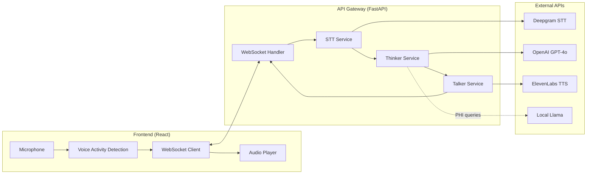
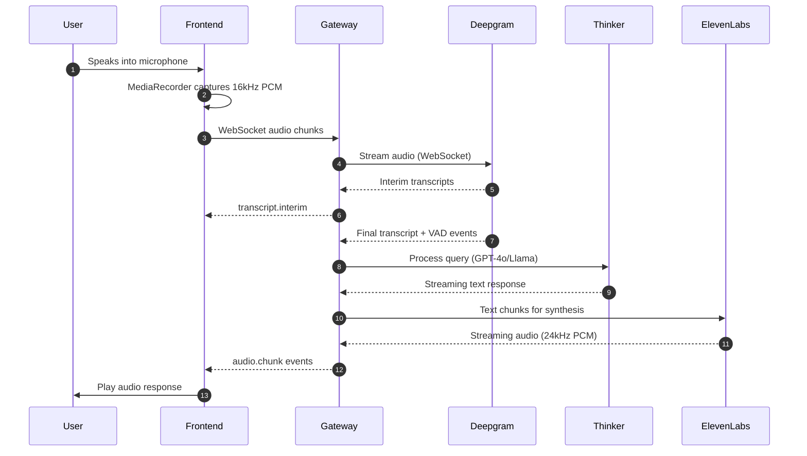
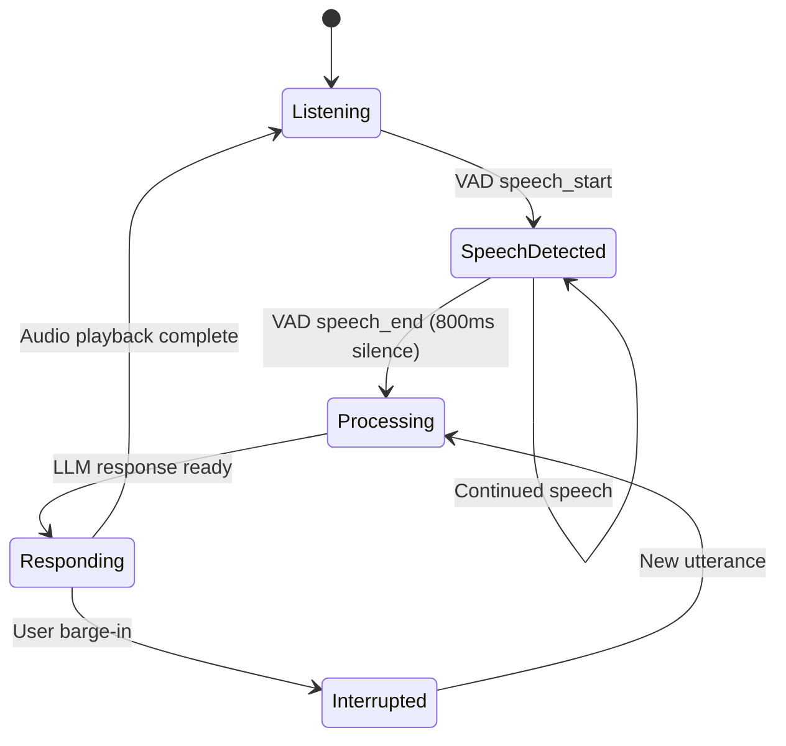
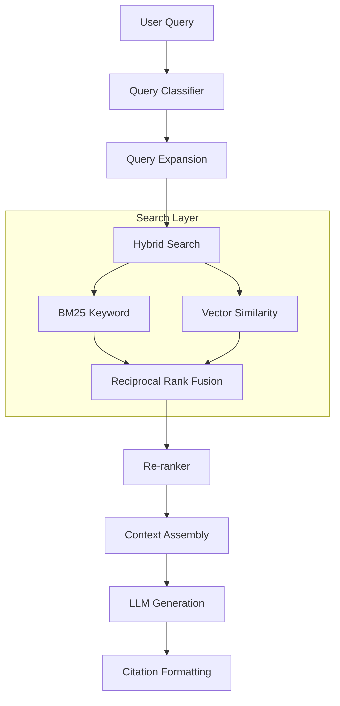

<Badge tone="info">Voice Mode v2.0 - Thinker/Talker Pipeline</Badge>

<Callout title="Document Purpose" variant="info">
  This document provides a comprehensive technical reference for the VoiceAssist Voice Mode implementation. It covers the current architecture, identifies known limitations, and serves as the authoritative source for understanding how voice interactions work in the system.
</Callout>

## Overview

VoiceAssist implements a sophisticated voice-first interface for healthcare professionals, enabling natural spoken interactions with an AI medical assistant. The system uses a **Thinker/Talker pipeline architecture** that decouples speech recognition, language model reasoning, and speech synthesis for maximum flexibility and low latency.

### High-Level Architecture



---

## Current Implementation of Voice Mode

### End-to-End Pipeline

The voice interaction follows this sequence:



### Audio Capture

<Tabs>
  <TabList>
    <Tab index={0}>Frontend Implementation</Tab>
    <Tab index={1}>Audio Format</Tab>
  </TabList>
  <TabPanels>
    <TabPanel index={0}>
      Audio is captured using the Web Audio API and MediaRecorder:

      - **Hook:** `useThinkerTalkerSession.ts` manages the voice session
      - **Component:** `ThinkerTalkerVoicePanel.tsx` provides the UI
      - **Capture:** MediaRecorder API with `audio/webm;codecs=opus` encoding
      - **Sample Rate:** 16kHz mono (resampled for Deepgram)
      - **Chunk Size:** 250ms intervals for streaming
    </TabPanel>
    <TabPanel index={1}>
      ```
      Format: PCM 16-bit mono
      Sample Rate: 16000 Hz (input) / 24000 Hz (output)
      Encoding: Linear16 for STT, PCM for TTS playback
      Chunk Duration: 250ms (configurable)
      ```
    </TabPanel>
  </TabPanels>
</Tabs>

### Speech-to-Text (STT) Providers

<Tabs>
  <TabList>
    <Tab index={0}>Deepgram (Primary)</Tab>
    <Tab index={1}>Whisper (Fallback)</Tab>
  </TabList>
  <TabPanels>
    <TabPanel index={0}>
      **Deepgram** is the primary STT provider, chosen for its low-latency streaming capabilities.

      | Property | Value |
      |----------|-------|
      | **Mode** | WebSocket streaming |
      | **Latency** | 100-150ms to first transcript |
      | **Features** | Interim results, VAD events, punctuation, diarization |
      | **Languages** | English (primary), multilingual support |
      | **Config Key** | `DEEPGRAM_API_KEY` |

      <Callout variant="success">
        Deepgram provides real-time VAD (Voice Activity Detection) events, enabling accurate end-of-utterance detection without client-side inference.
      </Callout>
    </TabPanel>
    <TabPanel index={1}>
      **OpenAI Whisper** serves as a fallback when Deepgram is unavailable.

      | Property | Value |
      |----------|-------|
      | **Mode** | Batch (non-streaming) |
      | **Latency** | 500-1500ms (depends on audio length) |
      | **Features** | High accuracy, language detection |
      | **Config Key** | `OPENAI_API_KEY` |

      <Callout variant="warning">
        Whisper operates in batch mode, introducing higher latency. It should only be used when streaming STT is not available.
      </Callout>
    </TabPanel>
  </TabPanels>
</Tabs>

### LLM / Assistant Layer

The **Thinker Service** (`thinker_service.py`) handles language model reasoning with intelligent routing:

<Tabs>
  <TabList>
    <Tab index={0}>Cloud (GPT-4o)</Tab>
    <Tab index={1}>Local (Llama)</Tab>
  </TabList>
  <TabPanels>
    <TabPanel index={0}>
      **OpenAI GPT-4o** is the primary LLM for general queries.

      | Property | Value |
      |----------|-------|
      | **Model** | `gpt-4o` |
      | **Mode** | Streaming |
      | **Latency** | 200-500ms to first token |
      | **Features** | Tool calling, RAG integration, citations |
      | **Use Case** | General medical queries, clinical decision support |

      ```python
      # Query classification determines urgency
      URGENT → prioritized, faster response
      SIMPLE → direct answer, minimal context
      COMPLEX → multi-hop reasoning, RAG retrieval
      CLARIFICATION → follow-up questions
      ```
    </TabPanel>
    <TabPanel index={1}>
      **Local Llama** handles PHI-sensitive queries to avoid sending protected health information to cloud services.

      | Property | Value |
      |----------|-------|
      | **Model** | Llama 3.1 (8B or 70B) |
      | **Mode** | Local inference |
      | **Latency** | 300-800ms (hardware dependent) |
      | **Use Case** | PHI-present queries, patient-specific data |

      <Callout variant="info">
        PHI detection uses Presidio and custom regex patterns. When PHI is detected, queries are automatically routed to the local model.
      </Callout>
    </TabPanel>
  </TabPanels>
</Tabs>

### Text-to-Speech (TTS) Providers

<Tabs>
  <TabList>
    <Tab index={0}>ElevenLabs (Primary)</Tab>
    <Tab index={1}>OpenAI TTS (Fallback)</Tab>
  </TabList>
  <TabPanels>
    <TabPanel index={0}>
      **ElevenLabs** provides premium neural TTS with emotional expressiveness.

      | Property | Value |
      |----------|-------|
      | **Models** | `eleven_multilingual_v2`, `eleven_turbo_v2_5` |
      | **Mode** | HTTP streaming |
      | **Latency** | 50-100ms TTFA (time to first audio) |
      | **Languages** | 28+ languages |
      | **Voices** | Custom voice IDs, professional cloning |

      **Voice Parameters:**
      - Stability: 0.0-1.0 (consistency vs. expressiveness)
      - Clarity: 0.0-1.0 (pronunciation precision)
      - Style: 0.0-1.0 (emotional intensity)

      <Callout variant="success">
        ElevenLabs supports SSML tags for prosody control (emphasis, pauses, rate), enabling natural-sounding medical terminology pronunciation.
      </Callout>
    </TabPanel>
    <TabPanel index={1}>
      **OpenAI TTS** serves as a fallback with standard voices.

      | Property | Value |
      |----------|-------|
      | **Voices** | alloy, echo, fable, onyx, nova, shimmer |
      | **Mode** | Streaming |
      | **Quality** | HD audio output |

      ```typescript
      // Voice selection in settings
      const voices = ['alloy', 'echo', 'fable', 'onyx', 'nova', 'shimmer'];
      ```
    </TabPanel>
  </TabPanels>
</Tabs>

---

## Streaming and Latency Behavior

### Streaming Architecture

All pipeline components support streaming to minimize perceived latency:

| Component | Streaming Mode | Chunk Size |
|-----------|---------------|------------|
| STT (Deepgram) | WebSocket bidirectional | Continuous |
| LLM (GPT-4o) | Server-sent events | Token-by-token |
| TTS (ElevenLabs) | HTTP chunked | 256 samples (24kHz) |

### Latency Targets

<Callout title="Performance Goals" variant="info">
  VoiceAssist targets sub-500ms end-to-end latency for optimal conversational UX.
</Callout>

| Stage | Target Latency | Actual (P95) |
|-------|---------------|--------------|
| Audio capture → STT | 100-150ms | ~120ms |
| STT → LLM first token | 200-300ms | ~250ms |
| LLM → TTS first audio | 50-100ms | ~80ms |
| **Total (speech-to-audio)** | **under 500ms** | **~450ms** |

### Voice Quality Presets

Users can select latency vs. quality trade-offs:

```typescript
// voiceSettingsStore.ts
type VoiceQualityPreset = 'speed' | 'balanced' | 'natural';

const presets = {
  speed: { ttfa: '100-150ms', description: 'Fastest response' },
  balanced: { ttfa: '200-250ms', description: 'Recommended default' },
  natural: { ttfa: '300-400ms', description: 'Most natural prosody' }
};
```

### VAD and End-of-Utterance Detection

The system determines when the user has finished speaking using:

1. **Deepgram VAD Events:** Server-side voice activity detection
2. **Silence Threshold:** 800ms of silence triggers end-of-utterance
3. **VAD Sensitivity:** 200ms minimum speech duration to avoid false triggers



### Barge-In Support

Users can interrupt the AI's response mid-playback:

- **Detection:** `barge_in_classifier.py` monitors for new speech during playback
- **Action:** Current audio playback stops, new utterance is processed
- **UI:** `VoiceBargeInIndicator.tsx` provides visual feedback

---

## Multilingual and Pronunciation Behavior

### Supported Languages

<Tabs>
  <TabList>
    <Tab index={0}>STT Languages</Tab>
    <Tab index={1}>TTS Languages</Tab>
  </TabList>
  <TabPanels>
    <TabPanel index={0}>
      **Deepgram STT** supports multiple languages, but the system is primarily configured for:

      - English (US) - Primary
      - Spanish
      - French
      - German
      - Italian
      - Portuguese

      <Callout variant="warning">
        Automatic language detection is **not currently implemented** in STT. The language must be pre-configured or selected by the user.
      </Callout>
    </TabPanel>
    <TabPanel index={1}>
      **ElevenLabs** `eleven_multilingual_v2` supports 28+ languages with native pronunciation.

      High-quality support includes:
      - English (multiple accents)
      - Spanish (Castilian, Latin American)
      - French
      - German
      - Italian
      - Portuguese (Brazilian, European)
      - Arabic
      - Hindi
      - Japanese
      - Korean
      - Mandarin Chinese
    </TabPanel>
  </TabPanels>
</Tabs>

### Mixed-Language Support

<Callout title="Current Limitation" variant="warning">
  Mixed-language utterances (e.g., English with Arabic terms) are **not fully supported**. The STT provider may fail to accurately transcribe code-switched speech.
</Callout>

**Workarounds:**
- Configure STT for the dominant language
- Use medical terminology in the configured language
- Rely on TTS's multilingual model for pronunciation

### Pronunciation Handling

| Feature | Status | Notes |
|---------|--------|-------|
| Custom lexicons | Not implemented | No phoneme dictionaries |
| Medical terminology | Partial | ElevenLabs handles common terms |
| SSML pronunciation | Supported | Via `ssml_processor.py` |
| Per-language tuning | Not implemented | Single-language configuration |

**Known Issues:**
- Uncommon drug names may be mispronounced
- Eponyms (e.g., "Parkinson's", "Alzheimer's") generally work well
- Abbreviations (e.g., "mg", "mL") require SSML hints

---

## Architecture and Module Integration

### Backend Service Structure

The voice pipeline is implemented across multiple services in `services/api-gateway/app/services/`:

```
services/
├── voice_pipeline_service.py      # Main orchestrator
├── streaming_stt_service.py       # Deepgram/Whisper STT
├── thinker_service.py             # LLM reasoning
├── talker_service.py              # TTS orchestration
├── voice_websocket_handler.py     # WebSocket management
├── thinker_talker_websocket_handler.py  # T/T protocol
├── voice_activity_detector.py     # VAD logic
├── barge_in_classifier.py         # Interrupt detection
├── elevenlabs_service.py          # ElevenLabs client
├── openai_tts_service.py          # OpenAI TTS client
├── ssml_processor.py              # SSML generation
├── emotion_detection_service.py   # User emotion analysis
├── prosody_analysis_service.py    # Speech prosody
├── backchannel_service.py         # Conversational cues
└── dictation_service.py           # Medical dictation
```

### Frontend Hook Structure

Voice features are exposed via React hooks in `apps/web-app/src/hooks/`:

```typescript
// Primary hooks (current production)
useThinkerTalkerSession.ts      // Session management
useThinkerTalkerVoiceMode.ts    // Combined session + playback
useTTAudioPlayback.ts           // Audio streaming playback

// Supporting hooks
useVoiceMetrics.ts              // Latency tracking
useVoiceModeStateMachine.ts     // State management
useStreamingAudio.ts            // Audio stream handling
useBackchannelAudio.ts          // AI conversational cues
useVoicePreferencesSync.ts      // Settings persistence

// Legacy (deprecated)
useRealtimeVoiceSession.ts      // OpenAI Realtime API (deprecated)
```

### Pipeline Modes

The voice pipeline supports multiple operating modes:

| Mode | Description | Use Case |
|------|-------------|----------|
| `CONVERSATION` | Full Thinker/Talker pipeline | Normal voice chat |
| `DICTATION` | Speech-to-text with formatting | Medical note dictation |
| `COMMAND` | Voice command processing | Quick actions |

### Error Handling and Retries

```typescript
// Circuit breaker pattern for external APIs
const circuitBreaker = {
  failureThreshold: 5,
  recoveryTimeout: 30000, // 30 seconds
  halfOpenRequests: 3
};

// Retry strategy
const retryPolicy = {
  maxRetries: 3,
  baseDelay: 1000,
  maxDelay: 10000,
  backoffMultiplier: 2
};
```

<Callout variant="info">
  When ElevenLabs fails, the system automatically falls back to OpenAI TTS. When Deepgram fails, batch Whisper transcription is used.
</Callout>

---

## Medical Intelligence and Data Sources

### Currently Integrated Sources

| Source | Type | Integration |
|--------|------|-------------|
| **PubMed (NCBI)** | Research articles | E-utilities API |
| **OpenEvidence** | Clinical evidence | REST API |
| **Medical Guidelines** | Curated guidelines | Local vector DB |
| **Epic FHIR** | EHR data | FHIR R4 API |

### RAG Architecture

The system uses Retrieval-Augmented Generation for evidence-based responses:



### Medical Embedding Models

Multiple embedding models are available for semantic search:

| Model | Dimensions | Best For |
|-------|------------|----------|
| OpenAI text-embedding-3-large | 3072 | General queries |
| PubMedBERT | 768 | Research literature |
| BioBERT | 768 | Biomedical text |
| MedCPT | 768 | Clinical queries |

### FHIR Integration

<Tabs>
  <TabList>
    <Tab index={0}>Read Operations</Tab>
    <Tab index={1}>Write Operations</Tab>
  </TabList>
  <TabPanels>
    <TabPanel index={0}>
      **Fully Implemented:**
      - Patient demographics
      - MedicationRequest (active/historical)
      - Condition (diagnoses, ICD-10)
      - Observation (labs, vitals, LOINC)
      - AllergyIntolerance
      - Procedure (CPT codes)
      - Encounter history
    </TabPanel>
    <TabPanel index={1}>
      **Partially Implemented:**
      - MedicationRequest (prescribing)
      - ServiceRequest (lab orders)
      - DocumentReference (notes)

      <Callout variant="warning">
        Write operations require Epic adapter configuration and are not fully functional in all deployments.
      </Callout>
    </TabPanel>
  </TabPanels>
</Tabs>

---

## Known Gaps and TODOs

### Voice Pipeline Gaps

| Gap | Description | Priority |
|-----|-------------|----------|
| **Language Detection** | No automatic STT language detection | High |
| **Mixed Language** | Code-switched speech not supported | Medium |
| **Custom Lexicons** | No phoneme/pronunciation dictionaries | Medium |
| **Speaker ID** | No multi-speaker diarization | Low |
| **Noise Suppression** | Limited background noise handling | Medium |

### Medical Intelligence Gaps

| Gap | Description | Priority |
|-----|-------------|----------|
| **Drug Interactions** | No PharmGKB integration | High |
| **Real-time EHR** | No streaming vital signs | Medium |
| **Clinical NER** | No medication/condition extraction from text | High |
| **SNOMED CT** | No ontology mapping | Medium |
| **Evidence Grading** | Limited quality assessment | Medium |

### Documentation Gaps

| Gap | Information Needed |
|-----|-------------------|
| **Exact VAD thresholds** | Configurable silence duration and sensitivity |
| **ElevenLabs voice IDs** | Complete list of available voices and characteristics |
| **PHI detection rules** | Full regex patterns and Presidio configuration |
| **Fallback behavior** | Exact conditions triggering provider fallbacks |
| **WebSocket protocol** | Complete message schema and error codes |

---

## Configuration Reference

### Environment Variables

```bash
# STT Configuration
DEEPGRAM_API_KEY=your-deepgram-key
VOICE_PIPELINE_STT_PRIMARY=deepgram
VOICE_PIPELINE_STT_FALLBACK=whisper

# TTS Configuration
ELEVENLABS_API_KEY=your-elevenlabs-key
VOICE_PIPELINE_TTS_PROVIDER=elevenlabs
TTS_VOICE=default-voice-id

# LLM Configuration
OPENAI_API_KEY=your-openai-key
LOCAL_LLM_ENDPOINT=http://localhost:11434

# Voice Pipeline
VOICE_WS_MAX_INFLIGHT=10
VAD_SILENCE_THRESHOLD_MS=800
VAD_SENSITIVITY_MS=200
```

### User Preferences (voiceSettingsStore)

```typescript
interface VoiceSettings {
  voiceId: string;           // ElevenLabs voice ID
  language: string;          // ISO language code
  playbackSpeed: number;     // 0.5-2.0x
  stability: number;         // 0.0-1.0
  clarity: number;           // 0.0-1.0
  expressiveness: number;    // 0.0-1.0
  qualityPreset: 'speed' | 'balanced' | 'natural';
  pushToTalk: boolean;
  autoPlay: boolean;
}
```

---

## Cost Philosophy

<Callout title="Important Context" variant="success">
  The product team is **not trying to reduce costs** at the expense of quality. We are willing to **increase costs** when it demonstrably improves the voice experience. However, we aim to avoid wasteful spending and prefer solutions with strong cost-benefit ratios.
</Callout>

**Guiding Principles:**
1. **Quality First:** Premium providers (ElevenLabs, Deepgram) are preferred for their superior quality
2. **Smart Fallbacks:** Cost-effective alternatives only activate when primary providers fail
3. **No Downgrades:** Never propose replacing current components with cheaper, lower-quality alternatives
4. **Measured Upgrades:** New features should justify their cost with measurable UX improvements

---

## References

### Backend Files
- `services/api-gateway/app/services/voice_pipeline_service.py`
- `services/api-gateway/app/services/streaming_stt_service.py`
- `services/api-gateway/app/services/thinker_service.py`
- `services/api-gateway/app/services/talker_service.py`
- `services/api-gateway/app/services/elevenlabs_service.py`

### Frontend Files
- `apps/web-app/src/hooks/useThinkerTalkerSession.ts`
- `apps/web-app/src/hooks/useThinkerTalkerVoiceMode.ts`
- `apps/web-app/src/components/voice/ThinkerTalkerVoicePanel.tsx`
- `apps/web-app/src/stores/voiceSettingsStore.ts`

### Related Documentation
- [Realtime WebSocket Protocol](/backend/websocket-protocol)
- [Deployment Guide](/operations/deployment)
