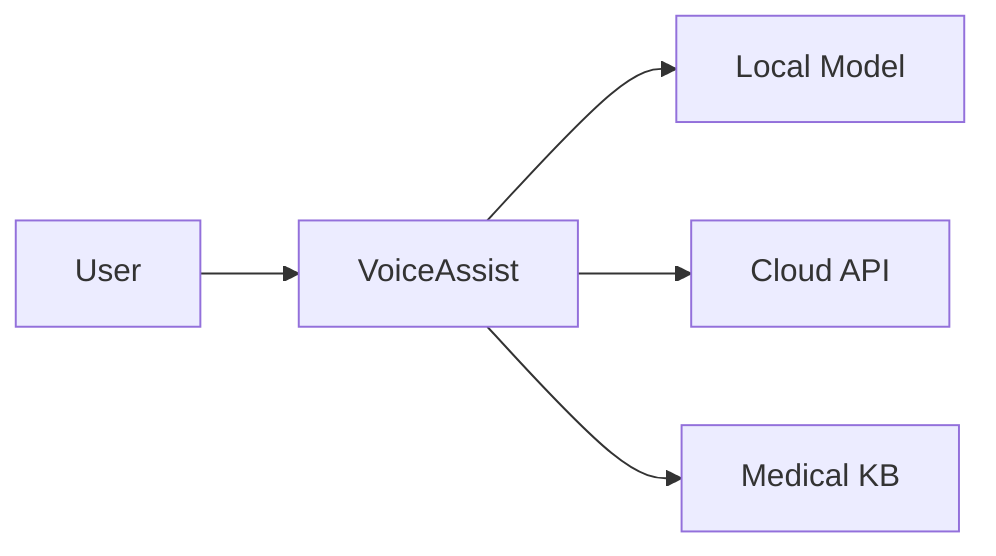

# Documentation Site Specifications

## Overview

The VoiceAssist documentation site provides comprehensive guides, tutorials, and API documentation for users and administrators. Accessible at `docs-voice.asimo.io`.

## Technology Stack

### Framework Options

**Option 1: Next.js with MDX (Recommended)**

- Next.js 14+ with App Router
- MDX for markdown with React components
- Tailwind CSS for styling
- next-themes for dark mode
- Contentlayer or next-mdx-remote for content processing

**Option 2: Docusaurus**

- Facebook's documentation framework
- Built on React
- Out-of-the-box features (search, versioning)
- Large plugin ecosystem

**Recommendation**: Next.js for more customization and consistency with other web apps.

### Additional Tools

- **Search**: Algolia DocSearch (free for open source) or local search
- **Code Highlighting**: Prism.js or Shiki
- **Diagrams**: Mermaid for flowcharts and diagrams
- **Analytics**: Plausible or simple self-hosted
- **Feedback**: thumbs up/down on each page

## Site Structure

### Navigation Layout

```
┌─────────────────────────────────────────────────────┐
│  Header                                              │
│  [Logo] VoiceAssist Docs    [Search] [Dark] [GitHub]│
├──────────────┬──────────────────────────────────────┤
│              │                                       │
│  Sidebar     │  Content Area                        │
│  Nav         │                                       │
│              │  # Page Title                        │
│ Getting      │                                       │
│ Started      │  Content with headings,              │
│ • Welcome    │  code blocks, images, etc.           │
│ • Quick Start│                                       │
│              │                                       │
│ User Guide   │                                       │
│ • Voice Mode │                                       │
│ • Text Mode  │  ┌──────────────────┐               │
│ • Files      │  │ On This Page     │               │
│              │  │ • Section 1      │               │
│ Medical      │  │ • Section 2      │               │
│ Features     │  │ • Section 3      │               │
│ • Textbooks  │  └──────────────────┘               │
│ • Journals   │                                       │
│              │                                       │
│ Admin        │  [← Previous] [Next →]               │
└──────────────┴──────────────────────────────────────┘
```

## Content Organization

### Section 1: Getting Started

#### 1.1 Welcome (`/`)

- What is VoiceAssist?
- Key features overview
- Who is it for?
- Quick demo video/GIF
- System requirements

#### 1.2 Quick Start (`/getting-started/quick-start`)

- 5-minute setup guide
- Access web app (easiest)
- First conversation example
- Basic voice commands

#### 1.3 Installation (`/getting-started/installation`)

**Server Setup**

- Ubuntu server requirements
- Docker installation
- Clone repository
- Environment configuration
- First run

**macOS Client**

- Download installer
- Grant permissions (microphone, accessibility)
- Configuration wizard
- Connect to server

**Web Access**

- Navigate to voiceassist.asimo.io
- Login/register
- Browser compatibility

#### 1.4 Configuration (`/getting-started/configuration`)

- Initial setup wizard
- API keys (OpenAI)
- Integration setup
- First textbook upload

### Section 2: User Guide

#### 2.1 Voice Mode (`/user-guide/voice`)

- Activating voice mode
- Wake word (macOS client)
- Push-to-talk (web)
- Voice commands
- Interrupting the assistant
- Voice settings

#### 2.2 Text Mode (`/user-guide/text`)

- Chat interface
- Message formatting
- Using markdown
- Code blocks
- File attachments

#### 2.3 File Access (`/user-guide/files`)

- Asking about files
- Supported file types
- Privacy considerations
- File indexing
- Search capabilities

#### 2.4 Calendar & Email (`/user-guide/integrations`)

- Calendar commands
  - "What's on my calendar today?"
  - "Schedule a meeting tomorrow at 2pm"
- Email commands
  - "Check my recent emails"
  - "Send an email to..."
- Reminders
- Notes

#### 2.5 Web Search (`/user-guide/web-search`)

- Asking for web information
- How web search works
- Citation handling

#### 2.6 Conversations (`/user-guide/conversations`)

- Starting new conversations
- Viewing history
- Searching past conversations
- Exporting conversations
- Deleting conversations

#### 2.7 Tips & Tricks (`/user-guide/tips`)

- Best practices for questions
- How to get better responses
- Voice command shortcuts
- Keyboard shortcuts
- Common issues and solutions

### Section 3: Medical Features

#### 3.1 Overview (`/medical/overview`)

- Medical capabilities introduction
- Privacy and PHI handling
- Disclaimer

#### 3.2 Medical Textbooks (`/medical/textbooks`)

- How textbook search works
- Example queries
- Citation format
- Reading sections aloud
- Bookmarking

#### 3.3 Medical Journals (`/medical/journals`)

- Searching PubMed
- Downloading PDFs
- Analyzing papers
- Evidence synthesis
- Managing your library

#### 3.4 Clinical Guidelines (`/medical/guidelines`)

- Available guideline sources
- Searching guidelines
- Recommendation formats
- Guideline updates

#### 3.5 OpenEvidence (`/medical/openevidence`)

- What is OpenEvidence
- Setting up integration
- Example queries
- Comparing multiple evidence sources

#### 3.6 Medical Calculators (`/medical/calculators`)

- Available calculators
- Using calculators via voice/text
- Understanding results

#### 3.7 Use Cases (`/medical/use-cases`)

- Pre-clinic preparation
- Literature review
- Clinical questions during rounds
- Research assistance
- CME and learning

#### 3.8 Privacy & HIPAA (`/medical/privacy`)

- Data handling policies
- What stays local vs cloud
- PHI detection
- Compliance considerations
- Best practices

### Section 4: Admin Guide

#### 4.1 Admin Panel Overview (`/admin/overview`)

- Accessing admin panel
- Dashboard tour
- Key metrics

#### 4.2 System Configuration (`/admin/system`)

- System settings
- Environment variables
- Service management

#### 4.3 AI Models (`/admin/models`)

- Selecting models
- Local vs cloud configuration
- Routing logic
- Performance tuning

#### 4.4 Knowledge Base (`/admin/knowledge-base`)

- Uploading textbooks
- Bulk upload
- Indexing process
- Troubleshooting indexing
- Managing documents

#### 4.5 Integrations (`/admin/integrations`)

- Nextcloud setup
- Calendar setup
- Email configuration
- PubMed API
- OpenEvidence API
- Web search setup

#### 4.6 User Management (`/admin/users`)

- Creating users (future)
- Roles and permissions
- Managing sessions

#### 4.7 Analytics (`/admin/analytics`)

- Understanding metrics
- Cost tracking
- Usage patterns

#### 4.8 Security (`/admin/security`)

- Best practices
- Access control
- Audit logs
- Encryption

#### 4.9 Backups (`/admin/backups`)

- Backup configuration
- Manual backups
- Restoring from backup
- Disaster recovery

#### 4.10 Troubleshooting (`/admin/troubleshooting`)

- Common issues
- Log analysis
- Performance optimization
- Getting help

### Section 5: API Documentation (Future)

#### 5.1 REST API (`/api/rest`)

- Authentication
- Endpoints reference
- Request/response examples
- Rate limiting

#### 5.2 WebSocket API (`/api/websocket`)

- Connection setup
- Event types
- Message format
- Error handling

#### 5.3 SDKs (`/api/sdks`)

- Python SDK
- JavaScript SDK
- Examples

### Section 6: Development

#### 6.1 Architecture (`/dev/architecture`)

- System overview
- Component diagram
- Data flow
- Technology stack

#### 6.2 Contributing (`/dev/contributing`)

- Setting up dev environment
- Code style
- Pull request process
- Issue tracking

#### 6.3 Extending VoiceAssist (`/dev/extending`)

- Adding custom tools
- New integrations
- Custom medical sources
- Plugin system (future)

### Section 7: Reference

#### 7.1 Voice Commands (`/reference/voice-commands`)

- Complete list of voice commands
- Categorized by function
- Examples

#### 7.2 Keyboard Shortcuts (`/reference/keyboard-shortcuts`)

- Web app shortcuts
- macOS client shortcuts

#### 7.3 Medical Sources (`/reference/sources`)

- List of textbooks supported
- Journal databases
- Guideline sources
- Update frequency

#### 7.4 FAQ (`/reference/faq`)

- Common questions
- Troubleshooting
- Feature requests

#### 7.5 Glossary (`/reference/glossary`)

- Technical terms
- Medical AI terminology
- Acronyms

#### 7.6 Changelog (`/reference/changelog`)

- Version history
- Release notes
- Breaking changes

## Design & Styling

### Theme

- Consistent with main web app and admin panel
- Professional medical aesthetic
- Dark mode support
- Accessible color contrast

### Typography

- Clear hierarchy
- Code font for technical content
- Medical terminology handling

### Components

#### Code Blocks

```python
# Support syntax highlighting
from voiceassist import VoiceAssist

assistant = VoiceAssist(api_key="...")
response = assistant.query("What is diabetes?")
```

#### Callouts/Admonitions

```
💡 Tip: Use specific medical terms for better results

⚠️ Warning: Never include PHI in queries sent to cloud APIs

❌ Error: This feature requires admin access

ℹ️ Info: Indexing large textbooks may take 10-15 minutes
```

#### Tabbed Content

For showing different options (macOS vs Linux, Python vs JavaScript, etc.)

#### Embedded Videos/GIFs

For tutorials and demonstrations

#### Interactive Examples

- Live code editor (for API examples)
- Voice command tester

#### Diagrams



### Navigation

#### Sidebar

- Collapsible sections
- Active page highlighted
- Progress indicator (for tutorials)

#### Table of Contents

- Right sidebar for page sections
- Sticky on scroll
- Clickable links

#### Breadcrumbs

`Home > Medical Features > Medical Textbooks`

#### Footer

- Links to main app, admin panel
- Social links (if applicable)
- Version number
- Last updated date

### Search

#### Features

- Full-text search across all docs
- Keyboard shortcut (Cmd+K / Ctrl+K)
- Search suggestions
- Recent searches
- Filters (section, topic)

#### Implementation

- Algolia DocSearch (if eligible)
- Or Lunr.js for local search
- Flexsearch for fast client-side search

## Features

### Dark Mode

- Toggle in header
- Persists preference
- Automatic based on system preference

### Feedback System

- Thumbs up/down on each page
- "Was this helpful?" prompt
- Optional comment
- Submit to admin dashboard

### Copy to Clipboard

- One-click code copy
- Copy API endpoints
- Copy command examples

### Page Navigation

- Previous/Next buttons at bottom
- Jump to top button
- Smooth scroll anchors

### Versioning (Future)

- Version selector
- Archive old versions
- Highlight changes

### Print Stylesheet

- Clean print layout
- Remove navigation
- Page breaks

### Offline Access (PWA)

- Service worker for caching
- Offline reading
- Update notification

## Content Guidelines

### Writing Style

- Clear and concise
- Step-by-step instructions
- Lots of examples
- Screenshots where helpful
- Avoid jargon (or explain it)

### Code Examples

- Complete, runnable examples
- Comments explaining key parts
- Multiple languages where applicable
- Link to full example repos

### Medical Content

- Accurate terminology
- Cite sources
- Disclaimer on every medical page
- Clear about limitations

### Updates

- Keep synchronized with app updates
- Version compatibility notes
- Deprecation warnings

## SEO & Metadata

### Meta Tags

- Descriptive titles
- Page descriptions
- Open Graph tags
- Twitter cards

### Sitemap

- Auto-generated XML sitemap
- Submit to search engines

### Structured Data

- Schema.org markup
- Documentation breadcrumbs

## Analytics

### Track

- Page views
- Popular pages
- Search queries (anonymized)
- Feedback responses
- Navigation patterns

### Privacy

- No personal data
- Respect Do Not Track
- Cookie-less if possible
- GDPR compliant

## Deployment

### Build Process

```bash
npm run build
# Generates static site
```

### Hosting

- Nginx on Ubuntu server
- Serve static files
- Reverse proxy if needed
- CDN for assets (optional)

### CI/CD

- Auto-build on content updates
- Deploy to staging first
- Smoke tests
- Auto-deploy to production

### Environment Variables

```
NEXT_PUBLIC_SITE_URL=https://docs-voice.asimo.io
NEXT_PUBLIC_APP_URL=https://voiceassist.asimo.io
NEXT_PUBLIC_ADMIN_URL=https://admin.asimo.io
```

## Maintenance

### Content Updates

- Regular review and updates
- Fix broken links
- Update screenshots
- Add new features

### Monitoring

- Track broken links
- Monitor search queries for gaps
- Review feedback
- Update based on support tickets

### Community

- Accept contributions (PRs)
- Issue tracking for doc bugs
- Discussion forum (GitHub Discussions?)

## Accessibility

### WCAG 2.1 AA Compliance

- Semantic HTML
- ARIA labels
- Keyboard navigation
- Screen reader friendly
- Color contrast
- Focus indicators

### Testing

- Automated accessibility testing
- Manual screen reader testing
- Keyboard-only navigation test

## Multilingual Support (Future)

### Languages

- English (primary)
- Spanish
- Arabic (given Islamic app background)
- Others based on demand

### Implementation

- next-intl or similar
- Language selector
- Translated content in separate files
- Machine translation + manual review

## Example Pages

### Example: Quick Start Page Structure

```markdown
---
title: Quick Start
description: Get started with VoiceAssist in 5 minutes
---

# Quick Start

Get up and running with VoiceAssist in just 5 minutes.

## Prerequisites

Before you begin, ensure you have:

- [ ] An OpenAI API key
- [ ] Access to voiceassist.asimo.io (or local installation)

## Step 1: Access the Web App

Navigate to [voiceassist.asimo.io](https://voiceassist.asimo.io) in your browser.

<Screenshot src="/images/quickstart-login.png" alt="Login page" />

## Step 2: Log In

Enter your credentials or register a new account.

## Step 3: Your First Query

Try asking a simple question:

<InteractiveExample>
"What is the mechanism of action of metformin?"
</InteractiveExample>

You should see a response with citations.

## Step 4: Enable Voice Mode

Click the microphone icon and grant permission.

<Video src="/videos/enable-voice.mp4" />

Now you can speak your questions!

## Next Steps

- [Learn about medical textbook queries →](/medical/textbooks)
- [Set up integrations →](/user-guide/integrations)
- [Upload your first textbook →](/admin/knowledge-base)

## Need Help?

- [FAQ](/reference/faq)
- [Troubleshooting](/admin/troubleshooting)
- Report issues on [GitHub](https://github.com/...)
```

## Open Source Considerations (Optional)

If making documentation public:

- License (MIT, Apache, CC BY)
- Contribution guidelines
- Code of conduct
- Issue templates
- PR templates

## Future Enhancements

- Interactive tutorials
- Video library
- Webinars/workshops
- Certification program (for medical users)
- API playground
- Community examples gallery
- Plugin marketplace docs
