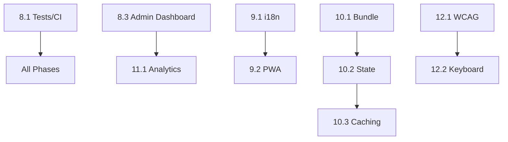

# VoiceAssist Frontend Completion Plan

## Executive Summary

This document outlines the comprehensive implementation plan for completing the VoiceAssist frontend MVP. Based on thorough codebase analysis, the frontend is approximately **65% complete** with solid foundations in place.

**Current State Assessment:**

| Area                  | Status                                     | Readiness |
| --------------------- | ------------------------------------------ | --------- |
| Test Infrastructure   | Vitest configured, ESM fixes applied       | 70%       |
| Offline Voice Capture | `useOfflineVoiceCapture` fully implemented | 90%       |
| Admin Dashboard       | 10 components exist, needs wiring          | 60%       |
| i18n Setup            | Config scaffolding only                    | 15%       |
| PWA Configuration     | Not started                                | 0%        |
| Voice Features        | Extensive implementation                   | 85%       |
| Bundle/Performance    | Good foundation                            | 70%       |
| Analytics/Monitoring  | Sentry complete, no analytics              | 75%       |
| Accessibility         | Basic components, no automation            | 45%       |
| CI/CD                 | Strong backend, needs frontend focus       | 70%       |

**Estimated Total Effort:** 180-240 hours (9-12 weeks at 20 hrs/week)

---

## Phase 8: Polish & Production Readiness

### 8.1 Fix Test Failures & CI Issues

**Estimate:** 4-6 hours | **Priority:** CRITICAL | **Risk:** Low

#### Current State

- Vitest 1.6.1 configured with memory optimization (`pool: 'forks'`, `maxConcurrency: 3`)
- ESM import issues already addressed via `inline: ['refractor', 'remark-gfm', ...]`
- 578 tests passing, 9 skipped
- Bandit configured in `.bandit`, runs in CI
- Trivy container scanning configured in `trivy.yaml`

#### Tasks

| Task                          | File(s)                            | Hours | Notes                                        |
| ----------------------------- | ---------------------------------- | ----- | -------------------------------------------- |
| Review ESM mock in test setup | `apps/web-app/src/test/setup.ts`   | 1     | Verify react-syntax-highlighter mock         |
| Add frontend linting to CI    | `.github/workflows/ci.yml`         | 1.5   | Add eslint + prettier check job              |
| Address Bandit HIGH findings  | `services/api-gateway/app/**/*.py` | 1     | Run `bandit -r services/api-gateway/app -ll` |
| Fix Trivy container issues    | `Dockerfile`, `trivy.yaml`         | 1     | Upgrade base images, fix CVEs                |
| Add type-check job to CI      | `.github/workflows/ci.yml`         | 0.5   | `pnpm tsc --noEmit`                          |
| Document test exclusions      | `vitest.config.mts`                | 0.5   | Add comments for OOM exclusions              |

#### Implementation

```yaml
# Add to .github/workflows/ci.yml
frontend-lint:
  runs-on: ubuntu-latest
  steps:
    - uses: actions/checkout@v4
    - uses: pnpm/action-setup@v2
    - run: pnpm install --frozen-lockfile
    - run: pnpm lint
    - run: pnpm tsc --noEmit
```

---

### 8.2 Complete Offline Voice Capture

**Estimate:** 8-12 hours | **Priority:** HIGH | **Risk:** Medium

#### Current State

- `useOfflineVoiceCapture.ts` (479 lines) - FULLY IMPLEMENTED
- IndexedDB storage with proper schema (`voiceassist-offline` DB)
- Recording lifecycle management (pending → uploading → uploaded → failed)
- Auto-sync on connectivity restoration
- Integration with `VoiceModePanel.tsx` exists

#### Gap Analysis

- No storage quota management
- No audio compression before storage
- UI indicator exists but may need polish
- Background sync API not used

#### Tasks

| Task                         | File(s)                     | Hours | Notes                                |
| ---------------------------- | --------------------------- | ----- | ------------------------------------ |
| Add storage quota management | `useOfflineVoiceCapture.ts` | 2     | Check `navigator.storage.estimate()` |
| Implement audio compression  | `useOfflineVoiceCapture.ts` | 3     | Use Web Audio API or lamejs          |
| Polish pending count UI      | `VoiceModePanel.tsx`        | 1.5   | Badge with animation                 |
| Add sync progress indicator  | `VoiceModePanel.tsx`        | 1.5   | Progress bar during upload           |
| Implement cleanup strategy   | `useOfflineVoiceCapture.ts` | 1.5   | Delete old recordings after 7 days   |
| Add retry backoff logic      | `useOfflineVoiceCapture.ts` | 1     | Exponential backoff on failures      |
| Write integration tests      | `__tests__/`                | 2     | Mock IndexedDB with fake-indexeddb   |

#### Implementation Notes

```typescript
// Storage quota management
async function checkStorageQuota() {
  if (navigator.storage?.estimate) {
    const { usage, quota } = await navigator.storage.estimate();
    const percentUsed = (usage! / quota!) * 100;
    if (percentUsed > 80) {
      await cleanupOldRecordings();
    }
  }
}
```

---

### 8.3 Admin Dashboard Enhancements

**Estimate:** 12-16 hours | **Priority:** HIGH | **Risk:** Medium

#### Current State

- 10 admin components in `/apps/web-app/src/components/admin/`
- `WebSocketStatusPanel.tsx` - Polls every 5 seconds
- `AnalyticsDashboard.tsx` - Placeholder data
- `UserManagement.tsx` - UI exists
- `KnowledgeBaseManager.tsx` - Basic UI
- Backend APIs exist for all features

#### Tasks

| Task                           | File(s)                             | Hours | Notes                                   |
| ------------------------------ | ----------------------------------- | ----- | --------------------------------------- |
| Wire real-time WS monitoring   | `WebSocketStatusPanel.tsx`          | 2     | Use actual WebSocket instead of polling |
| Connect user management CRUD   | `UserManagement.tsx`, `adminApi.ts` | 3     | Wire to `/api/admin/users`              |
| Implement charts with Recharts | `MetricsCharts.tsx`                 | 3     | Install recharts, add visualizations    |
| Wire audit log to real API     | `AuditLogViewer.tsx`                | 2     | Connect to `/api/admin/audit-logs`      |
| Add KB document preview        | `KnowledgeBaseManager.tsx`          | 2     | Modal with document content             |
| Wire analytics to real data    | `AnalyticsDashboard.tsx`            | 2.5   | Connect to `/api/admin/analytics`       |
| Add RBAC UI indicators         | All admin components                | 1.5   | Show disabled state for unauthorized    |

#### API Endpoints to Wire

```typescript
// Already in adminApi.ts - need to verify/connect:
GET  /api/admin/websocket-status
GET  /api/admin/system-health
GET  /api/admin/analytics
GET  /api/admin/users
POST /api/admin/users
PUT  /api/admin/users/:id
DELETE /api/admin/users/:id
GET  /api/admin/audit-logs
GET  /api/admin/kb/documents
```

---

## Phase 9: Advanced Features

### 9.1 Multi-Language Support (i18n)

**Estimate:** 16-20 hours | **Priority:** MEDIUM | **Risk:** Medium

#### Current State

- Config scaffolding in `/packages/config/i18n.ts`
- Supports: English (full), Arabic (planned RTL), Spanish, French
- No react-i18next installed
- No translation files

#### Tasks

| Task                               | File(s)                                    | Hours | Notes                                                             |
| ---------------------------------- | ------------------------------------------ | ----- | ----------------------------------------------------------------- |
| Install react-i18next              | `package.json`                             | 0.5   | `pnpm add react-i18next i18next i18next-browser-languagedetector` |
| Create i18n provider setup         | `apps/web-app/src/lib/i18n.ts`             | 2     | Configure with language detection                                 |
| Extract English strings            | `locales/en.json`                          | 4     | ~200 user-facing strings                                          |
| Create Arabic translations         | `locales/ar.json`                          | 3     | RTL language support                                              |
| Implement language switcher        | `components/settings/LanguageSwitcher.tsx` | 2     | Dropdown in header/settings                                       |
| Add RTL layout support             | `index.css`, layout components             | 3     | dir="rtl" and CSS adjustments                                     |
| Create useTranslation hook wrapper | `hooks/useI18n.ts`                         | 1     | Type-safe translations                                            |
| Test RTL in all components         | All components                             | 2.5   | Manual + snapshot tests                                           |
| Add i18n to CI                     | `.github/workflows/`                       | 1     | Check for missing translations                                    |

#### Implementation

```typescript
// apps/web-app/src/lib/i18n.ts
import i18n from "i18next";
import { initReactI18next } from "react-i18next";
import LanguageDetector from "i18next-browser-languagedetector";

i18n
  .use(LanguageDetector)
  .use(initReactI18next)
  .init({
    resources: {
      en: { translation: require("../locales/en.json") },
      ar: { translation: require("../locales/ar.json") },
    },
    fallbackLng: "en",
    interpolation: { escapeValue: false },
  });
```

---

### 9.2 Mobile Responsiveness & PWA

**Estimate:** 12-16 hours | **Priority:** MEDIUM | **Risk:** Low

#### Current State

- No PWA infrastructure
- No manifest.json
- No service worker
- Tailwind CSS with some responsive classes

#### Tasks

| Task                              | File(s)                            | Hours | Notes                        |
| --------------------------------- | ---------------------------------- | ----- | ---------------------------- |
| Install vite-plugin-pwa           | `package.json`, `vite.config.ts`   | 1     | Auto-generates manifest + SW |
| Create manifest.json              | `public/manifest.json`             | 1     | App metadata, icons          |
| Configure service worker          | `vite.config.ts`                   | 2     | Workbox strategies           |
| Add app icons (192x192, 512x512)  | `public/icons/`                    | 1     | PWA icon requirements        |
| Audit responsive breakpoints      | All layout components              | 3     | Mobile-first review          |
| Fix voice mode touch interactions | `VoiceModePanel.tsx`               | 2     | Touch-friendly buttons       |
| Add install prompt UI             | `components/pwa/InstallPrompt.tsx` | 2     | "Add to home screen"         |
| Test on mobile devices            | N/A                                | 2     | iOS Safari, Android Chrome   |
| Add offline fallback page         | `public/offline.html`              | 1     | Graceful offline experience  |

#### Implementation

```typescript
// vite.config.ts
import { VitePWA } from "vite-plugin-pwa";

export default defineConfig({
  plugins: [
    react(),
    VitePWA({
      registerType: "autoUpdate",
      manifest: {
        name: "VoiceAssist",
        short_name: "VoiceAssist",
        theme_color: "#2563eb",
        icons: [
          { src: "/icons/icon-192.png", sizes: "192x192", type: "image/png" },
          { src: "/icons/icon-512.png", sizes: "512x512", type: "image/png" },
        ],
      },
      workbox: {
        runtimeCaching: [
          { urlPattern: /^https:\/\/api\./, handler: "NetworkFirst" },
          { urlPattern: /\.(?:png|jpg|svg)$/, handler: "CacheFirst" },
        ],
      },
    }),
  ],
});
```

---

### 9.3 Enhanced Voice Features

**Estimate:** 20-30 hours | **Priority:** MEDIUM | **Risk:** High

#### Current State

- `VoiceModePanel.tsx` (38KB) - Extensive implementation
- `useRealtimeVoiceSession.ts` (34KB) - WebRTC management
- `waveform.ts` - Canvas-based visualization EXISTS
- `vad.ts` - Voice activity detection EXISTS
- `VoiceMetricsDisplay.tsx` - Latency/performance metrics

#### Tasks

| Task                          | File(s)                               | Hours | Notes                      |
| ----------------------------- | ------------------------------------- | ----- | -------------------------- |
| Integrate waveform visualizer | `VoiceModePanel.tsx`                  | 3     | Use existing `waveform.ts` |
| Add frequency spectrum view   | `utils/waveform.ts`                   | 3     | Alternative visualization  |
| Implement wake word detection | `hooks/useWakeWord.ts`                | 5     | "Hey Assistant" trigger    |
| Add voice command shortcuts   | `hooks/useVoiceCommands.ts`           | 4     | "Stop", "Repeat", etc.     |
| Create voice memo mode        | `components/voice/VoiceMemoMode.tsx`  | 4     | Quick note recording       |
| Add voice-to-text editing     | `components/chat/VoiceTextEditor.tsx` | 4     | Edit transcripts inline    |
| Speaker diarization (defer)   | -                                     | -     | Requires backend changes   |
| Add voice settings presets    | `stores/voiceSettingsStore.ts`        | 2     | Save/load configurations   |

#### Wake Word Implementation

```typescript
// hooks/useWakeWord.ts
import { useEffect, useRef } from "react";

export function useWakeWord(wakePhrase: string = "hey assistant", onActivate: () => void) {
  const recognitionRef = useRef<SpeechRecognition | null>(null);

  useEffect(() => {
    const SpeechRecognition = window.SpeechRecognition || window.webkitSpeechRecognition;
    if (!SpeechRecognition) return;

    const recognition = new SpeechRecognition();
    recognition.continuous = true;
    recognition.interimResults = true;

    recognition.onresult = (event) => {
      const transcript = Array.from(event.results)
        .map((r) => r[0].transcript.toLowerCase())
        .join("");

      if (transcript.includes(wakePhrase)) {
        onActivate();
      }
    };

    recognition.start();
    recognitionRef.current = recognition;

    return () => recognition.stop();
  }, [wakePhrase, onActivate]);
}
```

---

## Phase 10: Performance & Scalability

### 10.1 Bundle Optimization

**Estimate:** 8-12 hours | **Priority:** MEDIUM | **Risk:** Low

#### Current State

- Vite with SWC compiler
- Route-based lazy loading via React.lazy()
- No bundle analysis configured

#### Tasks

| Task                           | File(s)                              | Hours | Notes                       |
| ------------------------------ | ------------------------------------ | ----- | --------------------------- |
| Add rollup-plugin-visualizer   | `vite.config.ts`                     | 1     | Bundle size analysis        |
| Analyze current bundle         | N/A                                  | 2     | Identify large dependencies |
| Lazy load BranchTree           | `components/chat/BranchTree.tsx`     | 1     | Heavy component             |
| Lazy load chart components     | `components/admin/MetricsCharts.tsx` | 1     | Recharts is large           |
| Optimize markdown imports      | Various                              | 2     | Tree-shake remark/rehype    |
| Add manual chunks config       | `vite.config.ts`                     | 1.5   | Vendor splitting            |
| Set up bundle size CI check    | `.github/workflows/`                 | 1.5   | Fail if bundle > threshold  |
| Implement import cost warnings | `.vscode/settings.json`              | 0.5   | Import Cost extension       |

#### Implementation

```typescript
// vite.config.ts
import { visualizer } from "rollup-plugin-visualizer";

export default defineConfig({
  build: {
    rollupOptions: {
      output: {
        manualChunks: {
          "react-vendor": ["react", "react-dom", "react-router-dom"],
          "ui-vendor": ["@voiceassist/ui"],
          "chart-vendor": ["recharts"],
        },
      },
    },
  },
  plugins: [visualizer({ open: true, filename: "dist/stats.html" })],
});
```

---

### 10.2 State Management Optimization

**Estimate:** 8-12 hours | **Priority:** MEDIUM | **Risk:** Low

#### Current State

- Zustand for state management
- React Query installed but underutilized
- No visible React.memo usage audit

#### Tasks

| Task                                  | File(s)                    | Hours | Notes                         |
| ------------------------------------- | -------------------------- | ----- | ----------------------------- |
| Profile renders with React DevTools   | N/A                        | 2     | Identify expensive re-renders |
| Add React.memo to heavy components    | Various                    | 2     | MessageBubble, BranchTree     |
| Implement virtualization for messages | `MessageList.tsx`          | 2     | Already using react-virtuoso  |
| Add useDeferredValue for search       | `ConversationsSidebar.tsx` | 1     | Defer search filtering        |
| Optimize Zustand selectors            | All stores                 | 1.5   | Use shallow equality          |
| Add React Query provider              | `App.tsx`                  | 1.5   | Global query client           |
| Convert admin API to React Query      | `hooks/useAdminQuery.ts`   | 2     | Better caching                |

---

### 10.3 Caching & Data Fetching

**Estimate:** 12-16 hours | **Priority:** MEDIUM | **Risk:** Medium

#### Tasks

| Task                               | File(s)                    | Hours | Notes                         |
| ---------------------------------- | -------------------------- | ----- | ----------------------------- |
| Configure React Query defaults     | `lib/queryClient.ts`       | 2     | staleTime, cacheTime          |
| Add optimistic updates             | Various mutations          | 3     | Immediate UI feedback         |
| Implement background refresh       | Query configs              | 2     | refetchOnWindowFocus          |
| Cache WebSocket reconnection state | `useChatSession.ts`        | 3     | Restore messages on reconnect |
| Add conversation prefetching       | `ConversationsSidebar.tsx` | 2     | Prefetch on hover             |
| Implement request deduplication    | `apiClient.ts`             | 2     | Prevent duplicate fetches     |
| Add offline-first mutations        | `conversationsApi.ts`      | 2     | Queue mutations when offline  |

---

## Phase 11: Analytics & Observability

### 11.1 User Analytics

**Estimate:** 8-12 hours | **Priority:** LOW | **Risk:** Low

#### Current State

- No analytics service integrated
- Sentry for errors only

#### Tasks

| Task                       | File(s)             | Hours | Notes                               |
| -------------------------- | ------------------- | ----- | ----------------------------------- |
| Choose analytics provider  | N/A                 | 1     | Recommend Plausible (privacy-first) |
| Install Plausible script   | `index.html`        | 0.5   | Simple script tag                   |
| Track page views           | Router setup        | 1     | Automatic with react-router         |
| Track key events           | Various             | 3     | Voice session start, message sent   |
| Create custom goals        | Plausible dashboard | 1     | Feature adoption metrics            |
| Add UTM parameter handling | `lib/analytics.ts`  | 1.5   | Campaign tracking                   |
| Privacy policy update      | `docs/`             | 1     | Document data collection            |
| Create analytics dashboard | Internal docs       | 2     | Usage patterns report               |

---

### 11.2 Error Monitoring Enhancements

**Estimate:** 6-8 hours | **Priority:** MEDIUM | **Risk:** Low

#### Current State

- Sentry fully configured in `lib/sentry.ts`
- Voice-specific error capture
- PHI redaction enabled

#### Tasks

| Task                             | File(s)                                  | Hours | Notes                  |
| -------------------------------- | ---------------------------------------- | ----- | ---------------------- |
| Add error boundary to all routes | `AppRoutes.tsx`                          | 1.5   | Catch rendering errors |
| Enhance user context             | `sentry.ts`                              | 1     | Add conversation ID    |
| Configure performance monitoring | `sentry.ts`                              | 1.5   | Transaction sampling   |
| Add user feedback widget         | `components/feedback/FeedbackButton.tsx` | 2     | Sentry user feedback   |
| Set up Sentry alerts             | Sentry dashboard                         | 1     | Email on new issues    |
| Add release health tracking      | CI pipeline                              | 1     | Track regression rate  |

---

### 11.3 Voice Mode Metrics

**Estimate:** 8-12 hours | **Priority:** MEDIUM | **Risk:** Low

#### Current State

- `VoiceMetricsDisplay.tsx` exists
- `useRealtimeVoiceSession` tracks metrics
- Sentry integration for SLO violations

#### Tasks

| Task                           | File(s)                                      | Hours | Notes                        |
| ------------------------------ | -------------------------------------------- | ----- | ---------------------------- |
| Create voice metrics dashboard | `components/voice/VoiceMetricsDashboard.tsx` | 3     | Historical metrics view      |
| Track end-to-end STT latency   | `useRealtimeVoiceSession.ts`                 | 2     | From utterance to transcript |
| Add session duration tracking  | `voiceSettingsStore.ts`                      | 1.5   | Time spent in voice mode     |
| Monitor audio quality metrics  | `useRealtimeVoiceSession.ts`                 | 2     | Sample rate, bitrate         |
| Create health check endpoint   | Backend API                                  | 2     | Voice service status         |
| Add metrics export             | `lib/metrics.ts`                             | 1.5   | Download as CSV              |

---

## Phase 12: Accessibility & Compliance

### 12.1 WCAG 2.1 AA Compliance

**Estimate:** 12-16 hours | **Priority:** HIGH | **Risk:** Medium

#### Current State

- `LiveRegion.tsx`, `SkipLink.tsx` exist
- `ACCESSIBILITY_AUDIT.md` documents issues
- No automated testing

#### Tasks

| Task                 | File(s)                 | Hours | Notes                  |
| -------------------- | ----------------------- | ----- | ---------------------- |
| Install axe-core     | `package.json`          | 0.5   | `@axe-core/react`      |
| Run automated audit  | All pages               | 2     | Generate issue list    |
| Fix critical issues  | Various                 | 4     | Color contrast, labels |
| Fix serious issues   | Various                 | 3     | Focus order, ARIA      |
| Add focus management | Modal components        | 2     | Focus trapping         |
| Test with VoiceOver  | Manual                  | 2     | macOS screen reader    |
| Test with NVDA       | Manual                  | 2     | Windows screen reader  |
| Document compliance  | `docs/ACCESSIBILITY.md` | 1     | VPAT-style report      |

#### Implementation

```typescript
// Add to test setup
import { axe, toHaveNoViolations } from 'jest-axe';
expect.extend(toHaveNoViolations);

// In component tests
it('should have no accessibility violations', async () => {
  const { container } = render(<MyComponent />);
  const results = await axe(container);
  expect(results).toHaveNoViolations();
});
```

---

### 12.2 Keyboard Navigation

**Estimate:** 8-12 hours | **Priority:** HIGH | **Risk:** Low

#### Current State

- `useKeyboardShortcuts.ts` exists
- Basic keyboard support

#### Tasks

| Task                          | File(s)                                         | Hours | Notes                |
| ----------------------------- | ----------------------------------------------- | ----- | -------------------- |
| Audit keyboard navigation     | All interactive elements                        | 2     | Tab order review     |
| Add focus trapping to modals  | `components/ui/Modal.tsx`                       | 2     | Use focus-trap-react |
| Implement roving tabindex     | `MessageList.tsx`, `ConversationsSidebar.tsx`   | 2     | Arrow key navigation |
| Add keyboard hints overlay    | `components/keyboard/ShortcutsOverlay.tsx`      | 2     | Press ? to show      |
| Create accessibility settings | `components/settings/AccessibilitySettings.tsx` | 1.5   | Reduced motion, etc. |
| Add skip links                | `MainLayout.tsx`                                | 1     | Skip to main content |
| Test keyboard-only navigation | Manual                                          | 1.5   | Full app flow        |

---

## Implementation Schedule

### Recommended Order (Critical Path)

```
Week 1-2:  Phase 8.1 (Tests/CI) + 8.3 (Admin Dashboard)
Week 3:    Phase 8.2 (Offline Voice) + 12.1 (Accessibility)
Week 4-5:  Phase 9.1 (i18n)
Week 6:    Phase 9.2 (PWA) + 12.2 (Keyboard)
Week 7-8:  Phase 10.1-10.3 (Performance)
Week 9:    Phase 11.1-11.3 (Analytics)
Week 10+:  Phase 9.3 (Enhanced Voice) - ongoing
```

### Dependencies



---

## Risk Mitigation

| Risk                         | Mitigation                                                        |
| ---------------------------- | ----------------------------------------------------------------- |
| Wake word detection accuracy | Use browser SpeechRecognition API first, evaluate 3rd party later |
| RTL layout breaking          | Test incrementally, use logical CSS properties                    |
| Bundle size explosion        | Set CI size limits, monitor with visualizer                       |
| PWA caching issues           | Use NetworkFirst for API, CacheFirst for assets                   |
| i18n string extraction       | Use automated extraction tools (i18next-parser)                   |

---

## Success Metrics

| Phase | Metric                          | Target                   |
| ----- | ------------------------------- | ------------------------ |
| 8.1   | Test pass rate                  | 100%                     |
| 8.2   | Offline recordings sync success | >95%                     |
| 8.3   | Admin API coverage              | 100% endpoints wired     |
| 9.1   | Translation coverage            | >95% strings             |
| 9.2   | Lighthouse PWA score            | >90                      |
| 10.1  | Bundle size                     | <500KB gzipped           |
| 10.2  | Unnecessary re-renders          | <5% of renders           |
| 11.1  | Analytics coverage              | All key events tracked   |
| 12.1  | axe violations                  | 0 critical/serious       |
| 12.2  | Keyboard-only usability         | 100% features accessible |

---

## File Change Summary

### New Files to Create

```
apps/web-app/src/lib/i18n.ts
apps/web-app/src/locales/en.json
apps/web-app/src/locales/ar.json
apps/web-app/src/components/settings/LanguageSwitcher.tsx
apps/web-app/src/components/pwa/InstallPrompt.tsx
apps/web-app/src/hooks/useWakeWord.ts
apps/web-app/src/hooks/useVoiceCommands.ts
apps/web-app/src/components/voice/VoiceMemoMode.tsx
apps/web-app/src/components/feedback/FeedbackButton.tsx
apps/web-app/src/components/keyboard/ShortcutsOverlay.tsx
apps/web-app/src/components/settings/AccessibilitySettings.tsx
apps/web-app/public/manifest.json
apps/web-app/public/offline.html
apps/web-app/public/icons/icon-192.png
apps/web-app/public/icons/icon-512.png
```

### Files to Modify

```
apps/web-app/vite.config.ts (PWA, bundle analysis)
apps/web-app/src/App.tsx (i18n provider, React Query)
apps/web-app/src/hooks/useChatSession.ts (caching)
apps/web-app/src/components/voice/VoiceModePanel.tsx (waveform, wake word)
apps/web-app/src/components/admin/*.tsx (API wiring)
apps/web-app/src/lib/sentry.ts (enhanced monitoring)
.github/workflows/ci.yml (frontend checks)
```

---

_Document generated: 2025-11-26_
_Author: Claude Code_
