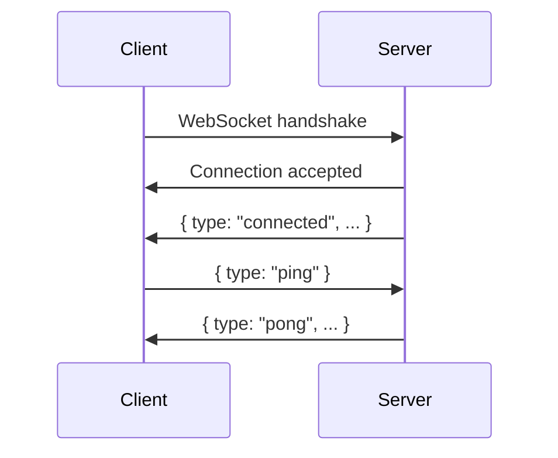
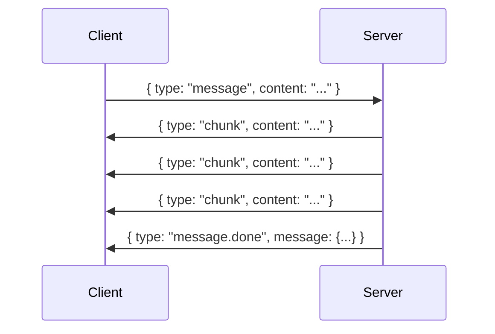
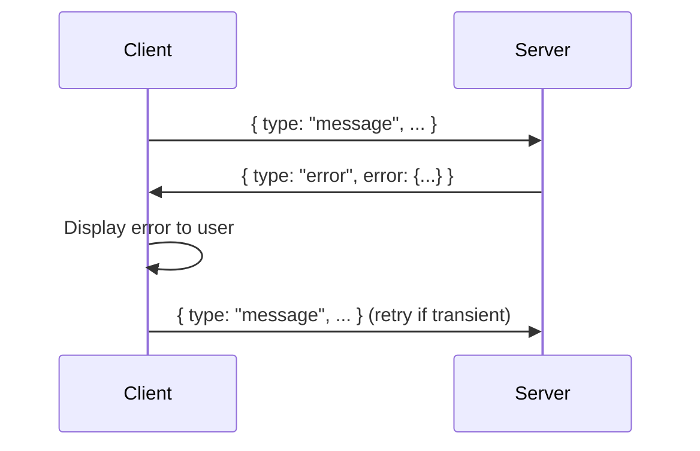
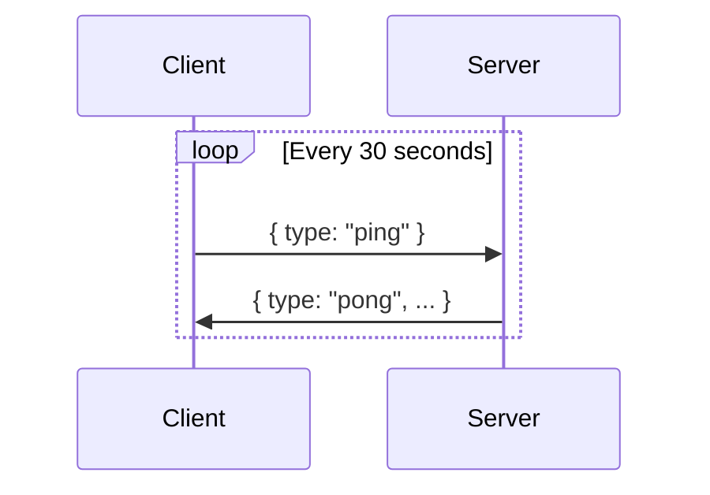
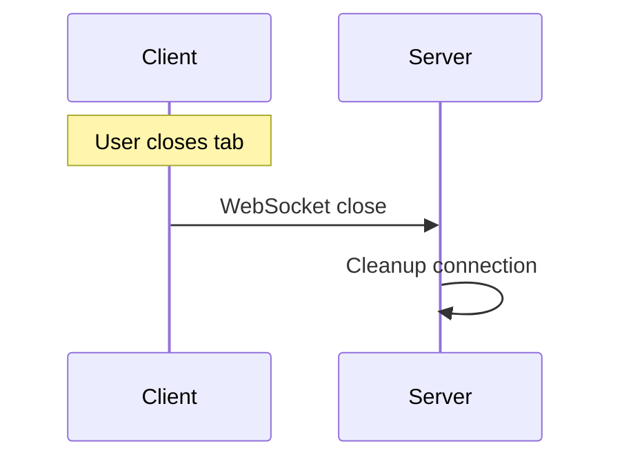

# WebSocket Protocol Specification

**Version:** 1.0
**Last Updated:** 2025-11-27
**Status:** Production

**Related Documentation:**

- [Realtime Architecture](REALTIME_ARCHITECTURE.md) - System architecture
- [Voice Mode Pipeline](VOICE_MODE_PIPELINE.md) - Voice implementation
- [Thinker-Talker Pipeline](THINKER_TALKER_PIPELINE.md) - T/T voice architecture
- [Voice Pipeline WebSocket API](api-reference/voice-pipeline-ws.md) - T/T WebSocket protocol
- [Implementation Status](overview/IMPLEMENTATION_STATUS.md) - Component status

---

## WebSocket Endpoints

VoiceAssist provides multiple WebSocket endpoints:

| Endpoint                      | Purpose                        | Protocol Doc                                               |
| ----------------------------- | ------------------------------ | ---------------------------------------------------------- |
| `/api/realtime/ws`            | Chat streaming                 | This document                                              |
| `/api/voice/pipeline-ws`      | Thinker-Talker voice (Primary) | [voice-pipeline-ws.md](api-reference/voice-pipeline-ws.md) |
| `/api/voice/realtime-session` | OpenAI Realtime (Legacy)       | [VOICE_MODE_PIPELINE.md](VOICE_MODE_PIPELINE.md)           |

---

## Chat Streaming Protocol

## Overview

The VoiceAssist WebSocket protocol enables real-time bidirectional communication between the web client and backend server for chat streaming. This document specifies the message format, event types, and connection lifecycle.

### Connection Endpoint

**Development:**

```
ws://localhost:8000/api/realtime/ws
```

**Production:**

```
wss://assist.asimo.io/api/realtime/ws
```

### Query Parameters

| Parameter        | Type   | Required | Description                         |
| ---------------- | ------ | -------- | ----------------------------------- |
| `conversationId` | string | Yes      | UUID of the conversation            |
| `token`          | string | Yes      | JWT access token for authentication |

### Example Connection

```typescript
const url = new URL("ws://localhost:8000/api/realtime/ws");
url.searchParams.append("conversationId", "conversation-uuid");
url.searchParams.append("token", "jwt-access-token");

const ws = new WebSocket(url.toString());
```

---

## Message Protocol

All messages are JSON-encoded. Field names use **camelCase** convention.

### Client → Server Messages

#### 1. Send Message

Send a chat message to the assistant.

```json
{
  "type": "message",
  "content": "What are the treatment protocols for hypertension?",
  "session_id": "conversation-uuid",
  "attachments": []
}
```

**Fields:**

- `type`: Always `"message"`
- `content`: User's message text (string, required)
- `session_id`: Conversation/session identifier (string, optional)
- `attachments`: Array of attachment IDs (string[], optional)

#### 2. Ping (Heartbeat)

Keep the connection alive.

```json
{
  "type": "ping"
}
```

**Response:** Server will respond with `pong` message

---

### Server → Client Messages

#### 1. Connection Established

Sent immediately after connection is established.

```json
{
  "type": "connected",
  "client_id": "uuid-v4",
  "timestamp": "2025-11-22T10:00:00.000Z",
  "protocol_version": "1.0",
  "capabilities": ["text_streaming"]
}
```

**Fields:**

- `type`: Always `"connected"`
- `client_id`: Unique identifier for this client connection
- `timestamp`: ISO 8601 timestamp
- `protocol_version`: Protocol version string
- `capabilities`: Array of supported features

#### 2. Message Chunk (Streaming)

Sent while assistant response is being generated.

```json
{
  "type": "chunk",
  "messageId": "msg-uuid",
  "content": "Treatment protocols for hypertension include..."
}
```

**Fields:**

- `type`: Always `"chunk"`
- `messageId`: UUID of the message being streamed
- `content`: Partial response text

**Notes:**

- Multiple chunks are sent for a single message
- Chunks should be appended in order
- No `chunkIndex` field - order is guaranteed by WebSocket

#### 3. Message Complete

Sent when assistant response is fully generated.

```json
{
  "type": "message.done",
  "messageId": "msg-uuid",
  "message": {
    "id": "msg-uuid",
    "role": "assistant",
    "content": "Complete response text...",
    "citations": [
      {
        "id": "cite-1",
        "source": "kb",
        "reference": "Hypertension Guidelines 2024",
        "snippet": "First-line therapy includes..."
      }
    ],
    "timestamp": 1700000000000
  },
  "timestamp": "2025-11-22T10:00:05.000Z"
}
```

**Fields:**

- `type`: Always `"message.done"`
- `messageId`: UUID of the completed message
- `message`: Complete message object
  - `id`: Message UUID
  - `role`: Always `"assistant"` for bot responses
  - `content`: Complete response text
  - `citations`: Array of citation objects (optional)
  - `timestamp`: Unix timestamp in milliseconds
- `timestamp`: ISO 8601 timestamp of completion

**Citation Object:**

```typescript
{
  id: string;           // Unique identifier
  source: 'kb' | 'url'; // Source type
  reference: string;    // Document title or URL
  snippet?: string;     // Relevant excerpt
  page?: number;        // Page number (for documents)
}
```

#### 4. Error

Sent when an error occurs.

```json
{
  "type": "error",
  "messageId": "msg-uuid",
  "timestamp": "2025-11-22T10:00:00.000Z",
  "error": {
    "code": "BACKEND_ERROR",
    "message": "Failed to process query: Network timeout"
  }
}
```

**Fields:**

- `type`: Always `"error"`
- `messageId`: UUID of the message that caused the error (optional)
- `timestamp`: ISO 8601 timestamp
- `error`: Error object
  - `code`: Error code (see Error Codes below)
  - `message`: Human-readable error description

**Error Codes:**

| Code                 | Description           | Action                               |
| -------------------- | --------------------- | ------------------------------------ |
| `AUTH_FAILED`        | Authentication failed | Disconnect, redirect to login        |
| `RATE_LIMITED`       | Too many requests     | Show notification, wait before retry |
| `QUOTA_EXCEEDED`     | Usage quota exceeded  | Disconnect, show upgrade prompt      |
| `INVALID_EVENT`      | Malformed message     | Log error, continue                  |
| `BACKEND_ERROR`      | Server error          | Show notification, allow retry       |
| `CONNECTION_DROPPED` | Connection lost       | Auto-reconnect                       |

#### 5. Pong (Heartbeat Response)

Response to client ping.

```json
{
  "type": "pong",
  "timestamp": "2025-11-22T10:00:00.000Z"
}
```

**Fields:**

- `type`: Always `"pong"`
- `timestamp`: ISO 8601 timestamp

---

## Connection Lifecycle

### 1. Connection Establishment



### 2. Message Exchange



### 3. Error Handling



### 4. Heartbeat



### 5. Disconnection



---

## Client Implementation Guide

### Connection Management

**Best Practices:**

1. **Automatic Reconnection**
   - Reconnect on unexpected disconnections
   - Use exponential backoff (1s, 2s, 4s, 8s, 16s)
   - Max 5 reconnection attempts
   - Reset counter on successful connection

2. **Heartbeat**
   - Send ping every 30 seconds
   - Timeout if no pong received in 5 seconds
   - Trigger reconnection on timeout

3. **Connection States**
   ```typescript
   type ConnectionStatus = "connecting" | "connected" | "reconnecting" | "disconnected";
   ```

### Message Handling

**Streaming Response Pattern:**

```typescript
let streamingMessage = null;

function handleMessage(data: WebSocketEvent) {
  switch (data.type) {
    case "chunk":
      if (!streamingMessage) {
        streamingMessage = {
          id: data.messageId,
          role: "assistant",
          content: data.content,
          timestamp: Date.now(),
        };
      } else {
        streamingMessage.content += data.content;
      }
      updateUI(streamingMessage);
      break;

    case "message.done":
      streamingMessage = null;
      addMessage(data.message);
      break;

    case "error":
      handleError(data.error);
      streamingMessage = null;
      break;
  }
}
```

### Error Handling

**Fatal Errors** (disconnect immediately):

- `AUTH_FAILED`
- `QUOTA_EXCEEDED`

**Transient Errors** (show notification, allow retry):

- `RATE_LIMITED`
- `BACKEND_ERROR`

**Recoverable Errors** (auto-reconnect):

- `CONNECTION_DROPPED`

### Example Implementation

See reference implementation: `/apps/web-app/src/hooks/useChatSession.ts`

---

## Server Implementation Guide

### Message Validation

1. Validate all incoming messages against schema
2. Check authentication token on connection
3. Verify conversation/session access
4. Sanitize user input before processing

### Response Streaming

1. Send chunks as they are generated
2. Keep chunks reasonably sized (50-100 characters)
3. Send `message.done` with complete message
4. Include citations in final message only

### Error Reporting

1. Always include error code
2. Provide actionable error messages
3. Log full error details server-side
4. Don't expose sensitive information

### Example Implementation

See reference implementation: `/services/api-gateway/app/api/realtime.py`

---

## Security Considerations

### Authentication

- JWT token required in query parameter
- Validate token on connection
- Reject unauthorized connections immediately
- Token should be short-lived (15 minutes)

### Input Validation

- Validate all incoming JSON
- Sanitize user content
- Limit message length (10,000 characters)
- Rate limit messages (10/minute per user)

### Data Protection

- Use TLS/SSL in production (`wss://`)
- Don't log sensitive user content
- Implement PHI redaction in logs
- Follow HIPAA compliance guidelines

---

## Testing

### Manual Testing

**Connection Test:**

```javascript
const ws = new WebSocket("ws://localhost:8000/api/realtime/ws?conversationId=test&token=test-token");

ws.onopen = () => console.log("Connected");
ws.onmessage = (event) => console.log("Received:", JSON.parse(event.data));
ws.send(
  JSON.stringify({
    type: "message",
    content: "Test message",
    session_id: "test-session",
  }),
);
```

**Ping Test:**

```javascript
ws.send(JSON.stringify({ type: "ping" }));
// Expect: { type: 'pong', timestamp: '...' }
```

### Automated Testing

See test file: `/apps/web-app/src/hooks/__tests__/useChatSession.test.ts`

---

## Changelog

### Version 1.0 (2025-11-22)

**Breaking Changes:**

- Changed `message_chunk` → `chunk`
- Changed `message_complete` → `message.done`
- Changed `message_id` → `messageId` (camelCase)
- Changed citation field names to match frontend types

**Additions:**

- Added `connected` event on connection
- Added `session_id` support in client messages
- Added heartbeat protocol (`ping`/`pong`)

**Fixes:**

- Fixed field name inconsistencies
- Fixed missing `messageId` in error events
- Fixed timestamp format (added milliseconds to message object)

---

## Future Enhancements

### Phase 2: Voice Streaming

**New Event Types:**

- `voice.start` - Start voice streaming
- `voice.chunk` - Audio chunk (base64-encoded)
- `voice.end` - End voice streaming

### Phase 3: Voice Activity Detection

**New Event Types:**

- `vad.speech_start` - User started speaking
- `vad.speech_end` - User stopped speaking

### Phase 4: Turn-Taking

**New Event Types:**

- `interrupt` - User interrupted assistant
- `resume` - Resume previous response

---

## Support

**Questions or Issues:**

- GitHub Issues: https://github.com/mohammednazmy/VoiceAssist/issues
- Documentation: `/docs/`
- API Reference: `/docs/API_REFERENCE.md`

---

**Document Version:** 1.0
**Last Updated:** 2025-11-22
**Maintainer:** VoiceAssist Development Team
