# VoiceAssist V2 - Architecture Diagrams

**Last Updated**: 2025-11-20 (Phase 7)
**Purpose**: Visual architecture diagrams for system understanding

---

## Table of Contents

1. [System Context Diagram](#system-context-diagram)
2. [Container Diagram](#container-diagram)
3. [Component Diagram](#component-diagram)
4. [Data Flow Diagrams](#data-flow-diagrams)
5. [Deployment Diagram](#deployment-diagram)
6. [Sequence Diagrams](#sequence-diagrams)

---

## System Context Diagram

High-level view of VoiceAssist and its external dependencies.

```mermaid
graph TB
    User[("👤 Clinician/User<br/>(Browser/Mobile)")]
    Admin[("👨‍💼 Admin<br/>(Browser)")]

    VA["🏥 VoiceAssist V2<br/>(Medical AI Assistant)<br/>Port: 8000"]

    NC["☁️ Nextcloud<br/>(Separate Stack)<br/>Port: 8080"]
    OpenAI["🤖 OpenAI API<br/>(Embeddings + LLM)"]

    User -->|"HTTP/WebSocket<br/>Query, Chat"| VA
    Admin -->|"HTTP<br/>Manage KB, View Dashboard"| VA

    VA -->|"CalDAV/WebDAV<br/>Calendar, Files"| NC
    VA -->|"OIDC (Future)<br/>Authentication"| NC
    VA -->|"Embeddings<br/>LLM Generation"| OpenAI

    NC -.->|"Stores Files"| User
    NC -.->|"Manages Calendar"| User

    style VA fill:#e1f5ff
    style NC fill:#fff4e1
    style OpenAI fill:#f0e1ff
```

---

## Container Diagram

Internal containers within VoiceAssist system.

---

## Component Diagram

Internal components of the API Gateway application.

```mermaid
graph TB
    subgraph "API Gateway (FastAPI Application)"
        subgraph "API Layer (app/api/)"
            AuthAPI["🔐 Auth API<br/>(/api/auth/*)"]
            RealtimeAPI["💬 Realtime API<br/>(/api/realtime/ws)"]
            AdminKB["📚 Admin KB API<br/>(/api/admin/kb/*)"]
            AdminPanel["🎛️ Admin Panel API<br/>(/api/admin/panel/*)"]
            IntegAPI["🔗 Integration API<br/>(/api/integrations/*)"]
            MetricsAPI["📊 Metrics API<br/>(/metrics)"]
        end

        subgraph "Service Layer (app/services/)"
            RAG["🧠 RAG Service<br/>(QueryOrchestrator)"]
            LLM["🤖 LLM Client<br/>(OpenAI Interface)"]
            KB["📖 KB Indexer<br/>(Document Ingestion)"]
            Search["🔍 Search Aggregator<br/>(Semantic Search)"]
            Cache["💾 Cache Service<br/>(L1 + L2)"]
            Audit["📝 Audit Service<br/>(Compliance Logging)"]
            CalDAV["📅 CalDAV Service<br/>(Calendar Ops)"]
            FileIdx["📁 File Indexer<br/>(Nextcloud Files)"]
            TokenRev["🚫 Token Revocation<br/>(Redis Blacklist)"]
        end

        subgraph "Core Layer (app/core/)"
            Security["🔒 Security<br/>(JWT, bcrypt)"]
            Database["🗄️ Database<br/>(SQLAlchemy Sessions)"]
            Config["⚙️ Config<br/>(Pydantic Settings)"]
            Envelope["📦 API Envelope<br/>(Response Format)"]
            Metrics["📈 Metrics<br/>(Prometheus Defs)"]
        end

        subgraph "Models Layer (app/models/)"
            UserModel["User Model"]
            AuditModel["Audit Log Model"]
            SessionModel["Session Model"]
        end
    end

    %% API to Service connections
    AuthAPI --> Security
    AuthAPI --> TokenRev
    AuthAPI --> Audit

    RealtimeAPI --> RAG

    AdminKB --> KB
    AdminKB --> Audit

    IntegAPI --> CalDAV
    IntegAPI --> FileIdx

    MetricsAPI --> Metrics

    %% Service to Service connections
    RAG --> Search
    RAG --> LLM
    RAG --> Cache

    Search --> Cache

    KB --> LLM

    FileIdx --> KB

    %% Service to Core connections
    RAG --> Database
    KB --> Database
    Audit --> Database

    TokenRev --> Cache

    %% Core to Models connections
    Database --> UserModel
    Database --> AuditModel
    Database --> SessionModel

    style AuthAPI fill:#ffe1e1
    style RealtimeAPI fill:#e1f5ff
    style AdminKB fill:#fff4e1
    style RAG fill:#e1ffe1
    style Cache fill:#f0e1ff
```

---

## Data Flow Diagrams

### RAG Query Flow

### Document Indexing Flow

### Authentication Flow

---

## Deployment Diagram

### Current Deployment (Docker Compose - Phases 0-7)

```mermaid
graph TB
    subgraph "Host Machine (MacBook Pro / Ubuntu Server)"
        subgraph "Docker Network: voiceassist_network"
            Server["📦 voiceassist-server<br/>(FastAPI)<br/>Port: 8000<br/>2 CPU, 4GB RAM"]
            Worker["📦 voiceassist-worker<br/>(ARQ)<br/>1 CPU, 2GB RAM"]

            PG["📦 postgres<br/>(pgvector/pgvector:pg16)<br/>Port: 5432<br/>2 CPU, 4GB RAM"]
            Redis["📦 redis<br/>(redis:7-alpine)<br/>Port: 6379<br/>1 CPU, 1GB RAM"]
            Qdrant["📦 qdrant<br/>(qdrant/qdrant:latest)<br/>Port: 6333<br/>2 CPU, 4GB RAM"]

            Prom["📦 prometheus<br/>(prom/prometheus)<br/>Port: 9090"]
            Graf["📦 grafana<br/>(grafana/grafana)<br/>Port: 3000"]
        end

        subgraph "Volumes"
            PGData["💾 postgres_data"]
            RedisData["💾 redis_data"]
            QdrantData["💾 qdrant_data"]
        end
    end

    subgraph "External"
        NC["☁️ Nextcloud<br/>(Separate Stack)<br/>localhost:8080 or<br/>cloud.asimo.io"]
        OpenAI["🤖 OpenAI API<br/>(api.openai.com)"]
    end

    Browser["🌐 Browser"] -->|"HTTP :8000"| Server
    Browser -->|"WS :8000"| Server
    Browser -->|"HTTP :3000"| Graf

    Server --> PG
    Server --> Redis
    Server --> Qdrant
    Server --> NC
    Server --> OpenAI

    Worker --> Redis
    Worker --> Qdrant
    Worker --> OpenAI

    Server --> Prom
    Worker --> Prom
    Prom --> Graf

    PG -.->|"Persists"| PGData
    Redis -.->|"Persists"| RedisData
    Qdrant -.->|"Persists"| QdrantData

    style Server fill:#e1f5ff
    style Worker fill:#e1ffe1
    style PG fill:#ffe1e1
    style Redis fill:#fff4e1
    style Qdrant fill:#f0e1ff
```

### Future Deployment (Kubernetes - Phases 11-14)

```mermaid
graph TB
    subgraph "Kubernetes Cluster"
        subgraph "Ingress Layer"
            Ingress["⚡ Ingress Controller<br/>(Nginx/Kong)<br/>SSL Termination"]
        end

        subgraph "Service Mesh (Linkerd)"
            Gateway["🌐 API Gateway<br/>(2-5 replicas)"]
            Auth["🔐 Auth Service<br/>(2-3 replicas)"]
            Realtime["💬 Realtime Service<br/>(3-10 replicas)"]
            RAGSvc["🧠 RAG Service<br/>(3-10 replicas)"]
            Admin["🎛️ Admin Service<br/>(2 replicas)"]
        end

        subgraph "Data Layer (StatefulSets)"
            PGPrimary["🗄️ PostgreSQL<br/>Primary"]
            PGReplica1["🗄️ PostgreSQL<br/>Replica 1"]
            PGReplica2["🗄️ PostgreSQL<br/>Replica 2"]

            RedisMaster["🔴 Redis<br/>Master"]
            RedisSlave["🔴 Redis<br/>Slave"]

            QdrantCluster["🔍 Qdrant<br/>Cluster (3 nodes)"]
        end

        subgraph "Observability"
            PromHA["📊 Prometheus<br/>(HA Pair)"]
            GrafCluster["📈 Grafana"]
            Jaeger["🔍 Jaeger"]
            Loki["📝 Loki"]
        end
    end

    Internet["🌐 Internet"] -->|"HTTPS"| Ingress
    Ingress --> Gateway

    Gateway --> Auth
    Gateway --> Realtime
    Gateway --> RAGSvc
    Gateway --> Admin

    Auth --> PGPrimary
    Realtime --> RAGSvc
    RAGSvc --> QdrantCluster
    RAGSvc --> RedisMaster

    PGPrimary -.->|"Replication"| PGReplica1
    PGPrimary -.->|"Replication"| PGReplica2
    RedisMaster -.->|"Replication"| RedisSlave

    Gateway --> PromHA
    Auth --> PromHA
    Realtime --> PromHA
    RAGSvc --> PromHA

    PromHA --> GrafCluster
    PromHA --> Loki

    Gateway --> Jaeger
    Auth --> Jaeger
    Realtime --> Jaeger
    RAGSvc --> Jaeger

    style Ingress fill:#ffe1e1
    style Gateway fill:#e1f5ff
    style RAGSvc fill:#e1ffe1
    style PGPrimary fill:#ffe1e1
    style QdrantCluster fill:#f0e1ff
```

---

## Sequence Diagrams

### Calendar Event Creation

### File Auto-Indexing from Nextcloud

---

## Related Documentation

- [UNIFIED_ARCHITECTURE.md](../UNIFIED_ARCHITECTURE.md) - Comprehensive architecture doc
- [SERVICE_CATALOG.md](../SERVICE_CATALOG.md) - Service descriptions
- [DATA_MODEL.md](../DATA_MODEL.md) - Data entities

---

**Last Updated**: 2025-11-20
**Diagram Format**: Mermaid (render with Mermaid.js or GitHub/GitLab)
**Review Cycle**: Updated with major architecture changes
