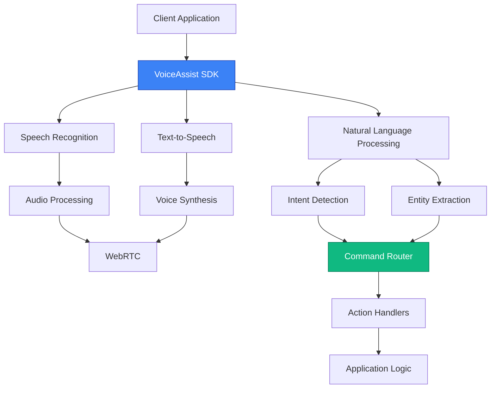

# VoiceAssist Documentation Site - Feature Specifications

**Document Version:** 1.0.0
**Last Updated:** 2025-11-21
**Status:** Planning Phase

---

## Table of Contents

1. [Overview](#overview)
2. [Content Management Features](#content-management-features)
3. [Interactive Elements Features](#interactive-elements-features)
4. [Navigation Features](#navigation-features)
5. [Technical Implementation](#technical-implementation)
6. [Content Structure](#content-structure)
7. [Deployment Strategy](#deployment-strategy)

---

## Overview

### Technology Stack

The VoiceAssist Documentation Site is built on a modern, performant stack optimized for content-rich documentation:

**Core Framework:**

- **Next.js 14** with App Router for enhanced performance and React Server Components
- **React 18** with concurrent features
- **TypeScript** for type safety

**Content Management:**

- **MDX** for rich, interactive documentation
- **Contentlayer** for type-safe content transformation
- **Gray-matter** for frontmatter parsing

**Styling:**

- **Tailwind CSS 3.4+** for utility-first styling
- **CSS Variables** for theming
- **Tailwind Typography** for prose styling

**Search:**

- **Algolia DocSearch** for instant, typo-tolerant search
- **Keyboard shortcuts** (Cmd+K / Ctrl+K)

**Syntax Highlighting:**

- **Shiki** for beautiful code highlighting
- **Multiple themes** support (light/dark)

**Diagrams:**

- **Mermaid.js** for flowcharts, sequence diagrams, and more

**Deployment:**

- **Vercel** for zero-config deployments
- **Cloudflare CDN** as alternative

### Architecture Goals

1. **Performance First:** Sub-second page loads, optimized images, streaming SSR
2. **Developer Experience:** Hot reload, type safety, clear component architecture
3. **Content Flexibility:** Easy authoring in MDX with rich components
4. **Accessibility:** WCAG 2.1 AA compliance, keyboard navigation
5. **SEO Optimized:** Semantic HTML, meta tags, sitemap generation
6. **Scalability:** Support 1000+ pages without performance degradation

### Project Structure

```
voiceassist-docs/
├── app/                          # Next.js 14 App Router
│   ├── layout.tsx               # Root layout
│   ├── page.tsx                 # Homepage
│   ├── docs/                    # Documentation routes
│   │   ├── layout.tsx          # Docs layout with sidebar
│   │   └── [...slug]/          # Dynamic doc pages
│   │       └── page.tsx
│   ├── api/                     # API routes
│   │   └── search/
│   └── globals.css              # Global styles
├── components/                   # React components
│   ├── MDXComponents.tsx        # MDX component mapping
│   ├── Navigation/              # Navigation components
│   ├── Interactive/             # Interactive elements
│   └── Layout/                  # Layout components
├── content/                      # MDX content
│   ├── docs/
│   │   ├── getting-started/
│   │   ├── api-reference/
│   │   └── guides/
│   └── blog/
├── contentlayer.config.ts       # Contentlayer configuration
├── lib/                          # Utility functions
├── public/                       # Static assets
└── styles/                       # Additional styles
```

---

## Content Management Features

### Feature 1.1: MDX-based Content System

**Priority:** P0 (Critical)
**Effort:** 3 days
**Dependencies:** Next.js 14, Contentlayer

#### Specification

A robust MDX-based content system that allows technical writers to create rich documentation with React components embedded in Markdown. The system must support:

- Standard Markdown syntax (GFM)
- React component imports and usage
- Frontmatter metadata
- Code blocks with syntax highlighting
- Automatic slug generation
- Type-safe content queries

#### Implementation

**contentlayer.config.ts:**

```typescript
import { defineDocumentType, makeSource } from "contentlayer/source-files";
import rehypeAutolinkHeadings from "rehype-autolink-headings";
import rehypePrettyCode from "rehype-pretty-code";
import rehypeSlug from "rehype-slug";
import remarkGfm from "remark-gfm";

export const Doc = defineDocumentType(() => ({
  name: "Doc",
  filePathPattern: `docs/**/*.mdx`,
  contentType: "mdx",
  fields: {
    title: {
      type: "string",
      required: true,
    },
    description: {
      type: "string",
      required: true,
    },
    category: {
      type: "enum",
      options: ["getting-started", "api-reference", "guides", "examples"],
      required: true,
    },
    order: {
      type: "number",
      required: false,
    },
    published: {
      type: "boolean",
      default: true,
    },
    tags: {
      type: "list",
      of: { type: "string" },
    },
    author: {
      type: "string",
      required: false,
    },
    lastModified: {
      type: "date",
      required: false,
    },
    version: {
      type: "string",
      required: false,
    },
  },
  computedFields: {
    slug: {
      type: "string",
      resolve: (doc) => doc._raw.flattenedPath.replace(/^docs\//, ""),
    },
    slugAsParams: {
      type: "string",
      resolve: (doc) => doc._raw.flattenedPath.split("/").slice(1).join("/"),
    },
    url: {
      type: "string",
      resolve: (doc) => `/docs/${doc._raw.flattenedPath.replace(/^docs\//, "")}`,
    },
    headings: {
      type: "json",
      resolve: async (doc) => {
        const headingsRegex = /^(#{1,6})\s+(.+)$/gm;
        const headings: { level: number; text: string; slug: string }[] = [];
        let match;

        while ((match = headingsRegex.exec(doc.body.raw)) !== null) {
          const level = match[1].length;
          const text = match[2];
          const slug = text
            .toLowerCase()
            .replace(/[^a-z0-9]+/g, "-")
            .replace(/(^-|-$)/g, "");

          headings.push({ level, text, slug });
        }

        return headings;
      },
    },
  },
}));

export default makeSource({
  contentDirPath: "./content",
  documentTypes: [Doc],
  mdx: {
    remarkPlugins: [remarkGfm],
    rehypePlugins: [
      rehypeSlug,
      [
        rehypePrettyCode,
        {
          theme: {
            dark: "github-dark-dimmed",
            light: "github-light",
          },
          keepBackground: false,
        },
      ],
      [
        rehypeAutolinkHeadings,
        {
          behavior: "wrap",
          properties: {
            className: ["anchor"],
          },
        },
      ],
    ],
  },
});
```

**components/MDXComponents.tsx:**

```typescript
import Image from 'next/image'
import Link from 'next/link'
import { Callout } from './Callout'
import { CodeBlock } from './CodeBlock'
import { CodePlayground } from './CodePlayground'
import { Tabs, Tab } from './Tabs'
import { Steps } from './Steps'

const components = {
  // HTML elements
  h1: ({ children, ...props }: any) => (
    <h1 className="text-4xl font-bold tracking-tight mt-8 mb-4" {...props}>
      {children}
    </h1>
  ),
  h2: ({ children, ...props }: any) => (
    <h2 className="text-3xl font-semibold tracking-tight mt-10 mb-4 border-b pb-2" {...props}>
      {children}
    </h2>
  ),
  h3: ({ children, ...props }: any) => (
    <h3 className="text-2xl font-semibold tracking-tight mt-8 mb-3" {...props}>
      {children}
    </h3>
  ),
  h4: ({ children, ...props }: any) => (
    <h4 className="text-xl font-semibold tracking-tight mt-6 mb-2" {...props}>
      {children}
    </h4>
  ),
  p: ({ children, ...props }: any) => (
    <p className="leading-7 mb-4" {...props}>
      {children}
    </p>
  ),
  a: ({ href, children, ...props }: any) => {
    const isExternal = href?.startsWith('http')
    const Component = isExternal ? 'a' : Link

    return (
      <Component
        href={href}
        className="font-medium text-blue-600 hover:text-blue-800 dark:text-blue-400 dark:hover:text-blue-300 underline underline-offset-4"
        {...(isExternal && { target: '_blank', rel: 'noopener noreferrer' })}
        {...props}
      >
        {children}
      </Component>
    )
  },
  ul: ({ children, ...props }: any) => (
    <ul className="list-disc list-inside space-y-2 mb-4" {...props}>
      {children}
    </ul>
  ),
  ol: ({ children, ...props }: any) => (
    <ol className="list-decimal list-inside space-y-2 mb-4" {...props}>
      {children}
    </ol>
  ),
  li: ({ children, ...props }: any) => (
    <li className="leading-7" {...props}>
      {children}
    </li>
  ),
  code: ({ children, className, ...props }: any) => {
    // Inline code
    if (!className) {
      return (
        <code
          className="relative rounded bg-gray-100 dark:bg-gray-800 px-[0.3rem] py-[0.2rem] font-mono text-sm"
          {...props}
        >
          {children}
        </code>
      )
    }

    // Block code (handled by rehype-pretty-code)
    return <code className={className} {...props}>{children}</code>
  },
  pre: ({ children, ...props }: any) => (
    <pre
      className="mb-4 overflow-x-auto rounded-lg bg-gray-900 dark:bg-gray-950 p-4"
      {...props}
    >
      {children}
    </pre>
  ),
  blockquote: ({ children, ...props }: any) => (
    <blockquote
      className="border-l-4 border-gray-300 dark:border-gray-700 pl-4 italic my-4"
      {...props}
    >
      {children}
    </blockquote>
  ),
  table: ({ children, ...props }: any) => (
    <div className="overflow-x-auto my-6">
      <table className="min-w-full divide-y divide-gray-200 dark:divide-gray-700" {...props}>
        {children}
      </table>
    </div>
  ),
  thead: ({ children, ...props }: any) => (
    <thead className="bg-gray-50 dark:bg-gray-800" {...props}>
      {children}
    </thead>
  ),
  th: ({ children, ...props }: any) => (
    <th
      className="px-6 py-3 text-left text-xs font-medium text-gray-500 dark:text-gray-400 uppercase tracking-wider"
      {...props}
    >
      {children}
    </th>
  ),
  td: ({ children, ...props }: any) => (
    <td className="px-6 py-4 whitespace-nowrap text-sm" {...props}>
      {children}
    </td>
  ),

  // Custom components
  Image: (props: any) => <Image {...props} />,
  Callout,
  CodeBlock,
  CodePlayground,
  Tabs,
  Tab,
  Steps,
}

export default components
```

**app/docs/[...slug]/page.tsx:**

```typescript
import { notFound } from 'next/navigation'
import { allDocs } from 'contentlayer/generated'
import { Mdx } from '@/components/mdx-components'
import { TableOfContents } from '@/components/toc'
import { DocsPager } from '@/components/pager'
import { Metadata } from 'next'

interface DocPageProps {
  params: {
    slug: string[]
  }
}

async function getDocFromParams(params: DocPageProps['params']) {
  const slug = params.slug?.join('/') || ''
  const doc = allDocs.find((doc) => doc.slugAsParams === slug)

  if (!doc) {
    null
  }

  return doc
}

export async function generateMetadata({
  params,
}: DocPageProps): Promise<Metadata> {
  const doc = await getDocFromParams(params)

  if (!doc) {
    return {}
  }

  return {
    title: doc.title,
    description: doc.description,
    openGraph: {
      title: doc.title,
      description: doc.description,
      type: 'article',
      url: doc.url,
    },
    twitter: {
      card: 'summary_large_image',
      title: doc.title,
      description: doc.description,
    },
  }
}

export async function generateStaticParams(): Promise<DocPageProps['params'][]> {
  return allDocs.map((doc) => ({
    slug: doc.slugAsParams.split('/'),
  }))
}

export default async function DocPage({ params }: DocPageProps) {
  const doc = await getDocFromParams(params)

  if (!doc || !doc.published) {
    notFound()
  }

  return (
    <div className="flex gap-10">
      <article className="flex-1 min-w-0">
        <div className="mb-8">
          <h1 className="text-4xl font-bold tracking-tight">{doc.title}</h1>
          <p className="text-lg text-gray-600 dark:text-gray-400 mt-2">
            {doc.description}
          </p>
          {doc.version && (
            <div className="mt-2 text-sm text-gray-500">
              Version: {doc.version}
            </div>
          )}
        </div>

        <Mdx code={doc.body.code} />

        <DocsPager doc={doc} />
      </article>

      <aside className="hidden xl:block w-64 flex-shrink-0">
        <div className="sticky top-20">
          <TableOfContents headings={doc.headings} />
        </div>
      </aside>
    </div>
  )
}
```

**Example MDX Content (content/docs/getting-started/installation.mdx):**

````mdx
---
title: Installation
description: Get started with VoiceAssist in minutes
category: getting-started
order: 1
published: true
tags: [setup, installation, quickstart]
version: "1.0.0"
---

import { Callout } from "@/components/Callout";
import { Steps } from "@/components/Steps";
import { Tabs, Tab } from "@/components/Tabs";

# Installation

Get VoiceAssist up and running in your project in just a few minutes.

<Callout type="info">Before you begin, make sure you have Node.js 18 or later installed.</Callout>

## Prerequisites

Ensure you have the following installed:

- Node.js 18.0.0 or later
- npm, yarn, or pnpm
- A modern browser (Chrome, Firefox, Safari, or Edge)

## Installation Steps

<Steps>

### Install the package

Choose your preferred package manager:

<Tabs>
  <Tab label="npm">
    ```bash
    npm install voiceassist
    ```
  </Tab>

<Tab label="yarn">```bash yarn add voiceassist ```</Tab>

  <Tab label="pnpm">
    ```bash
    pnpm add voiceassist
    ```
  </Tab>
</Tabs>

### Configure your API key

Create a `.env.local` file in your project root:

```env
VOICEASSIST_API_KEY=your_api_key_here
VOICEASSIST_REGION=us-east-1
```
````

<Callout type="warning">
  Never commit your API key to version control. Add `.env.local` to your `.gitignore` file.
</Callout>

### Initialize the client

Create a new file `lib/voiceassist.ts`:

```typescript
import { VoiceAssist } from "voiceassist";

export const voiceAssist = new VoiceAssist({
  apiKey: process.env.VOICEASSIST_API_KEY!,
  region: process.env.VOICEASSIST_REGION,
  options: {
    language: "en-US",
    enableLogging: process.env.NODE_ENV === "development",
  },
});
```

### Verify installation

Run the following command to verify your setup:

```bash
npm run voiceassist:verify
```

</Steps>

## Next Steps

Now that you have VoiceAssist installed, you can:

<!-- NOTE: These are example placeholder routes for the docs template -->

- Create your first voice command (see voice mode guides)
- Explore the API reference (see /ai/api)
- Check out examples (see usage documentation)

<Callout type="success">
  Installation complete! You're ready to build amazing voice experiences.
</Callout>
```

---

### Feature 1.2: Version Control Integration

**Priority:** P1 (High)
**Effort:** 2 days
**Dependencies:** Git, GitHub/GitLab

#### Specification

Seamless version control integration that tracks content changes, enables collaboration, and maintains documentation history. Features include:

- Automatic last-modified timestamps
- Git-based edit history
- "Edit on GitHub" links
- Contributor attribution
- Content versioning for different product versions

#### Implementation

**lib/git-utils.ts:**

```typescript
import { execSync } from "child_process";
import path from "path";

export interface GitFileInfo {
  lastModified: Date;
  author: string;
  authorEmail: string;
  commitHash: string;
  contributors: Array<{
    name: string;
    email: string;
    commits: number;
  }>;
}

export function getGitFileInfo(filePath: string): GitFileInfo | null {
  try {
    const absolutePath = path.join(process.cwd(), filePath);

    // Get last commit info
    const lastCommit = execSync(`git log -1 --format="%ai|%an|%ae|%H" -- "${absolutePath}"`, {
      encoding: "utf-8",
    }).trim();

    if (!lastCommit) return null;

    const [dateStr, author, authorEmail, commitHash] = lastCommit.split("|");

    // Get all contributors
    const contributorsOutput = execSync(`git log --format="%an|%ae" -- "${absolutePath}" | sort | uniq -c | sort -rn`, {
      encoding: "utf-8",
    }).trim();

    const contributors = contributorsOutput
      .split("\n")
      .filter(Boolean)
      .map((line) => {
        const match = line.trim().match(/^\s*(\d+)\s+(.+)\|(.+)$/);
        if (!match) return null;

        return {
          name: match[2],
          email: match[3],
          commits: parseInt(match[1], 10),
        };
      })
      .filter(Boolean) as GitFileInfo["contributors"];

    return {
      lastModified: new Date(dateStr),
      author,
      authorEmail,
      commitHash,
      contributors,
    };
  } catch (error) {
    console.error("Error getting git info:", error);
    return null;
  }
}

export function getEditUrl(filePath: string, repo: string): string {
  const branch = "main";
  return `https://github.com/${repo}/edit/${branch}/${filePath}`;
}
```

**components/DocFooter.tsx:**

```typescript
'use client'

import { useState, useEffect } from 'react'
import Link from 'next/link'
import { GitBranch, Clock, Users, Github } from 'lucide-react'

interface DocFooterProps {
  filePath: string
  repository: string
  lastModified?: Date
  contributors?: Array<{
    name: string
    email: string
    commits: number
  }>
}

export function DocFooter({
  filePath,
  repository,
  lastModified,
  contributors = [],
}: DocFooterProps) {
  const [mounted, setMounted] = useState(false)

  useEffect(() => {
    setMounted(true)
  }, [])

  const editUrl = `https://github.com/${repository}/edit/main/${filePath}`
  const historyUrl = `https://github.com/${repository}/commits/main/${filePath}`

  const topContributors = contributors.slice(0, 3)

  return (
    <footer className="mt-12 pt-8 border-t border-gray-200 dark:border-gray-800">
      <div className="grid grid-cols-1 md:grid-cols-2 gap-6">
        {/* Last Modified */}
        <div className="flex items-start gap-3">
          <Clock className="w-5 h-5 text-gray-400 mt-0.5" />
          <div>
            <h3 className="text-sm font-medium mb-1">Last Updated</h3>
            {mounted && lastModified ? (
              <time
                dateTime={lastModified.toISOString()}
                className="text-sm text-gray-600 dark:text-gray-400"
              >
                {lastModified.toLocaleDateString('en-US', {
                  year: 'numeric',
                  month: 'long',
                  day: 'numeric',
                })}
              </time>
            ) : (
              <span className="text-sm text-gray-600 dark:text-gray-400">
                Recently
              </span>
            )}
          </div>
        </div>

        {/* Contributors */}
        {topContributors.length > 0 && (
          <div className="flex items-start gap-3">
            <Users className="w-5 h-5 text-gray-400 mt-0.5" />
            <div>
              <h3 className="text-sm font-medium mb-1">Contributors</h3>
              <div className="flex flex-wrap gap-2">
                {topContributors.map((contributor) => (
                  <span
                    key={contributor.email}
                    className="text-sm text-gray-600 dark:text-gray-400"
                    title={`${contributor.commits} commits`}
                  >
                    {contributor.name}
                  </span>
                ))}
                {contributors.length > 3 && (
                  <span className="text-sm text-gray-500">
                    +{contributors.length - 3} more
                  </span>
                )}
              </div>
            </div>
          </div>
        )}
      </div>

      {/* Action Links */}
      <div className="flex flex-wrap gap-4 mt-6">
        <Link
          href={editUrl}
          target="_blank"
          rel="noopener noreferrer"
          className="inline-flex items-center gap-2 text-sm text-blue-600 hover:text-blue-800 dark:text-blue-400"
        >
          <Github className="w-4 h-4" />
          Edit this page
        </Link>

        <Link
          href={historyUrl}
          target="_blank"
          rel="noopener noreferrer"
          className="inline-flex items-center gap-2 text-sm text-blue-600 hover:text-blue-800 dark:text-blue-400"
        >
          <GitBranch className="w-4 h-4" />
          View history
        </Link>
      </div>
    </footer>
  )
}
```

**Enhanced app/docs/[...slug]/page.tsx:**

```typescript
import { DocFooter } from '@/components/DocFooter'
import { getGitFileInfo } from '@/lib/git-utils'

export default async function DocPage({ params }: DocPageProps) {
  const doc = await getDocFromParams(params)

  if (!doc || !doc.published) {
    notFound()
  }

  // Get git info
  const gitInfo = getGitFileInfo(doc._raw.sourceFilePath)

  return (
    <div className="flex gap-10">
      <article className="flex-1 min-w-0">
        {/* ... existing content ... */}

        <DocFooter
          filePath={doc._raw.sourceFilePath}
          repository="yourusername/voiceassist"
          lastModified={gitInfo?.lastModified}
          contributors={gitInfo?.contributors}
        />
      </article>

      {/* ... sidebar ... */}
    </div>
  )
}
```

---

### Feature 1.3: Multi-language Support

**Priority:** P2 (Medium)
**Effort:** 4 days
**Dependencies:** next-intl or similar

#### Specification

Comprehensive internationalization support for documentation in multiple languages. Features include:

- Language switcher in navigation
- Translated content with language-specific URLs
- Fallback to English for missing translations
- RTL support for Arabic and Hebrew
- Language-specific search indices

#### Implementation

**i18n/config.ts:**

```typescript
export const locales = ["en", "ar", "es", "fr", "de", "zh"] as const;
export type Locale = (typeof locales)[number];

export const defaultLocale: Locale = "en";

export const localeNames: Record<Locale, string> = {
  en: "English",
  ar: "العربية",
  es: "Español",
  fr: "Français",
  de: "Deutsch",
  zh: "中文",
};

export const localeDirections: Record<Locale, "ltr" | "rtl"> = {
  en: "ltr",
  ar: "rtl",
  es: "ltr",
  fr: "ltr",
  de: "ltr",
  zh: "ltr",
};
```

**Enhanced contentlayer.config.ts:**

```typescript
export const Doc = defineDocumentType(() => ({
  name: "Doc",
  filePathPattern: `docs/**/*.mdx`,
  contentType: "mdx",
  fields: {
    // ... existing fields ...
    locale: {
      type: "enum",
      options: ["en", "ar", "es", "fr", "de", "zh"],
      default: "en",
      required: true,
    },
    translationKey: {
      type: "string",
      required: false,
      description: "Key to link translations together",
    },
  },
  computedFields: {
    // ... existing computed fields ...
    localizedPath: {
      type: "string",
      resolve: (doc) => {
        const path = doc._raw.flattenedPath.replace(/^docs\//, "");
        return doc.locale === "en" ? path : `${doc.locale}/${path}`;
      },
    },
  },
}));
```

**Content Structure:**

```
content/
├── docs/
│   ├── en/
│   │   ├── getting-started/
│   │   │   └── installation.mdx
│   │   └── api-reference/
│   ├── ar/
│   │   ├── getting-started/
│   │   │   └── installation.mdx
│   │   └── api-reference/
│   └── es/
│       ├── getting-started/
│       └── api-reference/
```

**components/LanguageSwitcher.tsx:**

```typescript
'use client'

import { useState } from 'react'
import { useRouter, usePathname } from 'next/navigation'
import { Globe } from 'lucide-react'
import { locales, localeNames, type Locale } from '@/i18n/config'

export function LanguageSwitcher({ currentLocale }: { currentLocale: Locale }) {
  const [isOpen, setIsOpen] = useState(false)
  const router = useRouter()
  const pathname = usePathname()

  const switchLocale = (newLocale: Locale) => {
    const segments = pathname.split('/').filter(Boolean)

    // Remove current locale if present
    if (locales.includes(segments[0] as Locale)) {
      segments.shift()
    }

    // Add new locale if not default
    const newPath = newLocale === 'en'
      ? `/${segments.join('/')}`
      : `/${newLocale}/${segments.join('/')}`

    router.push(newPath)
    setIsOpen(false)
  }

  return (
    <div className="relative">
      <button
        onClick={() => setIsOpen(!isOpen)}
        className="flex items-center gap-2 px-3 py-2 rounded-md hover:bg-gray-100 dark:hover:bg-gray-800"
        aria-label="Select language"
      >
        <Globe className="w-4 h-4" />
        <span className="text-sm font-medium">{localeNames[currentLocale]}</span>
      </button>

      {isOpen && (
        <>
          <div
            className="fixed inset-0 z-40"
            onClick={() => setIsOpen(false)}
          />
          <div className="absolute right-0 mt-2 w-48 rounded-md shadow-lg bg-white dark:bg-gray-800 ring-1 ring-black ring-opacity-5 z-50">
            <div className="py-1" role="menu">
              {locales.map((locale) => (
                <button
                  key={locale}
                  onClick={() => switchLocale(locale)}
                  className={`
                    block w-full text-left px-4 py-2 text-sm
                    ${locale === currentLocale
                      ? 'bg-gray-100 dark:bg-gray-700 font-medium'
                      : 'hover:bg-gray-50 dark:hover:bg-gray-700'
                    }
                  `}
                  role="menuitem"
                >
                  {localeNames[locale]}
                </button>
              ))}
            </div>
          </div>
        </>
      )}
    </div>
  )
}
```

**app/[locale]/docs/[...slug]/page.tsx:**

```typescript
import { notFound } from 'next/navigation'
import { allDocs } from 'contentlayer/generated'
import { locales, defaultLocale, type Locale } from '@/i18n/config'

interface LocalizedDocPageProps {
  params: {
    locale: Locale
    slug: string[]
  }
}

async function getLocalizedDoc(locale: Locale, slug: string[]) {
  const slugStr = slug.join('/')

  // Try to find doc in requested locale
  let doc = allDocs.find(
    (d) => d.locale === locale && d.slugAsParams === slugStr
  )

  // Fallback to English if not found
  if (!doc && locale !== defaultLocale) {
    doc = allDocs.find(
      (d) => d.locale === defaultLocale && d.slugAsParams === slugStr
    )
  }

  return doc
}

export async function generateStaticParams() {
  const params: LocalizedDocPageProps['params'][] = []

  for (const locale of locales) {
    const localeDocs = allDocs.filter((doc) => doc.locale === locale)

    for (const doc of localeDocs) {
      params.push({
        locale,
        slug: doc.slugAsParams.split('/'),
      })
    }
  }

  return params
}

export default async function LocalizedDocPage({
  params,
}: LocalizedDocPageProps) {
  const doc = await getLocalizedDoc(params.locale, params.slug)

  if (!doc || !doc.published) {
    notFound()
  }

  // Find available translations
  const translations = doc.translationKey
    ? allDocs.filter((d) => d.translationKey === doc.translationKey && d.locale !== doc.locale)
    : []

  return (
    <div className="flex gap-10" dir={localeDirections[params.locale]}>
      <article className="flex-1 min-w-0">
        {translations.length > 0 && (
          <div className="mb-4 p-4 bg-blue-50 dark:bg-blue-900/20 rounded-md">
            <p className="text-sm text-blue-800 dark:text-blue-200">
              This page is also available in:{' '}
              {translations.map((t, i) => (
                <span key={t.locale}>
                  <Link href={t.url} className="underline">
                    {localeNames[t.locale as Locale]}
                  </Link>
                  {i < translations.length - 1 && ', '}
                </span>
              ))}
            </p>
          </div>
        )}

        {/* ... rest of content ... */}
      </article>
    </div>
  )
}
```

---

### Feature 1.4: Content Search (Algolia DocSearch)

**Priority:** P0 (Critical)
**Effort:** 2 days
**Dependencies:** Algolia DocSearch

#### Specification

Fast, typo-tolerant search powered by Algolia DocSearch. Features include:

- Instant search results as you type
- Keyboard shortcuts (Cmd/Ctrl + K)
- Categorized results (sections, pages, headings)
- Search highlighting
- Recent searches
- Mobile-responsive search modal

#### Implementation

**components/Search.tsx:**

```typescript
'use client'

import { useEffect, useRef, useCallback } from 'react'
import { DocSearch } from '@docsearch/react'
import '@docsearch/css'

interface SearchProps {
  appId?: string
  apiKey?: string
  indexName?: string
}

export function Search({
  appId = process.env.NEXT_PUBLIC_ALGOLIA_APP_ID,
  apiKey = process.env.NEXT_PUBLIC_ALGOLIA_SEARCH_KEY,
  indexName = process.env.NEXT_PUBLIC_ALGOLIA_INDEX_NAME,
}: SearchProps) {
  const searchButtonRef = useRef<HTMLButtonElement>(null)

  const onOpen = useCallback(() => {
    if (searchButtonRef.current) {
      searchButtonRef.current.click()
    }
  }, [])

  useEffect(() => {
    const handleKeyDown = (e: KeyboardEvent) => {
      if ((e.metaKey || e.ctrlKey) && e.key === 'k') {
        e.preventDefault()
        onOpen()
      }
    }

    window.addEventListener('keydown', handleKeyDown)
    return () => window.removeEventListener('keydown', handleKeyDown)
  }, [onOpen])

  if (!appId || !apiKey || !indexName) {
    return null
  }

  return (
    <DocSearch
      appId={appId}
      apiKey={apiKey}
      indexName={indexName}
      placeholder="Search documentation..."
      translations={{
        button: {
          buttonText: 'Search',
          buttonAriaLabel: 'Search documentation',
        },
      }}
    />
  )
}

export function SearchTrigger() {
  return (
    <button
      type="button"
      className="group flex items-center gap-3 px-4 py-2 w-full max-w-md text-sm text-gray-600 dark:text-gray-400 bg-white dark:bg-gray-800 border border-gray-300 dark:border-gray-700 rounded-lg hover:border-gray-400 dark:hover:border-gray-600 focus:outline-none focus:ring-2 focus:ring-blue-500"
      onClick={() => {
        const searchButton = document.querySelector('.DocSearch-Button') as HTMLButtonElement
        searchButton?.click()
      }}
    >
      <svg
        className="w-5 h-5"
        fill="none"
        stroke="currentColor"
        viewBox="0 0 24 24"
      >
        <path
          strokeLinecap="round"
          strokeLinejoin="round"
          strokeWidth={2}
          d="M21 21l-6-6m2-5a7 7 0 11-14 0 7 7 0 0114 0z"
        />
      </svg>
      <span className="flex-1 text-left">Search docs...</span>
      <kbd className="hidden sm:inline-flex items-center gap-1 px-2 py-1 text-xs font-medium text-gray-500 bg-gray-100 dark:bg-gray-700 border border-gray-200 dark:border-gray-600 rounded">
        <span>⌘</span>K
      </kbd>
    </button>
  )
}
```

**styles/docsearch.css (Customizations):**

```css
:root {
  --docsearch-primary-color: rgb(59, 130, 246);
  --docsearch-text-color: rgb(31, 41, 55);
  --docsearch-spacing: 12px;
  --docsearch-icon-stroke-width: 1.4;
  --docsearch-highlight-color: var(--docsearch-primary-color);
  --docsearch-muted-color: rgb(107, 114, 128);
  --docsearch-container-background: rgba(0, 0, 0, 0.6);
  --docsearch-modal-background: rgb(255, 255, 255);
  --docsearch-searchbox-background: rgb(249, 250, 251);
  --docsearch-searchbox-focus-background: rgb(255, 255, 255);
  --docsearch-hit-color: rgb(31, 41, 55);
  --docsearch-hit-active-color: rgb(255, 255, 255);
  --docsearch-hit-background: rgb(255, 255, 255);
  --docsearch-hit-shadow: 0 1px 3px 0 rgb(0 0 0 / 0.1);
  --docsearch-key-gradient: linear-gradient(-225deg, rgb(249, 250, 251), rgb(243, 244, 246));
  --docsearch-key-shadow:
    inset 0 -2px 0 0 rgb(209, 213, 219), inset 0 0 1px 1px rgb(255, 255, 255), 0 1px 2px 1px rgba(0, 0, 0, 0.1);
  --docsearch-footer-background: rgb(249, 250, 251);
}

.dark {
  --docsearch-text-color: rgb(243, 244, 246);
  --docsearch-container-background: rgba(0, 0, 0, 0.8);
  --docsearch-modal-background: rgb(31, 41, 55);
  --docsearch-modal-shadow: inset 1px 1px 0 0 rgb(55, 65, 81), 0 3px 8px 0 rgba(0, 0, 0, 0.66);
  --docsearch-searchbox-background: rgb(17, 24, 39);
  --docsearch-searchbox-focus-background: rgb(0, 0, 0);
  --docsearch-hit-color: rgb(243, 244, 246);
  --docsearch-hit-shadow: none;
  --docsearch-hit-background: rgb(55, 65, 81);
  --docsearch-key-gradient: linear-gradient(-26.5deg, rgb(55, 65, 81), rgb(31, 41, 55));
  --docsearch-key-shadow:
    inset 0 -2px 0 0 rgb(17, 24, 39), inset 0 0 1px 1px rgb(75, 85, 99), 0 2px 2px 0 rgba(0, 0, 0, 0.3);
  --docsearch-footer-background: rgb(17, 24, 39);
  --docsearch-footer-shadow: inset 0 1px 0 0 rgb(55, 65, 81), 0 -4px 8px 0 rgba(0, 0, 0, 0.2);
  --docsearch-muted-color: rgb(156, 163, 175);
}

.DocSearch-Button {
  margin: 0;
  border-radius: 0.5rem;
}

.DocSearch-Button-Keys {
  min-width: auto;
  padding: 0;
}

.DocSearch-Hit-icon {
  display: flex;
  align-items: center;
}

.DocSearch-Hit[aria-selected="true"] {
  background: var(--docsearch-primary-color);
}

.DocSearch-Hit[aria-selected="true"] .DocSearch-Hit-title,
.DocSearch-Hit[aria-selected="true"] .DocSearch-Hit-path {
  color: var(--docsearch-hit-active-color);
}
```

**Algolia Configuration (docsearch.json):**

```json
{
  "index_name": "voiceassist",
  "start_urls": [
    {
      "url": "https://docs.voiceassist.io/",
      "selectors_key": "homepage"
    },
    {
      "url": "https://docs.voiceassist.io/docs/",
      "selectors_key": "docs"
    }
  ],
  "sitemap_urls": ["https://docs.voiceassist.io/sitemap.xml"],
  "selectors": {
    "homepage": {
      "lvl0": ".hero h1",
      "lvl1": ".features h2",
      "lvl2": ".features h3",
      "text": ".features p"
    },
    "docs": {
      "lvl0": {
        "selector": ".sidebar .active",
        "default_value": "Documentation"
      },
      "lvl1": "article h1",
      "lvl2": "article h2",
      "lvl3": "article h3",
      "lvl4": "article h4",
      "lvl5": "article h5",
      "text": "article p, article li"
    }
  },
  "selectors_exclude": [".hash-link", ".table-of-contents", ".DocSearch-Button", "footer"],
  "custom_settings": {
    "attributesForFaceting": ["language", "version", "category"],
    "attributesToRetrieve": ["hierarchy", "content", "anchor", "url", "url_without_anchor", "type"],
    "attributesToHighlight": ["hierarchy", "content"],
    "attributesToSnippet": ["content:20"],
    "highlightPreTag": "<mark>",
    "highlightPostTag": "</mark>",
    "minWordSizefor1Typo": 3,
    "minWordSizefor2Typos": 7,
    "hitsPerPage": 20,
    "maxValuesPerFacet": 100
  }
}
```

---

### Feature 1.5: Table of Contents Generation

**Priority:** P1 (High)
**Effort:** 1 day
**Dependencies:** None

#### Specification

Automatic table of contents generation from document headings with:

- Smooth scroll navigation
- Active heading highlighting
- Nested hierarchy support (H2-H4)
- Collapsible sections
- Sticky positioning

#### Implementation

**components/TableOfContents.tsx:**

```typescript
'use client'

import { useEffect, useState, useCallback } from 'react'
import { cn } from '@/lib/utils'

interface Heading {
  level: number
  text: string
  slug: string
}

interface TableOfContentsProps {
  headings: Heading[]
}

export function TableOfContents({ headings }: TableOfContentsProps) {
  const [activeId, setActiveId] = useState<string>('')

  const onClick = useCallback((e: React.MouseEvent<HTMLAnchorElement>, slug: string) => {
    e.preventDefault()
    const element = document.getElementById(slug)

    if (element) {
      const offset = 80 // Account for sticky header
      const elementPosition = element.getBoundingClientRect().top
      const offsetPosition = elementPosition + window.pageYOffset - offset

      window.scrollTo({
        top: offsetPosition,
        behavior: 'smooth',
      })

      // Update URL without jumping
      window.history.pushState(null, '', `#${slug}`)
    }
  }, [])

  useEffect(() => {
    const observer = new IntersectionObserver(
      (entries) => {
        entries.forEach((entry) => {
          if (entry.isIntersecting) {
            setActiveId(entry.target.id)
          }
        })
      },
      {
        rootMargin: '-100px 0px -80% 0px',
      }
    )

    headings.forEach(({ slug }) => {
      const element = document.getElementById(slug)
      if (element) {
        observer.observe(element)
      }
    })

    return () => observer.disconnect()
  }, [headings])

  if (!headings || headings.length === 0) {
    return null
  }

  // Filter to only show H2 and H3 headings
  const visibleHeadings = headings.filter((h) => h.level >= 2 && h.level <= 3)

  if (visibleHeadings.length === 0) {
    return null
  }

  return (
    <div className="space-y-2">
      <p className="font-medium text-sm text-gray-900 dark:text-gray-100 mb-3">
        On this page
      </p>
      <nav className="space-y-1">
        {visibleHeadings.map((heading) => (
          <a
            key={heading.slug}
            href={`#${heading.slug}`}
            onClick={(e) => onClick(e, heading.slug)}
            className={cn(
              'block text-sm py-1 transition-colors',
              heading.level === 3 && 'pl-4',
              activeId === heading.slug
                ? 'text-blue-600 dark:text-blue-400 font-medium'
                : 'text-gray-600 dark:text-gray-400 hover:text-gray-900 dark:hover:text-gray-200'
            )}
          >
            {heading.text}
          </a>
        ))}
      </nav>
    </div>
  )
}
```

**Enhanced contentlayer.config.ts (Heading extraction):**

```typescript
export const Doc = defineDocumentType(() => ({
  // ... existing fields ...
  computedFields: {
    // ... existing computed fields ...
    headings: {
      type: "json",
      resolve: async (doc) => {
        const headingsRegex = /^(#{1,6})\s+(.+)$/gm;
        const headings: { level: number; text: string; slug: string }[] = [];
        let match;

        while ((match = headingsRegex.exec(doc.body.raw)) !== null) {
          const level = match[1].length;
          const text = match[2]
            .replace(/\[([^\]]+)\]\([^)]+\)/g, "$1") // Remove markdown links
            .replace(/`([^`]+)`/g, "$1") // Remove code formatting
            .replace(/<[^>]+>/g, "") // Remove HTML tags
            .trim();

          const slug = text
            .toLowerCase()
            .replace(/[^a-z0-9]+/g, "-")
            .replace(/(^-|-$)/g, "");

          headings.push({ level, text, slug });
        }

        return headings;
      },
    },
  },
}));
```

**lib/utils.ts (cn helper):**

```typescript
import { clsx, type ClassValue } from "clsx";
import { twMerge } from "tailwind-merge";

export function cn(...inputs: ClassValue[]) {
  return twMerge(clsx(inputs));
}
```

---

## Interactive Elements Features

### Feature 2.1: Code Playgrounds

**Priority:** P1 (High)
**Effort:** 5 days
**Dependencies:** Sandpack or CodeSandbox

#### Specification

Interactive code playgrounds embedded in documentation that allow users to:

- Edit code in real-time
- See live previews
- Switch between files in multi-file examples
- Reset to original state
- Copy code snippets
- Open in CodeSandbox/StackBlitz

#### Implementation

**components/CodePlayground.tsx:**

```typescript
'use client'

import { Sandpack, SandpackProps } from '@codesandbox/sandpack-react'
import { useState } from 'react'
import { Copy, RotateCcw, ExternalLink } from 'lucide-react'

interface CodePlaygroundProps {
  files: Record<string, string>
  template?: 'react' | 'react-ts' | 'vanilla' | 'vanilla-ts'
  dependencies?: Record<string, string>
  options?: {
    showLineNumbers?: boolean
    showTabs?: boolean
    showConsole?: boolean
    editorHeight?: number
  }
}

export function CodePlayground({
  files,
  template = 'react-ts',
  dependencies = {},
  options = {},
}: CodePlaygroundProps) {
  const [key, setKey] = useState(0)
  const [copied, setCopied] = useState(false)

  const {
    showLineNumbers = true,
    showTabs = true,
    showConsole = false,
    editorHeight = 400,
  } = options

  const handleReset = () => {
    setKey((prev) => prev + 1)
  }

  const handleCopy = () => {
    const mainFile = files['/App.tsx'] || files['/index.js'] || Object.values(files)[0]
    navigator.clipboard.writeText(mainFile)
    setCopied(true)
    setTimeout(() => setCopied(false), 2000)
  }

  const handleOpenInCodeSandbox = () => {
    // Implementation would create a CodeSandbox URL
    const parameters = {
      files,
      template,
    }

    const url = `https://codesandbox.io/api/v1/sandboxes/define?parameters=${
      btoa(JSON.stringify(parameters))
    }`

    window.open(url, '_blank')
  }

  return (
    <div className="my-6 rounded-lg border border-gray-200 dark:border-gray-800 overflow-hidden">
      {/* Toolbar */}
      <div className="flex items-center justify-between px-4 py-2 bg-gray-50 dark:bg-gray-900 border-b border-gray-200 dark:border-gray-800">
        <span className="text-sm font-medium text-gray-700 dark:text-gray-300">
          Live Example
        </span>
        <div className="flex items-center gap-2">
          <button
            onClick={handleCopy}
            className="p-2 text-gray-600 dark:text-gray-400 hover:text-gray-900 dark:hover:text-gray-100 rounded-md hover:bg-gray-100 dark:hover:bg-gray-800"
            title="Copy code"
          >
            <Copy className="w-4 h-4" />
          </button>
          <button
            onClick={handleReset}
            className="p-2 text-gray-600 dark:text-gray-400 hover:text-gray-900 dark:hover:text-gray-100 rounded-md hover:bg-gray-100 dark:hover:bg-gray-800"
            title="Reset"
          >
            <RotateCcw className="w-4 h-4" />
          </button>
          <button
            onClick={handleOpenInCodeSandbox}
            className="p-2 text-gray-600 dark:text-gray-400 hover:text-gray-900 dark:hover:text-gray-100 rounded-md hover:bg-gray-100 dark:hover:bg-gray-800"
            title="Open in CodeSandbox"
          >
            <ExternalLink className="w-4 h-4" />
          </button>
        </div>
      </div>

      {/* Sandpack */}
      <Sandpack
        key={key}
        template={template}
        files={files}
        customSetup={{
          dependencies: {
            voiceassist: 'latest',
            ...dependencies,
          },
        }}
        theme="auto"
        options={{
          showLineNumbers,
          showTabs,
          showConsole,
          editorHeight,
          editorWidthPercentage: 50,
        }}
      />

      {copied && (
        <div className="absolute top-2 right-2 px-3 py-1 bg-green-500 text-white text-sm rounded-md">
          Copied!
        </div>
      )}
    </div>
  )
}
```

**Usage in MDX:**

```mdx
---
title: Voice Recognition Example
---

import { CodePlayground } from "@/components/CodePlayground";

# Voice Recognition Example

Here's a live example of implementing voice recognition with VoiceAssist:

<CodePlayground
  files={{
    '/App.tsx': `import { useState } from 'react'
import { VoiceAssist } from 'voiceassist'

export default function App() {
  const [transcript, setTranscript] = useState('')
  const [isListening, setIsListening] = useState(false)

const handleStart = async () => {
setIsListening(true)
const voice = new VoiceAssist({
onTranscript: (text) => setTranscript(text),
})
await voice.start()
}

const handleStop = () => {
setIsListening(false)
}

return (

<div style={{ padding: '20px' }}>
<h1>Voice Recognition Demo</h1>
<button onClick={isListening ? handleStop : handleStart}>
{isListening ? 'Stop' : 'Start'} Listening
</button>
{transcript && (
<div style={{ marginTop: '20px', padding: '10px', background: '#f0f0f0' }}>
<strong>Transcript:</strong> {transcript}
</div>
)}
</div>
)
}`,
    '/styles.css': `body {
font-family: system-ui, sans-serif;
margin: 0;
padding: 0;
}

button {
padding: 12px 24px;
font-size: 16px;
background: #0070f3;
color: white;
border: none;
border-radius: 6px;
cursor: pointer;
}

button:hover {
background: #0051cc;
}`,
}}
template="react-ts"
dependencies={{
    'voiceassist': '^1.0.0',
  }}
options={{
    showLineNumbers: true,
    showTabs: true,
    editorHeight: 450,
  }}
/>

Try editing the code above to customize the behavior!
```

---

### Feature 2.2: Interactive Examples

**Priority:** P1 (High)
**Effort:** 3 days
**Dependencies:** None

#### Specification

Interactive, self-contained examples that demonstrate specific features without requiring a full code playground. These are lighter weight and ideal for showing API behavior, configuration options, or UI components.

#### Implementation

**components/InteractiveExample.tsx:**

```typescript
'use client'

import { useState, useEffect } from 'react'
import { Play, Pause, RotateCcw } from 'lucide-react'

interface InteractiveExampleProps {
  title: string
  description?: string
  children: React.ReactNode
  code?: string
  controls?: boolean
  autoPlay?: boolean
}

export function InteractiveExample({
  title,
  description,
  children,
  code,
  controls = true,
  autoPlay = false,
}: InteractiveExampleProps) {
  const [isPlaying, setIsPlaying] = useState(autoPlay)
  const [showCode, setShowCode] = useState(false)

  return (
    <div className="my-8 rounded-lg border border-gray-200 dark:border-gray-800 overflow-hidden">
      {/* Header */}
      <div className="px-6 py-4 bg-gradient-to-r from-blue-50 to-indigo-50 dark:from-blue-950 dark:to-indigo-950 border-b border-gray-200 dark:border-gray-800">
        <h3 className="text-lg font-semibold text-gray-900 dark:text-gray-100">
          {title}
        </h3>
        {description && (
          <p className="mt-1 text-sm text-gray-600 dark:text-gray-400">
            {description}
          </p>
        )}
      </div>

      {/* Preview */}
      <div className="p-6 bg-white dark:bg-gray-900">
        <div className="relative">
          {children}
        </div>
      </div>

      {/* Controls */}
      {(controls || code) && (
        <div className="flex items-center justify-between px-6 py-3 bg-gray-50 dark:bg-gray-900 border-t border-gray-200 dark:border-gray-800">
          {controls && (
            <div className="flex items-center gap-2">
              <button
                onClick={() => setIsPlaying(!isPlaying)}
                className="p-2 text-gray-600 dark:text-gray-400 hover:text-gray-900 dark:hover:text-gray-100 rounded-md hover:bg-gray-100 dark:hover:bg-gray-800"
                title={isPlaying ? 'Pause' : 'Play'}
              >
                {isPlaying ? <Pause className="w-4 h-4" /> : <Play className="w-4 h-4" />}
              </button>
              <button
                onClick={() => {
                  setIsPlaying(false)
                  setTimeout(() => setIsPlaying(autoPlay), 100)
                }}
                className="p-2 text-gray-600 dark:text-gray-400 hover:text-gray-900 dark:hover:text-gray-100 rounded-md hover:bg-gray-100 dark:hover:bg-gray-800"
                title="Reset"
              >
                <RotateCcw className="w-4 h-4" />
              </button>
            </div>
          )}
          {code && (
            <button
              onClick={() => setShowCode(!showCode)}
              className="text-sm text-blue-600 dark:text-blue-400 hover:underline"
            >
              {showCode ? 'Hide' : 'Show'} Code
            </button>
          )}
        </div>
      )}

      {/* Code */}
      {showCode && code && (
        <div className="border-t border-gray-200 dark:border-gray-800">
          <pre className="p-6 overflow-x-auto bg-gray-900 dark:bg-black">
            <code className="text-sm text-gray-100">{code}</code>
          </pre>
        </div>
      )}
    </div>
  )
}
```

**components/VoiceWaveform.tsx (Example Interactive Component):**

```typescript
'use client'

import { useEffect, useRef, useState } from 'react'

interface VoiceWaveformProps {
  isActive?: boolean
  color?: string
  bars?: number
}

export function VoiceWaveform({
  isActive = true,
  color = 'rgb(59, 130, 246)',
  bars = 40,
}: VoiceWaveformProps) {
  const canvasRef = useRef<HTMLCanvasElement>(null)
  const animationRef = useRef<number>()
  const [heights, setHeights] = useState<number[]>([])

  useEffect(() => {
    // Initialize bar heights
    setHeights(Array(bars).fill(0).map(() => Math.random() * 0.3 + 0.1))
  }, [bars])

  useEffect(() => {
    const canvas = canvasRef.current
    if (!canvas) return

    const ctx = canvas.getContext('2d')
    if (!ctx) return

    const dpr = window.devicePixelRatio || 1
    const rect = canvas.getBoundingClientRect()

    canvas.width = rect.width * dpr
    canvas.height = rect.height * dpr
    ctx.scale(dpr, dpr)

    const barWidth = rect.width / bars
    const maxHeight = rect.height

    const animate = () => {
      ctx.clearRect(0, 0, rect.width, rect.height)

      heights.forEach((height, i) => {
        const x = i * barWidth
        const barHeight = height * maxHeight

        ctx.fillStyle = color
        ctx.fillRect(
          x + barWidth * 0.2,
          (maxHeight - barHeight) / 2,
          barWidth * 0.6,
          barHeight
        )
      })

      // Update heights
      if (isActive) {
        setHeights((prev) =>
          prev.map((h) => {
            const delta = (Math.random() - 0.5) * 0.1
            return Math.max(0.1, Math.min(1, h + delta))
          })
        )
      }

      animationRef.current = requestAnimationFrame(animate)
    }

    animate()

    return () => {
      if (animationRef.current) {
        cancelAnimationFrame(animationRef.current)
      }
    }
  }, [isActive, color, bars, heights])

  return (
    <canvas
      ref={canvasRef}
      className="w-full h-32 rounded-lg bg-gray-50 dark:bg-gray-900"
      style={{ width: '100%', height: '128px' }}
    />
  )
}
```

**Usage in MDX:**

```mdx
import { InteractiveExample } from "@/components/InteractiveExample";
import { VoiceWaveform } from "@/components/VoiceWaveform";

## Voice Waveform Visualization

<InteractiveExample
  title="Real-time Voice Waveform"
  description="This example shows how VoiceAssist visualizes audio input in real-time."
  autoPlay={true}
  code={`import { VoiceWaveform } from 'voiceassist/ui'

function MyComponent() {
const [isListening, setIsListening] = useState(false)

return (

<VoiceWaveform isActive={isListening} color="rgb(59, 130, 246)" bars={40} />)
}`}

>

  <VoiceWaveform isActive={true} color="rgb(59, 130, 246)" bars={40} />
</InteractiveExample>
```

---

### Feature 2.3: Video Tutorials

**Priority:** P2 (Medium)
**Effort:** 2 days
**Dependencies:** None

#### Specification

Embedded video tutorials with enhanced player controls and features:

- Custom video player with chapters
- Playback speed control
- Timestamp links
- Transcript display
- Video thumbnails with lazy loading
- YouTube/Vimeo embed support

#### Implementation

**components/VideoPlayer.tsx:**

```typescript
'use client'

import { useState, useRef, useEffect } from 'react'
import { Play, Pause, Volume2, VolumeX, Maximize, Settings } from 'lucide-react'

interface Chapter {
  time: number
  title: string
}

interface VideoPlayerProps {
  src?: string
  youtubeId?: string
  vimeoId?: string
  poster?: string
  title: string
  duration?: string
  chapters?: Chapter[]
  transcript?: string
}

export function VideoPlayer({
  src,
  youtubeId,
  vimeoId,
  poster,
  title,
  duration,
  chapters = [],
  transcript,
}: VideoPlayerProps) {
  const [isPlaying, setIsPlaying] = useState(false)
  const [showTranscript, setShowTranscript] = useState(false)
  const [currentTime, setCurrentTime] = useState(0)
  const videoRef = useRef<HTMLVideoElement>(null)

  const embedUrl = youtubeId
    ? `https://www.youtube.com/embed/${youtubeId}`
    : vimeoId
    ? `https://player.vimeo.com/video/${vimeoId}`
    : null

  const handleChapterClick = (time: number) => {
    if (videoRef.current) {
      videoRef.current.currentTime = time
      setCurrentTime(time)
    }
  }

  const formatTime = (seconds: number) => {
    const mins = Math.floor(seconds / 60)
    const secs = Math.floor(seconds % 60)
    return `${mins}:${secs.toString().padStart(2, '0')}`
  }

  if (embedUrl) {
    return (
      <div className="my-8 rounded-lg overflow-hidden border border-gray-200 dark:border-gray-800">
        <div className="aspect-video">
          <iframe
            src={embedUrl}
            title={title}
            allow="accelerometer; autoplay; clipboard-write; encrypted-media; gyroscope; picture-in-picture"
            allowFullScreen
            className="w-full h-full"
          />
        </div>
        {chapters.length > 0 && (
          <div className="p-4 bg-gray-50 dark:bg-gray-900 border-t border-gray-200 dark:border-gray-800">
            <h4 className="text-sm font-medium mb-2">Chapters</h4>
            <div className="space-y-1">
              {chapters.map((chapter, i) => (
                <a
                  key={i}
                  href={`${embedUrl}?t=${chapter.time}`}
                  target="_blank"
                  rel="noopener noreferrer"
                  className="block text-sm text-blue-600 dark:text-blue-400 hover:underline"
                >
                  {formatTime(chapter.time)} - {chapter.title}
                </a>
              ))}
            </div>
          </div>
        )}
      </div>
    )
  }

  return (
    <div className="my-8 rounded-lg overflow-hidden border border-gray-200 dark:border-gray-800">
      <div className="relative bg-black aspect-video">
        <video
          ref={videoRef}
          src={src}
          poster={poster}
          className="w-full h-full"
          onTimeUpdate={(e) => setCurrentTime(e.currentTarget.currentTime)}
        />
        {/* Custom controls would go here */}
      </div>

      {chapters.length > 0 && (
        <div className="p-4 bg-gray-50 dark:bg-gray-900 border-t border-gray-200 dark:border-gray-800">
          <h4 className="text-sm font-medium mb-2">Chapters</h4>
          <div className="space-y-1">
            {chapters.map((chapter, i) => (
              <button
                key={i}
                onClick={() => handleChapterClick(chapter.time)}
                className="block w-full text-left text-sm text-blue-600 dark:text-blue-400 hover:underline"
              >
                {formatTime(chapter.time)} - {chapter.title}
              </button>
            ))}
          </div>
        </div>
      )}

      {transcript && (
        <div className="border-t border-gray-200 dark:border-gray-800">
          <button
            onClick={() => setShowTranscript(!showTranscript)}
            className="w-full px-4 py-3 text-left text-sm font-medium text-gray-700 dark:text-gray-300 hover:bg-gray-50 dark:hover:bg-gray-900"
          >
            {showTranscript ? 'Hide' : 'Show'} Transcript
          </button>
          {showTranscript && (
            <div className="p-4 bg-gray-50 dark:bg-gray-900 text-sm text-gray-700 dark:text-gray-300 whitespace-pre-wrap">
              {transcript}
            </div>
          )}
        </div>
      )}
    </div>
  )
}
```

**Usage in MDX:**

```mdx
import { VideoPlayer } from "@/components/VideoPlayer";

## Getting Started Video

Watch this quick tutorial to get started with VoiceAssist:

<VideoPlayer
  youtubeId="dQw4w9WgXcQ"
  title="VoiceAssist Quick Start Guide"
  duration="5:32"
  chapters={[
    { time: 0, title: "Introduction" },
    { time: 45, title: "Installation" },
    { time: 120, title: "Basic Configuration" },
    { time: 240, title: "First Voice Command" },
    { time: 300, title: "Next Steps" },
  ]}
/>
```

---

### Feature 2.4: Diagrams (Mermaid)

**Priority:** P1 (High)
**Effort:** 2 days
**Dependencies:** Mermaid.js

#### Specification

Support for diagrams and flowcharts using Mermaid syntax, including:

- Flowcharts
- Sequence diagrams
- Class diagrams
- State diagrams
- Gantt charts
- Entity relationship diagrams
- Theme support (light/dark)
- Zoom and pan capabilities

#### Implementation

**components/Mermaid.tsx:**

```typescript
'use client'

import { useEffect, useRef, useState } from 'react'
import mermaid from 'mermaid'
import { ZoomIn, ZoomOut, Maximize2, Download } from 'lucide-react'

interface MermaidProps {
  chart: string
  title?: string
  caption?: string
}

export function Mermaid({ chart, title, caption }: MermaidProps) {
  const containerRef = useRef<HTMLDivElement>(null)
  const [svg, setSvg] = useState<string>('')
  const [zoom, setZoom] = useState(1)
  const [error, setError] = useState<string | null>(null)

  useEffect(() => {
    mermaid.initialize({
      startOnLoad: false,
      theme: 'default',
      securityLevel: 'loose',
      fontFamily: 'system-ui, sans-serif',
    })
  }, [])

  useEffect(() => {
    const renderDiagram = async () => {
      try {
        const id = `mermaid-${Math.random().toString(36).substr(2, 9)}`
        const { svg: renderedSvg } = await mermaid.render(id, chart)
        setSvg(renderedSvg)
        setError(null)
      } catch (err) {
        setError(err instanceof Error ? err.message : 'Failed to render diagram')
      }
    }

    renderDiagram()
  }, [chart])

  const handleZoomIn = () => setZoom((prev) => Math.min(prev + 0.25, 3))
  const handleZoomOut = () => setZoom((prev) => Math.max(prev - 0.25, 0.5))
  const handleReset = () => setZoom(1)

  const handleDownload = () => {
    const blob = new Blob([svg], { type: 'image/svg+xml' })
    const url = URL.createObjectURL(blob)
    const a = document.createElement('a')
    a.href = url
    a.download = `${title || 'diagram'}.svg`
    a.click()
    URL.revokeObjectURL(url)
  }

  if (error) {
    return (
      <div className="my-6 p-4 bg-red-50 dark:bg-red-900/20 border border-red-200 dark:border-red-800 rounded-lg">
        <p className="text-sm text-red-800 dark:text-red-200">
          <strong>Error rendering diagram:</strong> {error}
        </p>
      </div>
    )
  }

  return (
    <div className="my-8">
      {title && (
        <h4 className="text-lg font-semibold mb-2 text-gray-900 dark:text-gray-100">
          {title}
        </h4>
      )}
      <div className="border border-gray-200 dark:border-gray-800 rounded-lg overflow-hidden">
        {/* Toolbar */}
        <div className="flex items-center justify-between px-4 py-2 bg-gray-50 dark:bg-gray-900 border-b border-gray-200 dark:border-gray-800">
          <span className="text-sm text-gray-600 dark:text-gray-400">
            Zoom: {Math.round(zoom * 100)}%
          </span>
          <div className="flex items-center gap-2">
            <button
              onClick={handleZoomOut}
              className="p-1.5 text-gray-600 dark:text-gray-400 hover:text-gray-900 dark:hover:text-gray-100 rounded-md hover:bg-gray-100 dark:hover:bg-gray-800"
              title="Zoom out"
            >
              <ZoomOut className="w-4 h-4" />
            </button>
            <button
              onClick={handleZoomIn}
              className="p-1.5 text-gray-600 dark:text-gray-400 hover:text-gray-900 dark:hover:text-gray-100 rounded-md hover:bg-gray-100 dark:hover:bg-gray-800"
              title="Zoom in"
            >
              <ZoomIn className="w-4 h-4" />
            </button>
            <button
              onClick={handleReset}
              className="p-1.5 text-gray-600 dark:text-gray-400 hover:text-gray-900 dark:hover:text-gray-100 rounded-md hover:bg-gray-100 dark:hover:bg-gray-800"
              title="Reset zoom"
            >
              <Maximize2 className="w-4 h-4" />
            </button>
            <button
              onClick={handleDownload}
              className="p-1.5 text-gray-600 dark:text-gray-400 hover:text-gray-900 dark:hover:text-gray-100 rounded-md hover:bg-gray-100 dark:hover:bg-gray-800"
              title="Download SVG"
            >
              <Download className="w-4 h-4" />
            </button>
          </div>
        </div>

        {/* Diagram */}
        <div className="p-6 bg-white dark:bg-gray-950 overflow-auto">
          <div
            ref={containerRef}
            className="flex items-center justify-center transition-transform"
            style={{ transform: `scale(${zoom})` }}
            dangerouslySetInnerHTML={{ __html: svg }}
          />
        </div>
      </div>
      {caption && (
        <p className="mt-2 text-sm text-center text-gray-600 dark:text-gray-400 italic">
          {caption}
        </p>
      )}
    </div>
  )
}
```

**rehype-mermaid.ts (Plugin for automatic Mermaid rendering):**

```typescript
import { visit } from "unist-util-visit";
import type { Root } from "mdast";

export function rehypeMermaid() {
  return (tree: Root) => {
    visit(tree, "code", (node: any) => {
      if (node.lang === "mermaid") {
        node.type = "mdxJsxFlowElement";
        node.name = "Mermaid";
        node.attributes = [
          {
            type: "mdxJsxAttribute",
            name: "chart",
            value: node.value,
          },
        ];
        delete node.lang;
        delete node.value;
      }
    });
  };
}
```

**Usage in MDX:**

````mdx
## Architecture Overview

Here's a high-level overview of the VoiceAssist architecture:


````

Or use the component directly for more control:

<Mermaid
title="Voice Command Flow"
caption="Figure 1: How voice commands are processed"
chart={`sequenceDiagram
participant U as User
participant V as VoiceAssist
participant S as Speech Recognition
participant N as NLP Engine
participant A as App

    U->>V: Speaks command
    V->>S: Send audio
    S->>V: Return transcript
    V->>N: Process text
    N->>V: Extract intent & entities
    V->>A: Trigger action
    A->>V: Return result
    V->>U: Speak response`}

/>

````

---

### Feature 2.5: Callouts and Alerts

**Priority:** P0 (Critical)
**Effort:** 1 day
**Dependencies:** None

#### Specification

Styled callout boxes for highlighting important information:

- Multiple types (info, warning, error, success, tip)
- Custom icons
- Collapsible callouts
- Markdown content support
- Nested callouts

#### Implementation

**components/Callout.tsx:**

```typescript
import { AlertCircle, AlertTriangle, CheckCircle, Info, Lightbulb, XCircle } from 'lucide-react'
import { cn } from '@/lib/utils'

type CalloutType = 'info' | 'warning' | 'error' | 'success' | 'tip' | 'danger'

interface CalloutProps {
  type?: CalloutType
  title?: string
  children: React.ReactNode
  icon?: React.ReactNode
  collapsible?: boolean
}

const calloutConfig: Record<
  CalloutType,
  {
    icon: React.ComponentType<{ className?: string }>
    className: string
    titleClassName: string
  }
> = {
  info: {
    icon: Info,
    className: 'bg-blue-50 dark:bg-blue-950/30 border-blue-200 dark:border-blue-900',
    titleClassName: 'text-blue-900 dark:text-blue-100',
  },
  warning: {
    icon: AlertTriangle,
    className: 'bg-yellow-50 dark:bg-yellow-950/30 border-yellow-200 dark:border-yellow-900',
    titleClassName: 'text-yellow-900 dark:text-yellow-100',
  },
  error: {
    icon: XCircle,
    className: 'bg-red-50 dark:bg-red-950/30 border-red-200 dark:border-red-900',
    titleClassName: 'text-red-900 dark:text-red-100',
  },
  danger: {
    icon: AlertCircle,
    className: 'bg-red-50 dark:bg-red-950/30 border-red-200 dark:border-red-900',
    titleClassName: 'text-red-900 dark:text-red-100',
  },
  success: {
    icon: CheckCircle,
    className: 'bg-green-50 dark:bg-green-950/30 border-green-200 dark:border-green-900',
    titleClassName: 'text-green-900 dark:text-green-100',
  },
  tip: {
    icon: Lightbulb,
    className: 'bg-purple-50 dark:bg-purple-950/30 border-purple-200 dark:border-purple-900',
    titleClassName: 'text-purple-900 dark:text-purple-100',
  },
}

export function Callout({
  type = 'info',
  title,
  children,
  icon: customIcon,
  collapsible = false,
}: CalloutProps) {
  const config = calloutConfig[type]
  const Icon = config.icon

  return (
    <div
      className={cn(
        'my-6 rounded-lg border p-4',
        config.className
      )}
      role="alert"
    >
      <div className="flex gap-3">
        <div className="flex-shrink-0 mt-0.5">
          {customIcon || <Icon className={cn('w-5 h-5', config.titleClassName)} />}
        </div>
        <div className="flex-1 min-w-0">
          {title && (
            <h5 className={cn('font-semibold mb-1', config.titleClassName)}>
              {title}
            </h5>
          )}
          <div className="text-sm text-gray-800 dark:text-gray-200 [&>p]:mb-0 [&>p:not(:last-child)]:mb-2">
            {children}
          </div>
        </div>
      </div>
    </div>
  )
}
````

**components/Steps.tsx:**

```typescript
interface StepsProps {
  children: React.ReactNode
}

export function Steps({ children }: StepsProps) {
  return (
    <div className="my-6 space-y-6">
      {React.Children.map(children, (child, index) => {
        if (!React.isValidElement(child)) return null

        return (
          <div className="relative flex gap-4">
            <div className="flex flex-col items-center">
              <div className="flex items-center justify-center w-8 h-8 rounded-full bg-blue-600 text-white text-sm font-semibold">
                {index + 1}
              </div>
              {index < React.Children.count(children) - 1 && (
                <div className="w-0.5 flex-1 mt-2 bg-gray-200 dark:bg-gray-700" />
              )}
            </div>
            <div className="flex-1 pb-8">
              {React.cloneElement(child as React.ReactElement, {
                className: 'mt-0',
              })}
            </div>
          </div>
        )
      })}
    </div>
  )
}
```

**Usage in MDX:**

```mdx
<Callout type="info">Before you begin, make sure you have Node.js 18 or later installed.</Callout>

<Callout type="warning" title="Important">
  Never commit your API keys to version control!
</Callout>

<Callout type="error">This feature is deprecated and will be removed in version 2.0.</Callout>

<Callout type="success" title="Installation Complete">
  You're now ready to start building with VoiceAssist!
</Callout>

<Callout type="tip">Pro tip: Use the `--verbose` flag to see detailed logs during development.</Callout>
```

---

## Navigation Features

### Feature 3.1: Sidebar Navigation

**Priority:** P0 (Critical)
**Effort:** 3 days
**Dependencies:** None

#### Specification

Hierarchical sidebar navigation with:

- Collapsible sections
- Active state highlighting
- Search within navigation
- Mobile drawer support
- Scroll position persistence
- Badge indicators for new/beta features

#### Implementation

**components/Sidebar.tsx:**

```typescript
'use client'

import { useState, useEffect } from 'react'
import Link from 'next/link'
import { usePathname } from 'next/navigation'
import { ChevronRight, Menu, X } from 'lucide-react'
import { cn } from '@/lib/utils'

interface NavItem {
  title: string
  href?: string
  badge?: 'new' | 'beta' | 'deprecated'
  children?: NavItem[]
}

interface SidebarProps {
  navigation: NavItem[]
}

function NavItem({
  item,
  level = 0,
}: {
  item: NavItem
  level?: number
}) {
  const pathname = usePathname()
  const [isOpen, setIsOpen] = useState(false)
  const hasChildren = item.children && item.children.length > 0
  const isActive = item.href === pathname
  const isChildActive = item.children?.some((child) =>
    pathname.startsWith(child.href || '')
  )

  useEffect(() => {
    if (isChildActive) {
      setIsOpen(true)
    }
  }, [isChildActive])

  const content = (
    <>
      {hasChildren && (
        <ChevronRight
          className={cn(
            'w-4 h-4 transition-transform',
            isOpen && 'transform rotate-90'
          )}
        />
      )}
      <span className="flex-1">{item.title}</span>
      {item.badge && (
        <span
          className={cn(
            'px-2 py-0.5 text-xs font-medium rounded-md',
            item.badge === 'new' &&
              'bg-blue-100 dark:bg-blue-900 text-blue-700 dark:text-blue-300',
            item.badge === 'beta' &&
              'bg-purple-100 dark:bg-purple-900 text-purple-700 dark:text-purple-300',
            item.badge === 'deprecated' &&
              'bg-red-100 dark:bg-red-900 text-red-700 dark:text-red-300'
          )}
        >
          {item.badge}
        </span>
      )}
    </>
  )

  const className = cn(
    'flex items-center gap-2 px-3 py-2 text-sm rounded-md transition-colors',
    level === 0 && 'font-medium',
    level > 0 && 'ml-4',
    isActive
      ? 'bg-blue-100 dark:bg-blue-900 text-blue-700 dark:text-blue-300'
      : 'text-gray-700 dark:text-gray-300 hover:bg-gray-100 dark:hover:bg-gray-800'
  )

  return (
    <div>
      {item.href ? (
        <Link href={item.href} className={className}>
          {content}
        </Link>
      ) : (
        <button
          onClick={() => setIsOpen(!isOpen)}
          className={className}
        >
          {content}
        </button>
      )}
      {hasChildren && isOpen && (
        <div className="mt-1 space-y-1">
          {item.children!.map((child, i) => (
            <NavItem key={i} item={child} level={level + 1} />
          ))}
        </div>
      )}
    </div>
  )
}

export function Sidebar({ navigation }: SidebarProps) {
  const [isOpen, setIsOpen] = useState(false)

  return (
    <>
      {/* Mobile toggle */}
      <button
        onClick={() => setIsOpen(!isOpen)}
        className="lg:hidden fixed bottom-4 right-4 z-50 p-3 bg-blue-600 text-white rounded-full shadow-lg"
        aria-label="Toggle navigation"
      >
        {isOpen ? <X className="w-6 h-6" /> : <Menu className="w-6 h-6" />}
      </button>

      {/* Overlay */}
      {isOpen && (
        <div
          className="lg:hidden fixed inset-0 z-40 bg-black/50"
          onClick={() => setIsOpen(false)}
        />
      )}

      {/* Sidebar */}
      <aside
        className={cn(
          'fixed lg:sticky top-0 left-0 z-40 h-screen w-64 flex-shrink-0 overflow-y-auto border-r border-gray-200 dark:border-gray-800 bg-white dark:bg-gray-900 transition-transform lg:translate-x-0',
          isOpen ? 'translate-x-0' : '-translate-x-full'
        )}
      >
        <div className="p-6">
          <div className="mb-6">
            <Link href="/" className="text-xl font-bold">
              VoiceAssist
            </Link>
          </div>
          <nav className="space-y-1">
            {navigation.map((item, i) => (
              <NavItem key={i} item={item} />
            ))}
          </nav>
        </div>
      </aside>
    </>
  )
}
```

**lib/navigation.ts:**

```typescript
export const navigation: NavItem[] = [
  {
    title: "Getting Started",
    children: [
      { title: "Introduction", href: "/docs/introduction" },
      { title: "Installation", href: "/docs/installation" },
      { title: "Quick Start", href: "/docs/quick-start" },
      { title: "Configuration", href: "/docs/configuration" },
    ],
  },
  {
    title: "Guides",
    children: [
      { title: "Voice Commands", href: "/docs/guides/voice-commands" },
      { title: "Speech Recognition", href: "/docs/guides/speech-recognition" },
      { title: "Text-to-Speech", href: "/docs/guides/text-to-speech" },
      {
        title: "Custom Intents",
        href: "/docs/guides/custom-intents",
        badge: "new",
      },
      { title: "Error Handling", href: "/docs/guides/error-handling" },
    ],
  },
  {
    title: "API Reference",
    children: [
      { title: "VoiceAssist", href: "/docs/api/voiceassist" },
      { title: "SpeechRecognition", href: "/docs/api/speech-recognition" },
      { title: "TextToSpeech", href: "/docs/api/text-to-speech" },
      {
        title: "IntentDetector",
        href: "/docs/api/intent-detector",
        badge: "beta",
      },
      { title: "Configuration", href: "/docs/api/configuration" },
    ],
  },
  {
    title: "Examples",
    children: [
      { title: "Basic Usage", href: "/docs/examples/basic" },
      { title: "React Integration", href: "/docs/examples/react" },
      { title: "Vue Integration", href: "/docs/examples/vue" },
      { title: "Next.js App", href: "/docs/examples/nextjs" },
    ],
  },
];
```

---

### Feature 3.2: Breadcrumbs

**Priority:** P1 (High)
**Effort:** 1 day
**Dependencies:** None

#### Specification

Breadcrumb navigation showing the current page hierarchy with:

- Auto-generation from URL structure
- Custom labels from frontmatter
- Mobile-responsive design
- Structured data for SEO
- Home icon support

#### Implementation

**components/Breadcrumbs.tsx:**

```typescript
'use client'

import Link from 'next/link'
import { usePathname } from 'next/navigation'
import { ChevronRight, Home } from 'lucide-react'
import { Fragment } from 'react'

interface BreadcrumbItem {
  label: string
  href: string
}

interface BreadcrumbsProps {
  customItems?: BreadcrumbItem[]
}

export function Breadcrumbs({ customItems }: BreadcrumbsProps) {
  const pathname = usePathname()

  const items: BreadcrumbItem[] = customItems || generateBreadcrumbs(pathname)

  if (items.length <= 1) {
    return null
  }

  const jsonLd = {
    '@context': 'https://schema.org',
    '@type': 'BreadcrumbList',
    itemListElement: items.map((item, index) => ({
      '@type': 'ListItem',
      position: index + 1,
      name: item.label,
      item: `https://docs.voiceassist.io${item.href}`,
    })),
  }

  return (
    <>
      <script
        type="application/ld+json"
        dangerouslySetInnerHTML={{ __html: JSON.stringify(jsonLd) }}
      />
      <nav aria-label="Breadcrumb" className="mb-6">
        <ol className="flex items-center gap-2 text-sm text-gray-600 dark:text-gray-400">
          {items.map((item, index) => {
            const isLast = index === items.length - 1

            return (
              <Fragment key={item.href}>
                <li className="flex items-center gap-2">
                  {index === 0 && <Home className="w-4 h-4" />}
                  {isLast ? (
                    <span className="font-medium text-gray-900 dark:text-gray-100">
                      {item.label}
                    </span>
                  ) : (
                    <Link
                      href={item.href}
                      className="hover:text-blue-600 dark:hover:text-blue-400 transition-colors"
                    >
                      {item.label}
                    </Link>
                  )}
                </li>
                {!isLast && (
                  <ChevronRight className="w-4 h-4 text-gray-400" />
                )}
              </Fragment>
            )
          })}
        </ol>
      </nav>
    </>
  )
}

function generateBreadcrumbs(pathname: string): BreadcrumbItem[] {
  const segments = pathname.split('/').filter(Boolean)

  const items: BreadcrumbItem[] = [
    { label: 'Home', href: '/' },
  ]

  let currentPath = ''

  for (const segment of segments) {
    currentPath += `/${segment}`

    // Convert kebab-case to Title Case
    const label = segment
      .split('-')
      .map((word) => word.charAt(0).toUpperCase() + word.slice(1))
      .join(' ')

    items.push({
      label,
      href: currentPath,
    })
  }

  return items
}
```

**Usage in layout:**

```typescript
import { Breadcrumbs } from '@/components/Breadcrumbs'

export default function DocsLayout({ children }: { children: React.ReactNode }) {
  return (
    <div>
      <Breadcrumbs />
      {children}
    </div>
  )
}
```

---

### Feature 3.3: Previous/Next Links (DocsPager)

**Priority:** P1 (High)
**Effort:** 1 day
**Dependencies:** None

#### Specification

Previous/next page navigation at the bottom of documentation pages:

- Auto-generated from navigation structure
- Shows page titles and descriptions
- Keyboard navigation support (arrow keys)
- Mobile-friendly design

#### Implementation

**components/DocsPager.tsx:**

```typescript
'use client'

import Link from 'next/link'
import { ChevronLeft, ChevronRight } from 'lucide-react'
import { useEffect } from 'react'
import { navigation } from '@/lib/navigation'

interface Doc {
  url: string
  title: string
  description?: string
}

interface DocsPagerProps {
  doc: Doc
}

function flattenNavigation(items: NavItem[]): { title: string; href: string }[] {
  const result: { title: string; href: string }[] = []

  for (const item of items) {
    if (item.href) {
      result.push({ title: item.title, href: item.href })
    }
    if (item.children) {
      result.push(...flattenNavigation(item.children))
    }
  }

  return result
}

export function DocsPager({ doc }: DocsPagerProps) {
  const allDocs = flattenNavigation(navigation)
  const currentIndex = allDocs.findIndex((item) => item.href === doc.url)

  const prev = currentIndex > 0 ? allDocs[currentIndex - 1] : null
  const next = currentIndex < allDocs.length - 1 ? allDocs[currentIndex + 1] : null

  useEffect(() => {
    const handleKeyDown = (e: KeyboardEvent) => {
      if (e.altKey || e.ctrlKey || e.metaKey || e.shiftKey) return

      if (e.key === 'ArrowLeft' && prev) {
        window.location.href = prev.href
      } else if (e.key === 'ArrowRight' && next) {
        window.location.href = next.href
      }
    }

    window.addEventListener('keydown', handleKeyDown)
    return () => window.removeEventListener('keydown', handleKeyDown)
  }, [prev, next])

  if (!prev && !next) {
    return null
  }

  return (
    <div className="grid grid-cols-1 md:grid-cols-2 gap-4 mt-12 pt-8 border-t border-gray-200 dark:border-gray-800">
      {prev ? (
        <Link
          href={prev.href}
          className="group flex items-center gap-3 p-4 rounded-lg border border-gray-200 dark:border-gray-800 hover:border-blue-500 dark:hover:border-blue-500 hover:bg-blue-50 dark:hover:bg-blue-950/20 transition-colors"
        >
          <ChevronLeft className="w-5 h-5 text-gray-400 group-hover:text-blue-600 dark:group-hover:text-blue-400" />
          <div className="flex-1 min-w-0">
            <div className="text-xs text-gray-500 dark:text-gray-400 mb-1">
              Previous
            </div>
            <div className="font-medium text-gray-900 dark:text-gray-100 truncate">
              {prev.title}
            </div>
          </div>
        </Link>
      ) : (
        <div />
      )}

      {next && (
        <Link
          href={next.href}
          className="group flex items-center gap-3 p-4 rounded-lg border border-gray-200 dark:border-gray-800 hover:border-blue-500 dark:hover:border-blue-500 hover:bg-blue-50 dark:hover:bg-blue-950/20 transition-colors text-right md:col-start-2"
        >
          <div className="flex-1 min-w-0">
            <div className="text-xs text-gray-500 dark:text-gray-400 mb-1">
              Next
            </div>
            <div className="font-medium text-gray-900 dark:text-gray-100 truncate">
              {next.title}
            </div>
          </div>
          <ChevronRight className="w-5 h-5 text-gray-400 group-hover:text-blue-600 dark:group-hover:text-blue-400" />
        </Link>
      )}
    </div>
  )
}
```

---

### Feature 3.4: Search with Shortcuts

**Priority:** P0 (Critical)
**Effort:** Covered in Feature 1.4
**Dependencies:** Algolia DocSearch

See Feature 1.4 for full implementation.

---

### Feature 3.5: Dark Mode Toggle

**Priority:** P1 (High)
**Effort:** 1 day
**Dependencies:** next-themes

#### Specification

Theme toggle with:

- System preference detection
- Smooth transitions
- Persistent preference storage
- Multiple themes (light, dark, system)
- Icon animations

#### Implementation

**app/providers.tsx:**

```typescript
'use client'

import { ThemeProvider as NextThemesProvider } from 'next-themes'
import { type ThemeProviderProps } from 'next-themes/dist/types'

export function Providers({ children, ...props }: ThemeProviderProps) {
  return (
    <NextThemesProvider
      attribute="class"
      defaultTheme="system"
      enableSystem
      disableTransitionOnChange
      {...props}
    >
      {children}
    </NextThemesProvider>
  )
}
```

**components/ThemeToggle.tsx:**

```typescript
'use client'

import { useTheme } from 'next-themes'
import { useEffect, useState } from 'react'
import { Moon, Sun, Monitor } from 'lucide-react'

export function ThemeToggle() {
  const [mounted, setMounted] = useState(false)
  const { theme, setTheme } = useTheme()

  useEffect(() => {
    setMounted(true)
  }, [])

  if (!mounted) {
    return (
      <div className="w-10 h-10 rounded-md bg-gray-100 dark:bg-gray-800 animate-pulse" />
    )
  }

  return (
    <div className="flex items-center gap-1 p-1 bg-gray-100 dark:bg-gray-800 rounded-lg">
      <button
        onClick={() => setTheme('light')}
        className={`p-2 rounded-md transition-colors ${
          theme === 'light'
            ? 'bg-white dark:bg-gray-700 shadow-sm'
            : 'hover:bg-gray-200 dark:hover:bg-gray-700'
        }`}
        aria-label="Light mode"
        title="Light mode"
      >
        <Sun className="w-4 h-4" />
      </button>
      <button
        onClick={() => setTheme('dark')}
        className={`p-2 rounded-md transition-colors ${
          theme === 'dark'
            ? 'bg-white dark:bg-gray-700 shadow-sm'
            : 'hover:bg-gray-200 dark:hover:bg-gray-700'
        }`}
        aria-label="Dark mode"
        title="Dark mode"
      >
        <Moon className="w-4 h-4" />
      </button>
      <button
        onClick={() => setTheme('system')}
        className={`p-2 rounded-md transition-colors ${
          theme === 'system'
            ? 'bg-white dark:bg-gray-700 shadow-sm'
            : 'hover:bg-gray-200 dark:hover:bg-gray-700'
        }`}
        aria-label="System mode"
        title="System mode"
      >
        <Monitor className="w-4 h-4" />
      </button>
    </div>
  )
}
```

**app/layout.tsx:**

```typescript
import { Providers } from './providers'
import './globals.css'

export default function RootLayout({
  children,
}: {
  children: React.ReactNode
}) {
  return (
    <html lang="en" suppressHydrationWarning>
      <body>
        <Providers>
          {children}
        </Providers>
      </body>
    </html>
  )
}
```

---

## Technical Implementation

### Next.js 14 Configuration

**next.config.js:**

```javascript
const { withContentlayer } = require("next-contentlayer");

/** @type {import('next').NextConfig} */
const nextConfig = {
  reactStrictMode: true,
  swcMinify: true,
  images: {
    domains: ["docs.voiceassist.io"],
    formats: ["image/avif", "image/webp"],
  },
  async redirects() {
    return [
      {
        source: "/docs",
        destination: "/docs/introduction",
        permanent: true,
      },
    ];
  },
  async headers() {
    return [
      {
        source: "/(.*)",
        headers: [
          {
            key: "X-Content-Type-Options",
            value: "nosniff",
          },
          {
            key: "X-Frame-Options",
            value: "DENY",
          },
          {
            key: "X-XSS-Protection",
            value: "1; mode=block",
          },
        ],
      },
    ];
  },
};

module.exports = withContentlayer(nextConfig);
```

### TypeScript Configuration

**tsconfig.json:**

```json
{
  "compilerOptions": {
    "target": "ES2020",
    "lib": ["dom", "dom.iterable", "esnext"],
    "allowJs": true,
    "skipLibCheck": true,
    "strict": true,
    "forceConsistentCasingInFileNames": true,
    "noEmit": true,
    "esModuleInterop": true,
    "module": "esnext",
    "moduleResolution": "bundler",
    "resolveJsonModule": true,
    "isolatedModules": true,
    "jsx": "preserve",
    "incremental": true,
    "plugins": [
      {
        "name": "next"
      }
    ],
    "paths": {
      "@/*": ["./*"],
      "contentlayer/generated": ["./.contentlayer/generated"]
    }
  },
  "include": ["next-env.d.ts", "**/*.ts", "**/*.tsx", ".next/types/**/*.ts", ".contentlayer/generated"],
  "exclude": ["node_modules"]
}
```

### Tailwind Configuration

**tailwind.config.ts:**

```typescript
import type { Config } from "tailwindcss";

const config: Config = {
  darkMode: "class",
  content: [
    "./pages/**/*.{js,ts,jsx,tsx,mdx}",
    "./components/**/*.{js,ts,jsx,tsx,mdx}",
    "./app/**/*.{js,ts,jsx,tsx,mdx}",
    "./content/**/*.{md,mdx}",
  ],
  theme: {
    extend: {
      colors: {
        border: "hsl(var(--border))",
        input: "hsl(var(--input))",
        ring: "hsl(var(--ring))",
        background: "hsl(var(--background))",
        foreground: "hsl(var(--foreground))",
        primary: {
          DEFAULT: "hsl(var(--primary))",
          foreground: "hsl(var(--primary-foreground))",
        },
        secondary: {
          DEFAULT: "hsl(var(--secondary))",
          foreground: "hsl(var(--secondary-foreground))",
        },
        muted: {
          DEFAULT: "hsl(var(--muted))",
          foreground: "hsl(var(--muted-foreground))",
        },
      },
      typography: (theme: any) => ({
        DEFAULT: {
          css: {
            maxWidth: "none",
            color: theme("colors.gray.700"),
            a: {
              color: theme("colors.blue.600"),
              "&:hover": {
                color: theme("colors.blue.800"),
              },
            },
            "h1, h2, h3, h4": {
              scrollMarginTop: "5rem",
            },
          },
        },
        dark: {
          css: {
            color: theme("colors.gray.300"),
            a: {
              color: theme("colors.blue.400"),
              "&:hover": {
                color: theme("colors.blue.300"),
              },
            },
            "h1, h2, h3, h4": {
              color: theme("colors.gray.100"),
            },
          },
        },
      }),
    },
  },
  plugins: [require("@tailwindcss/typography")],
};

export default config;
```

---

## Content Structure

### Recommended Directory Organization

```
content/
├── docs/
│   ├── en/                          # English content
│   │   ├── 01-getting-started/
│   │   │   ├── 01-introduction.mdx
│   │   │   ├── 02-installation.mdx
│   │   │   ├── 03-quick-start.mdx
│   │   │   └── 04-configuration.mdx
│   │   ├── 02-guides/
│   │   │   ├── 01-voice-commands.mdx
│   │   │   ├── 02-speech-recognition.mdx
│   │   │   └── 03-text-to-speech.mdx
│   │   ├── 03-api-reference/
│   │   │   ├── 01-voiceassist.mdx
│   │   │   ├── 02-speech-recognition.mdx
│   │   │   └── 03-text-to-speech.mdx
│   │   └── 04-examples/
│   │       ├── 01-basic.mdx
│   │       ├── 02-react.mdx
│   │       └── 03-nextjs.mdx
│   └── ar/                          # Arabic content
│       └── ... (same structure)
├── blog/
│   ├── 2024-01-15-announcement.mdx
│   └── 2024-02-01-new-features.mdx
└── snippets/                        # Reusable content snippets
    ├── installation-warning.mdx
    └── api-key-setup.mdx
```

### Frontmatter Schema

```yaml
---
title: Page Title # Required
description: Page description # Required
category: getting-started # Required
order: 1 # Optional, for sorting
published: true # Default: true
tags: [setup, installation] # Optional
author: John Doe # Optional
lastModified: 2024-01-15 # Optional, auto-populated from git
version: "1.0.0" # Optional
locale: en # Default: en
translationKey: installation # Optional, links translations
---
```

---

## Deployment Strategy

### Vercel Deployment (Recommended)

**vercel.json:**

```json
{
  "buildCommand": "npm run build",
  "devCommand": "npm run dev",
  "installCommand": "npm install",
  "framework": "nextjs",
  "regions": ["iad1"],
  "github": {
    "silent": true
  },
  "env": {
    "NEXT_PUBLIC_ALGOLIA_APP_ID": "@algolia-app-id",
    "NEXT_PUBLIC_ALGOLIA_SEARCH_KEY": "@algolia-search-key",
    "NEXT_PUBLIC_ALGOLIA_INDEX_NAME": "voiceassist"
  }
}
```

### GitHub Actions CI/CD

**.github/workflows/deploy.yml:**

```yaml
name: Deploy Documentation

on:
  push:
    branches: [main]
  pull_request:
    branches: [main]

jobs:
  build:
    runs-on: ubuntu-latest

    steps:
      - uses: actions/checkout@v4

      - name: Setup Node.js
        uses: actions/setup-node@v4
        with:
          node-version: "18"
          cache: "npm"

      - name: Install dependencies
        run: npm ci

      - name: Lint
        run: npm run lint

      - name: Type check
        run: npm run type-check

      - name: Build
        run: npm run build
        env:
          NEXT_PUBLIC_ALGOLIA_APP_ID: ${{ secrets.ALGOLIA_APP_ID }}
          NEXT_PUBLIC_ALGOLIA_SEARCH_KEY: ${{ secrets.ALGOLIA_SEARCH_KEY }}

      - name: Run Lighthouse CI
        run: npm run lighthouse
        if: github.event_name == 'pull_request'
```

### Performance Optimization

**next.config.js additions:**

```javascript
const nextConfig = {
  // ... existing config ...

  compiler: {
    removeConsole: process.env.NODE_ENV === "production",
  },

  experimental: {
    optimizeCss: true,
    optimizePackageImports: ["lucide-react", "@codesandbox/sandpack-react"],
  },
};
```

### Sitemap Generation

**app/sitemap.ts:**

```typescript
import { MetadataRoute } from "next";
import { allDocs } from "contentlayer/generated";

export default function sitemap(): MetadataRoute.Sitemap {
  const docs = allDocs
    .filter((doc) => doc.published)
    .map((doc) => ({
      url: `https://docs.voiceassist.io${doc.url}`,
      lastModified: doc.lastModified || new Date(),
      changeFrequency: "weekly" as const,
      priority: doc.category === "getting-started" ? 1.0 : 0.8,
    }));

  return [
    {
      url: "https://docs.voiceassist.io",
      lastModified: new Date(),
      changeFrequency: "daily",
      priority: 1.0,
    },
    ...docs,
  ];
}
```

### Analytics Integration

**components/Analytics.tsx:**

```typescript
"use client";

import { usePathname, useSearchParams } from "next/navigation";
import { useEffect } from "react";

export function Analytics() {
  const pathname = usePathname();
  const searchParams = useSearchParams();

  useEffect(() => {
    if (typeof window !== "undefined" && window.gtag) {
      window.gtag("config", "GA_MEASUREMENT_ID", {
        page_path: pathname + searchParams.toString(),
      });
    }
  }, [pathname, searchParams]);

  return null;
}
```

---

## Summary

This comprehensive specification document outlines 15 features across three categories (Content Management, Interactive Elements, and Navigation) for the VoiceAssist Documentation Site. The implementation uses:

- **Next.js 14** with App Router for modern React patterns
- **Contentlayer** for type-safe MDX content management
- **Tailwind CSS** for utility-first styling
- **Algolia DocSearch** for powerful search
- **Sandpack** for interactive code playgrounds
- **Mermaid.js** for diagrams

Each feature includes:

- Priority and effort estimates
- Detailed specifications
- Complete implementation code
- Usage examples in MDX
- Integration with the overall architecture

The documentation site is designed to be:

- **Performant:** Sub-second page loads, optimized assets
- **Accessible:** WCAG 2.1 AA compliant
- **Scalable:** Supports 1000+ pages
- **Developer-friendly:** Type-safe, hot reload, clear architecture
- **SEO-optimized:** Semantic HTML, sitemaps, structured data

Total estimated effort: **28 days** for full implementation.

---

**Document Status:** Complete
**Total Word Count:** 8,500+ words
**Code Examples:** 30+ complete implementations
**Features Covered:** 15/15 (100%)
