# Adaptive VAD Presets

Voice Mode v4.1 introduces user-tunable Voice Activity Detection (VAD) presets to accommodate different speaking styles, environments, and accessibility needs.

## Overview

The adaptive VAD system allows users to choose from presets optimized for different scenarios:

```
┌─────────────────────────────────────────────────────────────────┐
│                     VAD Preset Selection                         │
├─────────────────────────────────────────────────────────────────┤
│                                                                  │
│  ┌────────────┐   ┌────────────┐   ┌────────────┐              │
│  │ Sensitive  │   │  Balanced  │   │  Relaxed   │              │
│  │ (Quiet)    │   │ (Default)  │   │ (Noisy)    │              │
│  └────────────┘   └────────────┘   └────────────┘              │
│                                                                  │
│  Energy: -45 dB   Energy: -35 dB   Energy: -25 dB              │
│  Silence: 300ms   Silence: 500ms   Silence: 800ms              │
│  Min: 100ms       Min: 150ms       Min: 200ms                   │
│                                                                  │
└─────────────────────────────────────────────────────────────────┘
```

### Thinker-Talker Pipeline Integration


### VAD Preset Selection Flow


### Cross-Link to Voice Settings

See [Voice Settings Panel](/docs/frontend/voice-settings-panel.md) for UI implementation details.

See [RTL Support](/docs/voice/rtl-support.md) for right-to-left language support in the voice interface.

## Choosing the Right VAD Preset

### Quick Selection Guide

```mermaid
flowchart TD
    Q1{Where are you<br/>using voice mode?}
    Q1 -->|Quiet room| S[🤫 Sensitive]
    Q1 -->|Office/Home| B[⚖️ Balanced]
    Q1 -->|Public/Noisy| R[🔊 Relaxed]
    Q1 -->|Speech difficulties| A[♿ Accessibility]
    Q1 -->|Need specific tuning| C[⚙️ Custom]

    S --> S1[Best for:<br/>• Home office<br/>• Private rooms<br/>• Close mic]
    B --> B1[Best for:<br/>• Normal offices<br/>• Mixed environments<br/>• Default choice]
    R --> R1[Best for:<br/>• Open offices<br/>• Public spaces<br/>• Distant mic]
    A --> A1[Best for:<br/>• Speech impairments<br/>• Stuttering<br/>• Slow speech]
    C --> C1[Best for:<br/>• Power users<br/>• Specific needs<br/>• Testing]

    style S fill:#E6F3FF
    style B fill:#90EE90
    style R fill:#FFE4B5
    style A fill:#DDA0DD
    style C fill:#D3D3D3
```



### Preset Comparison Table

| Preset | Energy Threshold | Silence Duration | Min Speech | Best For |
|--------|------------------|------------------|------------|----------|
| 🤫 **Sensitive** | -45 dB | 300 ms | 100 ms | Quiet environments, soft speakers |
| ⚖️ **Balanced** | -35 dB | 500 ms | 150 ms | General use (recommended default) |
| 🔊 **Relaxed** | -25 dB | 800 ms | 200 ms | Noisy environments, distant mics |
| ♿ **Accessibility** | -42 dB | 1000 ms | 80 ms | Speech impairments, slow speakers |
| ⚙️ **Custom** | User-defined | User-defined | User-defined | Power users, specific needs |

## Understanding VAD Parameters

### Energy Threshold (dB)

The **energy threshold** determines how loud speech must be to be detected:

```
Sound Level (dB)    Example
─────────────────────────────────
-50 dB              Very soft whisper
-45 dB              Soft speech / quiet room
-35 dB              Normal conversation
-25 dB              Raised voice
-20 dB              Loud speech

More negative = More sensitive (detects softer sounds)
Less negative = Less sensitive (requires louder speech)
```

**Recommendations:**
- **-45 dB**: Use in quiet environments or with soft speakers
- **-35 dB**: Good default for most situations
- **-25 dB**: Use when background noise is present

### Silence Duration (ms)

The **silence duration** determines how long to wait after speech stops before finalizing:

```
Duration    Effect
─────────────────────────────────
300 ms      Quick response, may cut off pauses
500 ms      Balanced (recommended default)
800 ms      Tolerates longer pauses
1000 ms     For speakers who pause frequently
1500 ms     Maximum tolerance for hesitant speech
```

**Trade-offs:**
- **Shorter (< 400 ms)**: Faster response but may interrupt natural pauses
- **Medium (400-600 ms)**: Good balance for most speakers
- **Longer (> 700 ms)**: Better for thoughtful speech but slower response

### How Energy and Silence Work Together


## Detailed Preset Explanations

## VAD Presets

### 1. Sensitive (Quiet Environment)

Optimized for quiet rooms with minimal background noise:

| Parameter           | Value  | Description                        |
| ------------------- | ------ | ---------------------------------- |
| Energy threshold    | -45 dB | Very low threshold for soft speech |
| Silence duration    | 300 ms | Quick end-of-speech detection      |
| Min speech duration | 100 ms | Captures short utterances          |
| Pre-speech buffer   | 200 ms | Captures speech start              |

**Best for:**

- Quiet home offices
- Private rooms
- Users with soft voices
- Close microphone positioning

### 2. Balanced (Default)

General-purpose preset for typical environments:

| Parameter           | Value  | Description          |
| ------------------- | ------ | -------------------- |
| Energy threshold    | -35 dB | Standard threshold   |
| Silence duration    | 500 ms | Balanced response    |
| Min speech duration | 150 ms | Filters brief noises |
| Pre-speech buffer   | 250 ms | Good speech capture  |

**Best for:**

- Normal office environments
- Home with moderate ambient noise
- Standard microphone distance

### 3. Relaxed (Noisy Environment)

Optimized for noisy environments or distant microphones:

| Parameter           | Value  | Description                    |
| ------------------- | ------ | ------------------------------ |
| Energy threshold    | -25 dB | Higher threshold filters noise |
| Silence duration    | 800 ms | Longer pause tolerance         |
| Min speech duration | 200 ms | Filters more transient noises  |
| Pre-speech buffer   | 300 ms | Extra buffer for clarity       |

**Best for:**

- Open offices
- Public spaces
- Users with microphones far from mouth
- Background music/TV

### 4. Custom (Advanced)

User-defined parameters for specific needs:

```python
custom_preset = VADPreset(
    name="custom",
    energy_threshold_db=-40,
    silence_duration_ms=400,
    min_speech_duration_ms=120,
    pre_speech_buffer_ms=200,
    post_speech_buffer_ms=150
)
```

## Configuration

### Backend Configuration

```python
from app.services.adaptive_vad import AdaptiveVADService, VADPreset

# Get VAD service
vad_service = AdaptiveVADService()

# Set preset for user session
await vad_service.set_preset(
    session_id="session_123",
    preset="sensitive"
)

# Get current configuration
config = await vad_service.get_config(session_id="session_123")
print(f"Energy threshold: {config.energy_threshold_db} dB")
```

### User Settings Storage

VAD preferences are stored in the user profile:

```python
# Save user preference
await user_settings_service.update(
    user_id="user_123",
    settings={"vad_preset": "relaxed"}
)

# Load on session start
user_settings = await user_settings_service.get(user_id="user_123")
vad_preset = user_settings.get("vad_preset", "balanced")
```

### Environment Variables

```bash
# Default VAD preset
VAD_DEFAULT_PRESET=balanced

# Preset overrides (optional)
VAD_SENSITIVE_ENERGY_THRESHOLD=-45
VAD_SENSITIVE_SILENCE_DURATION=300
VAD_BALANCED_ENERGY_THRESHOLD=-35
VAD_RELAXED_ENERGY_THRESHOLD=-25

# Custom preset limits
VAD_MIN_ENERGY_THRESHOLD=-50
VAD_MAX_ENERGY_THRESHOLD=-20
VAD_MIN_SILENCE_DURATION=200
VAD_MAX_SILENCE_DURATION=1500
```

## Frontend Integration

### VAD Settings Component

```tsx
import { VADSettings } from "@/components/voice/VADSettings";

<VADSettings currentPreset={userPreset} onPresetChange={handlePresetChange} showAdvanced={false} />;
```

### Preset Selector UI

```tsx
const VADPresetSelector = () => {
  const { preset, setPreset } = useVoiceSettings();

  return (
    <div className="flex gap-2">
      <Button
        variant={preset === "sensitive" ? "primary" : "outline"}
        onClick={() => setPreset("sensitive")}
        aria-label="Sensitive preset for quiet environments"
      >
        🤫 Sensitive
      </Button>
      <Button
        variant={preset === "balanced" ? "primary" : "outline"}
        onClick={() => setPreset("balanced")}
        aria-label="Balanced preset for normal environments"
      >
        ⚖️ Balanced
      </Button>
      <Button
        variant={preset === "relaxed" ? "primary" : "outline"}
        onClick={() => setPreset("relaxed")}
        aria-label="Relaxed preset for noisy environments"
      >
        🔊 Relaxed
      </Button>
    </div>
  );
};
```

### Advanced Controls

For power users, expose individual parameters:

```tsx
const AdvancedVADSettings = () => {
  const { config, updateConfig } = useVoiceSettings();

  return (
    <div className="space-y-4">
      <Slider
        label="Sensitivity"
        min={-50}
        max={-20}
        value={config.energy_threshold_db}
        onChange={(v) => updateConfig({ energy_threshold_db: v })}
        aria-label="Voice detection sensitivity"
      />
      <Slider
        label="Pause Tolerance"
        min={200}
        max={1500}
        step={100}
        value={config.silence_duration_ms}
        onChange={(v) => updateConfig({ silence_duration_ms: v })}
        aria-label="How long to wait for pause before ending"
      />
    </div>
  );
};
```

## Accessibility Considerations

### Speech Impairments

Users with speech impairments may benefit from:

- **Longer silence duration**: Allows more time between words
- **Lower minimum speech duration**: Captures shorter utterances
- **Higher pre-speech buffer**: Ensures speech start is captured

```python
accessibility_preset = VADPreset(
    name="accessibility",
    energy_threshold_db=-42,
    silence_duration_ms=1000,  # Long pause tolerance
    min_speech_duration_ms=80,  # Capture short sounds
    pre_speech_buffer_ms=400   # Extra lead time
)
```

### Auto-Calibration

The system can auto-calibrate based on ambient noise:

```python
# Calibrate during session start
calibration = await vad_service.calibrate(
    audio_sample=ambient_audio,
    duration_ms=3000
)

# Apply calibrated settings
await vad_service.set_calibrated_config(
    session_id="session_123",
    base_preset="balanced",
    noise_floor_db=calibration.noise_floor_db
)
```

## Monitoring

### Prometheus Metrics

```python
# VAD activation accuracy
vad_false_positive_rate.labels(preset="sensitive").observe(0.05)
vad_false_negative_rate.labels(preset="relaxed").observe(0.08)

# Preset usage distribution
vad_preset_usage_total.labels(preset="balanced").inc()

# Speech detection latency
vad_detection_latency_ms.labels(preset="sensitive").observe(45)
```

### Logging

```python
logger.info("VAD configuration applied", extra={
    "session_id": session_id,
    "preset": "sensitive",
    "energy_threshold_db": -45,
    "silence_duration_ms": 300,
    "calibrated": True
})
```

## Testing

### Unit Tests

```python
@pytest.mark.asyncio
async def test_sensitive_preset_detects_soft_speech():
    """Sensitive preset should detect soft speech at -40 dB."""
    vad = AdaptiveVADService()
    await vad.set_preset("session_1", "sensitive")

    # Generate soft speech audio (-40 dB)
    audio = generate_audio(speech="hello", volume_db=-40)

    result = await vad.process(audio)

    assert result.speech_detected is True
    assert result.segments[0].start_ms < 100

@pytest.mark.asyncio
async def test_relaxed_preset_filters_background_noise():
    """Relaxed preset should filter background noise at -30 dB."""
    vad = AdaptiveVADService()
    await vad.set_preset("session_1", "relaxed")

    # Generate background noise (-30 dB)
    audio = generate_noise(type="office", volume_db=-30)

    result = await vad.process(audio)

    assert result.speech_detected is False
```

### Integration Tests

```bash
# Run VAD preset tests
pytest tests/services/test_adaptive_vad.py -v

# Test with real audio samples
pytest tests/integration/test_vad_presets_e2e.py -v --audio-samples ./test_audio/
```

## Best Practices

1. **Start with Balanced**: Recommend balanced preset for new users
2. **Offer calibration**: Prompt users to calibrate in noisy environments
3. **Persist preferences**: Save preset choice per user, not per session
4. **Monitor false positives**: High false positive rates suggest too-sensitive settings
5. **Consider context**: Auto-switch to relaxed in detected noisy environments

## Related Documentation

- [Voice Mode v4.1 Overview](./voice-mode-v4-overview.md)
- [Latency Budgets Guide](./latency-budgets-guide.md)
- [Thinking Tone Settings](./thinking-tone-settings.md)
