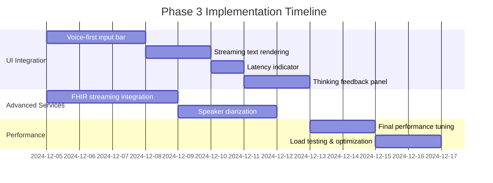

# Voice Mode v4.1 Phase 3 Implementation Plan

This document outlines the remaining work for Voice Mode v4.1 Phase 3, including UI integration, advanced services, and performance tuning.

## Phase 3 Overview



## Workstream 1: UI Integration

### 1.1 Voice-First Input Bar

**Feature Flag**: `frontend.voice_first_input_bar`

A unified input component that prioritizes voice interaction:

```tsx
interface VoiceFirstInputBarProps {
  mode: "voice" | "text" | "hybrid";
  onVoiceStart: () => void;
  onVoiceEnd: () => void;
  onTextSubmit: (text: string) => void;
  vadPreset: VADPresetType;
  rtlEnabled: boolean;
}
```

**Tasks**:

- [ ] Create `VoiceFirstInputBar` component
- [ ] Integrate VAD preset selector (sensitive/balanced/relaxed)
- [ ] Add RTL layout support for Arabic/Hebrew
- [ ] Implement smooth voice/text mode transition
- [ ] Add accessibility keyboard shortcuts

**Success Criteria**:

- Voice activation < 100ms
- Mode switch < 200ms
- Meets WCAG 2.1 AA accessibility standards

### 1.2 Streaming Text Rendering

**Feature Flag**: `frontend.streaming_text_render`

Real-time text display as Thinker generates response:

**Tasks**:

- [ ] Implement token-by-token streaming display
- [ ] Add cursor animation during streaming
- [ ] Support markdown rendering during stream
- [ ] Handle RTL text direction switching
- [ ] Add smooth scroll-to-bottom behavior

**Success Criteria**:

- First token visible within 50ms of receipt
- No flicker or reflow during streaming
- RTL text renders correctly

### 1.3 Latency Indicator

**Feature Flag**: `frontend.latency_indicator`

Visual feedback showing response latency:

```tsx
interface LatencyIndicatorProps {
  ttfa: number; // Time to first audio (ms)
  totalLatency: number; // Total response time (ms)
  phiMode: PHIRoutingMode;
  showDetails: boolean;
}
```

**Tasks**:

- [ ] Create `LatencyIndicator` component
- [ ] Color-code by performance (green < 300ms, yellow < 500ms, red > 500ms)
- [ ] Show PHI routing mode indicator (🛡️/🔒/☁️)
- [ ] Add tooltip with detailed breakdown
- [ ] Store latency history for user feedback

**Success Criteria**:

- Updates in real-time during response
- Accurate to ±10ms
- Non-intrusive visual design

### 1.4 Thinking Feedback Panel

**Feature Flag**: `frontend.thinking_feedback`

Visual and audio feedback while AI processes:

**Tasks**:

- [ ] Create `ThinkingFeedbackPanel` component
- [ ] Implement audio tones (gentle_beep, soft_chime, subtle_tick)
- [ ] Add visual indicators (dots, pulse, spinner, progress)
- [ ] Support haptic feedback on mobile
- [ ] Integrate with existing thinking tone settings

**Success Criteria**:

- Feedback starts within 50ms of thinking state
- Respects user volume preferences
- Works across mobile and desktop

## Workstream 2: Advanced Services

### 2.1 FHIR Streaming Integration

**Feature Flag**: `backend.fhir_streaming`

Real-time FHIR data streaming for clinical context:

```python
class FHIRStreamingService:
    async def subscribe_to_patient(self, patient_id: str):
        """Subscribe to real-time patient updates."""
        pass

    async def stream_observations(self, patient_id: str):
        """Stream lab results, vitals as they arrive."""
        pass
```

**Tasks**:

- [ ] Implement FHIR subscription service
- [ ] Add WebSocket endpoint for real-time updates
- [ ] Integrate with Thinker context for live data
- [ ] Add PHI detection for streamed data
- [ ] Implement reconnection and error handling

**Success Criteria**:

- New data visible within 2 seconds of FHIR event
- PHI properly detected and routed
- Handles network disconnections gracefully

### 2.2 Speaker Diarization

**Feature Flag**: `backend.speaker_diarization`

Multi-speaker detection and attribution:

```python
class SpeakerDiarizationService:
    async def process_audio(
        self,
        audio: bytes,
        num_speakers: Optional[int] = None
    ) -> List[SpeakerSegment]:
        """Identify speaker segments in audio."""
        pass

    def get_speaker_profile(self, speaker_id: str) -> SpeakerProfile:
        """Get or create speaker profile."""
        pass
```

**Tasks**:

- [ ] Implement pyannote.audio integration
- [ ] Create speaker embedding database
- [ ] Add real-time speaker change detection
- [ ] Integrate with Thinker for multi-party context
- [ ] Support up to 4 concurrent speakers

**Success Criteria**:

- Speaker change detected within 500ms
- > 90% accuracy for 2-speaker conversations
- Latency < 200ms per segment

## Workstream 3: Performance Tuning

### 3.1 Final Performance Optimization

**Tasks**:

- [ ] Profile end-to-end latency breakdown
- [ ] Optimize VAD chunk size for latency/accuracy trade-off
- [ ] Tune Thinker token generation parameters
- [ ] Optimize Talker audio chunk sizes
- [ ] Implement adaptive quality based on connection speed

**Target Metrics**:
| Metric | Target | Current |
|--------|--------|---------|
| Time to First Audio (TTFA) | < 300ms | ~400ms |
| End-to-End Latency | < 1000ms | ~1200ms |
| PHI Detection Latency | < 50ms | ~75ms |
| VAD Latency | < 20ms | ~25ms |

### 3.2 Load Testing

**Tasks**:

- [ ] Create load testing scenarios (10, 50, 100 concurrent sessions)
- [ ] Test PHI routing under load
- [ ] Measure memory usage over extended sessions
- [ ] Validate WebSocket connection stability
- [ ] Document performance characteristics

## Feature Flag Definitions

Add to `flag_definitions.py`:

```python
# Phase 3 Feature Flags
PHASE_3_FLAGS = {
    # UI Features
    "frontend.voice_first_input_bar": {
        "default": False,
        "description": "Enable voice-first unified input bar",
        "rollout_percentage": 0,
    },
    "frontend.streaming_text_render": {
        "default": False,
        "description": "Enable streaming text rendering",
        "rollout_percentage": 0,
    },
    "frontend.latency_indicator": {
        "default": False,
        "description": "Show latency indicator in voice mode",
        "rollout_percentage": 0,
    },
    "frontend.thinking_feedback": {
        "default": True,  # Already partially implemented
        "description": "Enable thinking feedback panel",
        "rollout_percentage": 100,
    },

    # Backend Features
    "backend.fhir_streaming": {
        "default": False,
        "description": "Enable FHIR real-time streaming",
        "rollout_percentage": 0,
    },
    "backend.speaker_diarization": {
        "default": False,
        "description": "Enable multi-speaker detection",
        "rollout_percentage": 0,
    },

    # Performance Features
    "backend.adaptive_quality": {
        "default": False,
        "description": "Adapt quality based on connection speed",
        "rollout_percentage": 0,
    },
}
```

## PR Templates

### UI Feature PR Template

```markdown
## Summary

[Brief description of UI feature]

## Changes

- [ ] Component implementation
- [ ] Store integration
- [ ] Accessibility support
- [ ] RTL support
- [ ] Unit tests
- [ ] Storybook stories

## Test Plan

- [ ] Manual testing on Chrome, Firefox, Safari
- [ ] Mobile testing (iOS Safari, Android Chrome)
- [ ] Screen reader testing
- [ ] RTL layout testing

## Screenshots

[Before/After screenshots]

## Performance Impact

[Any latency or bundle size changes]
```

### Backend Service PR Template

```markdown
## Summary

[Brief description of backend feature]

## Changes

- [ ] Service implementation
- [ ] API endpoints
- [ ] Feature flag integration
- [ ] PHI handling (if applicable)
- [ ] Unit tests
- [ ] Integration tests

## Test Plan

- [ ] pytest tests pass
- [ ] Load testing results
- [ ] PHI routing verification

## Metrics

- Latency impact: [expected change]
- Memory impact: [expected change]

## Rollback Plan

[How to disable/rollback if issues]
```

## Success Criteria (Phase 3 Complete)

- [ ] All UI components implemented and accessible
- [ ] FHIR streaming integration functional
- [ ] Speaker diarization working for 2+ speakers
- [ ] TTFA < 300ms for 95th percentile
- [ ] All feature flags documented and functional
- [ ] Load testing complete (100 concurrent sessions)
- [ ] Documentation updated

## Prototypes: Surfacing Data to Users

### FHIR Data Display Prototype

When FHIR streaming detects new patient data, it will be surfaced in the voice interface:

```tsx
// VitalsPanel component prototype
interface VitalsPanelProps {
  patientId: string;
  observations: FHIRObservation[];
  onVitalClick: (observation: FHIRObservation) => void;
}

const VitalsPanel: React.FC<VitalsPanelProps> = ({
  patientId,
  observations,
  onVitalClick,
}) => {
  // Group by category
  const vitals = observations.filter((o) => o.resourceType === "vital-signs");
  const labs = observations.filter((o) => o.resourceType === "laboratory");

  return (
    <div className="vitals-panel bg-white dark:bg-gray-800 rounded-lg p-4">
      <h3 className="text-lg font-semibold mb-3">Latest Patient Data</h3>

      {/* Real-time indicator */}
      <div className="flex items-center gap-2 mb-3">
        <span className="w-2 h-2 bg-green-500 rounded-full animate-pulse" />
        <span className="text-sm text-gray-500">Live updates</span>
      </div>

      {/* Vital signs grid */}
      <div className="grid grid-cols-2 gap-3 mb-4">
        {vitals.slice(0, 4).map((vital) => (
          <VitalCard
            key={vital.resourceId}
            label={vital.codeDisplay}
            value={`${vital.valueQuantity} ${vital.valueUnit}`}
            interpretation={vital.interpretation}
            onClick={() => onVitalClick(vital)}
          />
        ))}
      </div>

      {/* Lab results list */}
      {labs.length > 0 && (
        <div className="mt-4">
          <h4 className="text-sm font-medium mb-2">Recent Labs</h4>
          <ul className="space-y-2">
            {labs.slice(0, 5).map((lab) => (
              <LabResultRow
                key={lab.resourceId}
                label={lab.codeDisplay}
                value={lab.value || `${lab.valueQuantity} ${lab.valueUnit}`}
                interpretation={lab.interpretation}
                referenceRange={lab.referenceRange}
              />
            ))}
          </ul>
        </div>
      )}
    </div>
  );
};
```

**Voice Context Injection:**

```python
# In Thinker service, inject FHIR context into prompt
async def build_context_with_fhir(
    session_id: str,
    patient_id: str,
    query: str,
) -> str:
    # Get latest observations
    fhir_service = get_fhir_subscription_service()
    vitals = await fhir_service.get_latest_vitals(patient_id, max_results=5)
    labs = await fhir_service.get_latest_labs(patient_id, max_results=5)

    # Build context string
    context_parts = ["## Current Patient Data"]

    if vitals:
        context_parts.append("\n### Vital Signs")
        for v in vitals:
            context_parts.append(f"- {v.to_context_string()}")

    if labs:
        context_parts.append("\n### Recent Lab Results")
        for l in labs:
            context_parts.append(f"- {l.to_context_string()}")

    return "\n".join(context_parts)
```

### Speaker Diarization Display Prototype

When multiple speakers are detected, the UI will show speaker attribution:

```tsx
// SpeakerAttributedTranscript component prototype
interface SpeakerAttributedTranscriptProps {
  segments: SpeakerSegment[];
  speakerProfiles: Map<string, SpeakerProfile>;
  currentSpeaker?: string;
}

const SpeakerAttributedTranscript: React.FC<SpeakerAttributedTranscriptProps> = ({
  segments,
  speakerProfiles,
  currentSpeaker,
}) => {
  // Get speaker color
  const getSpeakerColor = (speakerId: string) => {
    const colors = ["blue", "green", "purple", "orange"];
    const index = parseInt(speakerId.replace("SPEAKER_", "")) || 0;
    return colors[index % colors.length];
  };

  return (
    <div className="speaker-transcript space-y-3">
      {/* Speaker legend */}
      <div className="flex gap-2 mb-4">
        {Array.from(speakerProfiles.entries()).map(([id, profile]) => (
          <div
            key={id}
            className={cn(
              "flex items-center gap-1 px-2 py-1 rounded-full text-xs",
              `bg-${getSpeakerColor(id)}-100 text-${getSpeakerColor(id)}-700`,
              currentSpeaker === id && "ring-2 ring-blue-500"
            )}
          >
            <span className="w-2 h-2 rounded-full bg-current" />
            {profile.name || id}
          </div>
        ))}
      </div>

      {/* Transcript with speaker labels */}
      {segments.map((segment, index) => (
        <div
          key={index}
          className={cn(
            "flex gap-3",
            segment.speakerId === currentSpeaker && "animate-pulse"
          )}
        >
          {/* Speaker indicator */}
          <div
            className={cn(
              "w-8 h-8 rounded-full flex items-center justify-center text-xs font-medium",
              `bg-${getSpeakerColor(segment.speakerId)}-100`,
              `text-${getSpeakerColor(segment.speakerId)}-700`
            )}
          >
            {segment.speakerId.replace("SPEAKER_", "")}
          </div>

          {/* Transcript text */}
          <div className="flex-1">
            <div className="text-xs text-gray-500 mb-1">
              {formatTime(segment.startMs)} - {formatTime(segment.endMs)}
            </div>
            <div className="text-sm">{segment.transcript}</div>
          </div>
        </div>
      ))}
    </div>
  );
};
```

**Multi-Party Context for Thinker:**

```python
# Build multi-speaker context for Thinker
def build_multi_speaker_context(
    diarization_result: DiarizationResult,
    transcripts: Dict[str, str],  # speaker_id -> transcript
) -> str:
    context_parts = ["## Conversation Participants"]

    speaker_summary = diarization_result.get_speaker_summary()
    for speaker_id, speaking_time_ms in speaker_summary.items():
        context_parts.append(
            f"- {speaker_id}: {speaking_time_ms / 1000:.1f}s speaking time"
        )

    context_parts.append("\n## Conversation Transcript")
    for speaker_id, transcript in transcripts.items():
        context_parts.append(f"\n### {speaker_id}:")
        context_parts.append(transcript)

    return "\n".join(context_parts)
```

## PR Breakdown for Phase 3

### PR #1: UI Integration (Voice-First Input)

**Branch:** `feature/voice-mode-v4.1-phase3-ui`

**Files:**

- `apps/web-app/src/components/voice/VoiceFirstInputBar.tsx`
- `apps/web-app/src/components/voice/StreamingTextDisplay.tsx`
- `apps/web-app/src/components/voice/LatencyIndicator.tsx`
- `apps/web-app/src/components/voice/ThinkingFeedbackPanel.tsx`
- `apps/web-app/src/hooks/useStreamingText.ts`
- `apps/web-app/src/hooks/useThinkingFeedback.ts`

### PR #2: Advanced Services (FHIR + Diarization)

**Branch:** `feature/voice-mode-v4.1-phase3-services`

**Files:**

- `services/api-gateway/app/services/speaker_diarization_service.py` ✓
- `services/api-gateway/app/services/fhir_subscription_service.py` ✓
- `services/api-gateway/app/api/voice_fhir.py`
- `services/api-gateway/app/api/voice_diarization.py`
- `apps/web-app/src/components/voice/VitalsPanel.tsx`
- `apps/web-app/src/components/voice/SpeakerAttributedTranscript.tsx`

### PR #3: Performance & Quality

**Branch:** `feature/voice-mode-v4.1-phase3-performance`

**Files:**

- `services/api-gateway/app/services/adaptive_quality_service.py`
- `services/api-gateway/tests/load/voice_load_test.py`
- `docs/voice/performance-tuning-guide.md`

## Related Documentation

- [PHI-Aware STT Routing](./phi-aware-stt-routing.md)
- [Adaptive VAD Presets](./adaptive-vad-presets.md)
- [Unified Conversation Memory](./unified-memory.md)
- [Voice Mode v4.1 Overview](./voice-mode-v4-overview.md)
