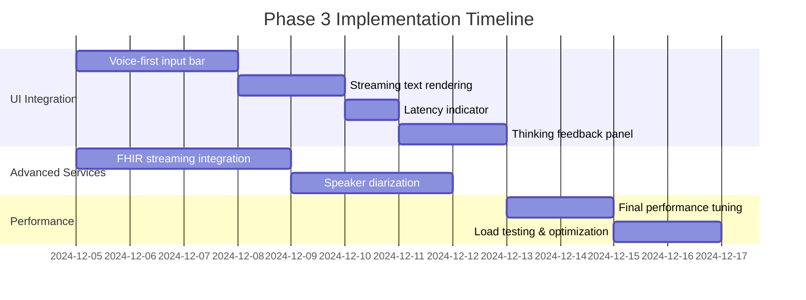

# Voice Mode v4.1 Phase 3 Implementation Plan

This document outlines the remaining work for Voice Mode v4.1 Phase 3, including UI integration, advanced services, and performance tuning.

## Phase 3 Overview



## Workstream 1: UI Integration

### 1.1 Voice-First Input Bar

**Feature Flag**: `frontend.voice_first_input_bar`

A unified input component that prioritizes voice interaction:

```tsx
interface VoiceFirstInputBarProps {
  mode: "voice" | "text" | "hybrid";
  onVoiceStart: () => void;
  onVoiceEnd: () => void;
  onTextSubmit: (text: string) => void;
  vadPreset: VADPresetType;
  rtlEnabled: boolean;
}
```

**Tasks**:

- [ ] Create `VoiceFirstInputBar` component
- [ ] Integrate VAD preset selector (sensitive/balanced/relaxed)
- [ ] Add RTL layout support for Arabic/Hebrew
- [ ] Implement smooth voice/text mode transition
- [ ] Add accessibility keyboard shortcuts

**Success Criteria**:

- Voice activation < 100ms
- Mode switch < 200ms
- Meets WCAG 2.1 AA accessibility standards

### 1.2 Streaming Text Rendering

**Feature Flag**: `frontend.streaming_text_render`

Real-time text display as Thinker generates response:

**Tasks**:

- [ ] Implement token-by-token streaming display
- [ ] Add cursor animation during streaming
- [ ] Support markdown rendering during stream
- [ ] Handle RTL text direction switching
- [ ] Add smooth scroll-to-bottom behavior

**Success Criteria**:

- First token visible within 50ms of receipt
- No flicker or reflow during streaming
- RTL text renders correctly

### 1.3 Latency Indicator

**Feature Flag**: `frontend.latency_indicator`

Visual feedback showing response latency:

```tsx
interface LatencyIndicatorProps {
  ttfa: number; // Time to first audio (ms)
  totalLatency: number; // Total response time (ms)
  phiMode: PHIRoutingMode;
  showDetails: boolean;
}
```

**Tasks**:

- [ ] Create `LatencyIndicator` component
- [ ] Color-code by performance (green < 300ms, yellow < 500ms, red > 500ms)
- [ ] Show PHI routing mode indicator (🛡️/🔒/☁️)
- [ ] Add tooltip with detailed breakdown
- [ ] Store latency history for user feedback

**Success Criteria**:

- Updates in real-time during response
- Accurate to ±10ms
- Non-intrusive visual design

### 1.4 Thinking Feedback Panel

**Feature Flag**: `frontend.thinking_feedback`

Visual and audio feedback while AI processes:

**Tasks**:

- [ ] Create `ThinkingFeedbackPanel` component
- [ ] Implement audio tones (gentle_beep, soft_chime, subtle_tick)
- [ ] Add visual indicators (dots, pulse, spinner, progress)
- [ ] Support haptic feedback on mobile
- [ ] Integrate with existing thinking tone settings

**Success Criteria**:

- Feedback starts within 50ms of thinking state
- Respects user volume preferences
- Works across mobile and desktop

## Workstream 2: Advanced Services

### 2.1 FHIR Streaming Integration

**Feature Flag**: `backend.fhir_streaming`

Real-time FHIR data streaming for clinical context:

```python
class FHIRStreamingService:
    async def subscribe_to_patient(self, patient_id: str):
        """Subscribe to real-time patient updates."""
        pass

    async def stream_observations(self, patient_id: str):
        """Stream lab results, vitals as they arrive."""
        pass
```

**Tasks**:

- [ ] Implement FHIR subscription service
- [ ] Add WebSocket endpoint for real-time updates
- [ ] Integrate with Thinker context for live data
- [ ] Add PHI detection for streamed data
- [ ] Implement reconnection and error handling

**Success Criteria**:

- New data visible within 2 seconds of FHIR event
- PHI properly detected and routed
- Handles network disconnections gracefully

### 2.2 Speaker Diarization

**Feature Flag**: `backend.speaker_diarization`

Multi-speaker detection and attribution:

```python
class SpeakerDiarizationService:
    async def process_audio(
        self,
        audio: bytes,
        num_speakers: Optional[int] = None
    ) -> List[SpeakerSegment]:
        """Identify speaker segments in audio."""
        pass

    def get_speaker_profile(self, speaker_id: str) -> SpeakerProfile:
        """Get or create speaker profile."""
        pass
```

**Tasks**:

- [ ] Implement pyannote.audio integration
- [ ] Create speaker embedding database
- [ ] Add real-time speaker change detection
- [ ] Integrate with Thinker for multi-party context
- [ ] Support up to 4 concurrent speakers

**Success Criteria**:

- Speaker change detected within 500ms
- > 90% accuracy for 2-speaker conversations
- Latency < 200ms per segment

## Workstream 3: Performance Tuning

### 3.1 Final Performance Optimization

**Tasks**:

- [ ] Profile end-to-end latency breakdown
- [ ] Optimize VAD chunk size for latency/accuracy trade-off
- [ ] Tune Thinker token generation parameters
- [ ] Optimize Talker audio chunk sizes
- [ ] Implement adaptive quality based on connection speed

**Target Metrics**:
| Metric | Target | Current |
|--------|--------|---------|
| Time to First Audio (TTFA) | < 300ms | ~400ms |
| End-to-End Latency | < 1000ms | ~1200ms |
| PHI Detection Latency | < 50ms | ~75ms |
| VAD Latency | < 20ms | ~25ms |

### 3.2 Load Testing

**Tasks**:

- [ ] Create load testing scenarios (10, 50, 100 concurrent sessions)
- [ ] Test PHI routing under load
- [ ] Measure memory usage over extended sessions
- [ ] Validate WebSocket connection stability
- [ ] Document performance characteristics

## Feature Flag Definitions

Add to `flag_definitions.py`:

```python
# Phase 3 Feature Flags
PHASE_3_FLAGS = {
    # UI Features
    "frontend.voice_first_input_bar": {
        "default": False,
        "description": "Enable voice-first unified input bar",
        "rollout_percentage": 0,
    },
    "frontend.streaming_text_render": {
        "default": False,
        "description": "Enable streaming text rendering",
        "rollout_percentage": 0,
    },
    "frontend.latency_indicator": {
        "default": False,
        "description": "Show latency indicator in voice mode",
        "rollout_percentage": 0,
    },
    "frontend.thinking_feedback": {
        "default": True,  # Already partially implemented
        "description": "Enable thinking feedback panel",
        "rollout_percentage": 100,
    },

    # Backend Features
    "backend.fhir_streaming": {
        "default": False,
        "description": "Enable FHIR real-time streaming",
        "rollout_percentage": 0,
    },
    "backend.speaker_diarization": {
        "default": False,
        "description": "Enable multi-speaker detection",
        "rollout_percentage": 0,
    },

    # Performance Features
    "backend.adaptive_quality": {
        "default": False,
        "description": "Adapt quality based on connection speed",
        "rollout_percentage": 0,
    },
}
```

## PR Templates

### UI Feature PR Template

```markdown
## Summary

[Brief description of UI feature]

## Changes

- [ ] Component implementation
- [ ] Store integration
- [ ] Accessibility support
- [ ] RTL support
- [ ] Unit tests
- [ ] Storybook stories

## Test Plan

- [ ] Manual testing on Chrome, Firefox, Safari
- [ ] Mobile testing (iOS Safari, Android Chrome)
- [ ] Screen reader testing
- [ ] RTL layout testing

## Screenshots

[Before/After screenshots]

## Performance Impact

[Any latency or bundle size changes]
```

### Backend Service PR Template

```markdown
## Summary

[Brief description of backend feature]

## Changes

- [ ] Service implementation
- [ ] API endpoints
- [ ] Feature flag integration
- [ ] PHI handling (if applicable)
- [ ] Unit tests
- [ ] Integration tests

## Test Plan

- [ ] pytest tests pass
- [ ] Load testing results
- [ ] PHI routing verification

## Metrics

- Latency impact: [expected change]
- Memory impact: [expected change]

## Rollback Plan

[How to disable/rollback if issues]
```

## Success Criteria (Phase 3 Complete)

- [ ] All UI components implemented and accessible
- [ ] FHIR streaming integration functional
- [ ] Speaker diarization working for 2+ speakers
- [ ] TTFA < 300ms for 95th percentile
- [ ] All feature flags documented and functional
- [ ] Load testing complete (100 concurrent sessions)
- [ ] Documentation updated

## Related Documentation

- [PHI-Aware STT Routing](./phi-aware-stt-routing.md)
- [Adaptive VAD Presets](./adaptive-vad-presets.md)
- [Unified Conversation Memory](./unified-memory.md)
- [Voice Mode v4.1 Overview](./voice-mode-v4-overview.md)
