# PHI-Aware STT Routing

Voice Mode v4.1 introduces PHI-aware speech-to-text routing to ensure Protected Health Information remains on-premises when required for HIPAA compliance.

## Overview

The PHI-aware STT router intelligently routes audio based on content sensitivity:

```
┌─────────────────────────────────────────────────────────────────┐
│                      Audio Input                                 │
├─────────────────────────────────────────────────────────────────┤
│                                                                  │
│  ┌──────────────┐     ┌──────────────────┐                      │
│  │ PHI Detector │────▶│ Sensitivity Score │                     │
│  └──────────────┘     └──────────────────┘                      │
│                              │                                   │
│              ┌───────────────┼───────────────┐                  │
│              ▼               ▼               ▼                  │
│        Score < 0.3     0.3 ≤ Score < 0.7   Score ≥ 0.7         │
│              │               │               │                  │
│              ▼               ▼               ▼                  │
│     ┌────────────┐   ┌────────────┐   ┌────────────┐           │
│     │ Cloud STT  │   │ Hybrid Mode│   │Local Whisper│           │
│     │(OpenAI/GCP)│   │  (Redacted) │   │ (On-Prem)  │           │
│     └────────────┘   └────────────┘   └────────────┘           │
│                                                                  │
└─────────────────────────────────────────────────────────────────┘
```

### Thinker-Talker Pipeline Integration

```mermaid
sequenceDiagram
    participant User
    participant Frontend
    participant VoicePipeline
    participant PHIRouter
    participant Thinker as Thinker (LLM)
    participant Talker as Talker (TTS)
    participant Telemetry

    User->>Frontend: Speaks audio
    Frontend->>VoicePipeline: Audio stream
    VoicePipeline->>PHIRouter: route(audio_context)

    Note over PHIRouter: PHI Detection & Scoring
    PHIRouter->>Telemetry: update_routing_state()
    Telemetry-->>Frontend: PHI mode indicator (🛡️/🔒/☁️)

    alt PHI Score >= 0.7
        PHIRouter->>VoicePipeline: route="local"
        Note over VoicePipeline: Use Local Whisper
    else PHI Score 0.3-0.7
        PHIRouter->>VoicePipeline: route="hybrid"
        Note over VoicePipeline: Use Cloud + Redaction
    else PHI Score < 0.3
        PHIRouter->>VoicePipeline: route="cloud"
        Note over VoicePipeline: Use Cloud STT
    end

    VoicePipeline->>Thinker: transcript + context
    Thinker-->>VoicePipeline: response_stream
    VoicePipeline->>Talker: text_stream
    Talker-->>Frontend: audio_chunks
    Frontend-->>User: Plays response
```



### Routing Priority Order

```mermaid
flowchart TD
    A[Audio Input] --> B{Session has prior PHI?}
    B -->|Yes| L[LOCAL<br/>🛡️ On-device Whisper]
    B -->|No| C{PHI Score >= 0.7?}
    C -->|Yes| L
    C -->|No| D{PHI Score >= 0.3?}
    D -->|Yes| H[HYBRID<br/>🔒 Cloud + Redaction]
    D -->|No| E{Medical Context?}
    E -->|Yes| H
    E -->|No| CL[CLOUD<br/>☁️ Standard STT]

    L --> T[Thinker-Talker Pipeline]
    H --> T
    CL --> T

    style L fill:#90EE90
    style H fill:#FFE4B5
    style CL fill:#ADD8E6
```



## PHI Detection

### Detection Signals

The PHI detector analyzes multiple signals to score content sensitivity:

| Signal                   | Weight | Examples                                |
| ------------------------ | ------ | --------------------------------------- |
| Medical entity detection | 0.4    | "My doctor said...", "I take metformin" |
| Personal identifiers     | 0.3    | Names, DOB, SSN patterns                |
| Appointment context      | 0.2    | "My appointment at...", "Dr. Smith"     |
| Session history          | 0.1    | Previous PHI in conversation            |

### Sensitivity Scores

| Score Range | Classification        | Routing Decision       |
| ----------- | --------------------- | ---------------------- |
| 0.0 - 0.29  | General               | Cloud STT (fastest)    |
| 0.3 - 0.69  | Potentially Sensitive | Hybrid mode (redacted) |
| 0.7 - 1.0   | PHI Detected          | Local Whisper (secure) |

## Routing Strategies

### 1. Cloud STT (Default)

For general queries with no PHI indicators:

```python
from app.services.phi_stt_router import PHISTTRouter

router = PHISTTRouter()

# General query - routes to cloud
result = await router.transcribe(
    audio_data=audio_bytes,
    session_id="session_123"
)

# result.provider = "openai_whisper"
# result.phi_score = 0.15
# result.routing = "cloud"
```

### 2. Local Whisper (Secure)

For queries with high PHI probability:

```python
# PHI detected - routes to local Whisper
result = await router.transcribe(
    audio_data=audio_bytes,
    session_id="session_123",
    context={"has_prior_phi": True}  # Session context
)

# result.provider = "local_whisper"
# result.phi_score = 0.85
# result.routing = "local"
# result.phi_entities = ["medication", "condition"]
```

### 3. Hybrid Mode (Redacted)

For borderline cases, audio is processed with entity redaction:

```python
# Borderline - uses hybrid with redaction
result = await router.transcribe(
    audio_data=audio_bytes,
    session_id="session_123"
)

# result.provider = "openai_whisper_redacted"
# result.phi_score = 0.45
# result.routing = "hybrid"
# result.redacted_entities = ["name", "date"]
```

## Configuration

### Environment Variables

```bash
# Enable PHI-aware routing
VOICE_V4_PHI_ROUTING=true

# Local Whisper model path
WHISPER_MODEL_PATH=/opt/voiceassist/models/whisper-large-v3
WHISPER_MODEL_SIZE=large-v3

# Cloud STT provider (fallback)
STT_PROVIDER=openai  # openai, google, azure

# PHI detection thresholds
PHI_THRESHOLD_LOCAL=0.7
PHI_THRESHOLD_HYBRID=0.3

# Session context window (for PHI history)
PHI_SESSION_CONTEXT_WINDOW=10  # messages
```

### Feature Flag

```python
# Check if PHI routing is enabled
from app.core.feature_flags import feature_flag_service

if await feature_flag_service.is_enabled("backend.voice_v4_phi_routing"):
    router = PHISTTRouter()
else:
    router = StandardSTTRouter()
```

## Local Whisper Setup

### Installation

```bash
# Install faster-whisper (optimized inference)
pip install faster-whisper

# Download model
python -c "
from faster_whisper import WhisperModel
model = WhisperModel('large-v3', device='cuda', compute_type='float16')
print('Model downloaded successfully')
"
```

### Model Options

| Model    | Size   | VRAM  | RTF\* | Quality |
| -------- | ------ | ----- | ----- | ------- |
| tiny     | 39 MB  | 1 GB  | 0.03  | Basic   |
| base     | 74 MB  | 1 GB  | 0.05  | Good    |
| small    | 244 MB | 2 GB  | 0.08  | Better  |
| medium   | 769 MB | 5 GB  | 0.15  | Great   |
| large-v3 | 1.5 GB | 10 GB | 0.25  | Best    |

\*Real-time factor (lower is faster)

### GPU Requirements

- **Minimum**: NVIDIA GPU with 4GB VRAM (small model)
- **Recommended**: NVIDIA GPU with 10GB VRAM (large-v3)
- **CPU Fallback**: Available but 5-10x slower

## UI Integration

### PHI Indicator Component

```tsx
import { PHIIndicator } from "@/components/voice/PHIIndicator";

<PHIIndicator
  routing={result.routing} // "cloud" | "hybrid" | "local"
  phiScore={result.phi_score}
  showDetails={true}
/>;
```

### Visual States

| Routing | Icon | Color  | Tooltip                      |
| ------- | ---- | ------ | ---------------------------- |
| cloud   | ☁️   | Blue   | "Using cloud transcription"  |
| hybrid  | 🔒   | Yellow | "Sensitive content detected" |
| local   | 🛡️   | Green  | "Secure local processing"    |

## Audit Logging

All PHI routing decisions are logged for compliance:

```python
logger.info("PHI routing decision", extra={
    "session_id": session_id,
    "phi_score": 0.85,
    "routing_decision": "local",
    "detection_signals": ["medication_mention", "condition_name"],
    "provider": "local_whisper",
    "processing_time_ms": 234,
    "model": "whisper-large-v3"
})
```

### Prometheus Metrics

```python
# Routing distribution
stt_routing_total.labels(routing="local").inc()
stt_routing_total.labels(routing="cloud").inc()
stt_routing_total.labels(routing="hybrid").inc()

# PHI detection accuracy
phi_detection_score_histogram.observe(phi_score)

# Latency by routing type
stt_latency_ms.labels(routing="local").observe(234)
```

## Testing

### Unit Tests

```python
@pytest.mark.asyncio
async def test_phi_routing_high_score():
    """High PHI score routes to local Whisper."""
    router = PHISTTRouter()

    # Mock audio with PHI content
    audio = generate_test_audio("I take metformin for my diabetes")

    result = await router.transcribe(audio)

    assert result.routing == "local"
    assert result.phi_score >= 0.7
    assert result.provider == "local_whisper"

@pytest.mark.asyncio
async def test_phi_routing_low_score():
    """Low PHI score routes to cloud."""
    router = PHISTTRouter()

    # Mock audio without PHI
    audio = generate_test_audio("What is the weather today?")

    result = await router.transcribe(audio)

    assert result.routing == "cloud"
    assert result.phi_score < 0.3
```

### Integration Tests

```bash
# Run PHI routing tests
pytest tests/services/test_phi_stt_router.py -v

# Test with real audio samples
pytest tests/integration/test_phi_routing_e2e.py -v --audio-samples ./test_audio/
```

## Best Practices

1. **Default to local for medical context**: If session involves health topics, bias toward local processing
2. **Cache PHI decisions per session**: Avoid re-evaluating the same session repeatedly
3. **Monitor latency impact**: Local Whisper adds ~200ms; account for this in latency budgets
4. **Regular model updates**: Update Whisper model quarterly for accuracy improvements
5. **Audit trail**: Maintain logs of all routing decisions for compliance audits

## Related Documentation

- [Voice Mode v4.1 Overview](./voice-mode-v4-overview.md)
- [Latency Budgets Guide](./latency-budgets-guide.md)
- [HIPAA Compliance Guide](../security/hipaa-compliance.md)
